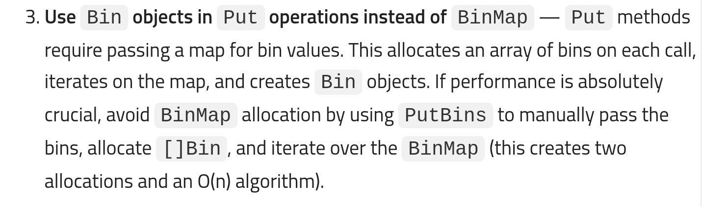

## SQL Analogy

I think the best way to start learning Aerospike is to establish an analogy with SQL databases.

<div id="post-table">

| Aerospike     | SQL         |
| ------------- | ----------- |
| NameSpace     | TableSpace  |
| Set           | Table       |
| Record/Object | Row         |
| Bin           | Column      |
| Key           | Primary Key |

</div>

Knowing this much will be sufficient to get us started.

## Install Aerospike

I'd recommened installing Aerospike with Docker just because it's simple that way. For this article, I'm using version `5.5.0.2`.

```bash
# Download aerospike docker image
docker image pull aerospike:5.5.0.2

# Start docker
docker container run -p 3000:3000 --rm aerospike:5.5.0.2
```

Aerospike server, by default, runs on port 3000. The `-p` flag tells docker to map the container's port `3000` to our system's port `3000`. The flag `--rm` will automatically delete the docker container after we stop the aerospike server.

You also need to download the Aerospike Go package which is officially available at `github.com/aerospike/aerospike-client-go`

```
go get github.com/aerospike/aerospike-client-go
```

## 1. Connect to Aerospike from GO

```go
package main

import (
	"log"

	as "github.com/aerospike/aerospike-client-go"
)

func main() {
	client, err := as.NewClient("localhost", 3000)
	if err != nil {
		log.Fatal(err)
	}
	client.Close()
}

```

These few lines of code will connect to Aerospike and then close immediately.

## 2. Create a Set

Naturally, the next move you'd think would be to create a **Set** like we do in SQL databases. However, that's not required in Aerospike because our table (Set) do not have a fixed schema unlike SQL.

## 3. Inserting data

Although, we didn't need to explicitly create a Set, we do however require one. Let's call our Set `"Person"`. And also a namespace is mandatory so let's name it `"Avengers"` for lack of a better word right now 🤷‍♂️.

The namespace can only be created from the server. In our server in the docker container, there's a default namespace called "test". Let's create our namespace by modifying the docker command. We can pass in a `NAMESPACE` environment variable to the docker container and it'll create the namespace for us.

```
docker container run -e 'NAMESPACE=Avengers' --name 'Aero' -p 3000:3000 --rm aerospike:5.5.0.2
```

I've assigned a name to the docker container so that's it'll be easier to reference it later.

Close the previous container and run the above command to restart the Aerospike server with our namespace.

### 3.1 Storing Records

For every record that we want to store, we need a key to identify that record; just like a primary key in SQL databases. Let's use the person's name as the key 🙃.

Then we need to create the record itself. Just so we have a reference, let's try to insert the person's age and the name.

```
# Reference SQL table
+-----+----------+
| age | name     |
+-----+----------+
| 25  | "Aditya" |
+-----+----------+
```

"age" and "name" are columns (bin). We can create them like this

```
binAge := as.NewBin("age", 25)
binName := as.NewBin("name", "Aditya")
```

Finally, to piece everything together, here's the code to store the record.

```go
package main

import (
	"log"

	as "github.com/aerospike/aerospike-client-go"
)

const Namespace = "Avengers"
const Set = "Person"

func main() {
	client, err := as.NewClient("localhost", 3000)
	if err != nil {
		log.Fatal(err)
	}
	defer client.Close()

	// Create key for a record
	key, err := as.NewKey(Namespace, Set, "aditya")
	if err != nil {
		log.Fatal(err)
	}

	binAge := as.NewBin("age", 25)
	binName := as.NewBin("name", "Aditya")

	client.PutBins(nil, key, binAge, binName)
}
```

Notice that I never explicitly create the Set "Person". It is created automatically on-demand.

The `PutBins()` method can take in any number of bins. If you supply two bins with the same name, then the later will take precedence.

### 3.2 Different way to create bins

There's another way to create bins using BinMaps.

```go
binMap := as.BinMap{
  "age":  25,
  "name": "Aditya",
}

client.Put(nil, key, binMap)
```

To me, this looks neater and I think is more readable.

### 3.3 PutBins() vs Put()

So we have two methods to insert bins. Which one should you prefer ? Well internally, Put() uses PutBins() and the [Official Best Practices](https://docs.aerospike.com/docs/client/go/usage/best_practices.html) recommends using PutBins over Put to avoid allocation for binmaps.



## 4. Reading records

We can read the records from Aerospike using the **Key**.

```go
package main

import (
	"fmt"
	"log"

	as "github.com/aerospike/aerospike-client-go"
)

const Namespace = "Avengers"
const Set = "Person"

func main() {
	client, err := as.NewClient("localhost", 3000)
	if err != nil {
		log.Fatal(err)
	}
	defer client.Close()

	// Create key for a record
	key, err := as.NewKey(Namespace, Set, "aditya")
	if err != nil {
		log.Fatal(err)
	}

	binMap := as.BinMap{
		"age":  25,
		"name": "Aditya",
	}

	client.Put(nil, key, binMap)

	// Read a record
	record, err := client.Get(nil, key)
	if err != nil {
		log.Fatal(err)
	}
	fmt.Println(record.Bins)
}

// OUTPUT
//s map[age:25 name:Aditya]
```

In addition to reading records with the key, Aerospike also offers a basic query language. It's similar to SQL but nowhere near as powerful. Here's an example query

```sql
SELECT * FROM Avengers.Person WHERE age BETWEEN 15 AND 30
```

I won't be discussing Aerospike Query language (AQL) in this article.

## 5. Deleting records

We can delete specific records by the key or drop the entire records in the Set.

```go
package main

import (
	"fmt"
	"log"

	as "github.com/aerospike/aerospike-client-go"
)

const Namespace = "Avengers"
const Set = "Person"

func main() {
	client, err := as.NewClient("localhost", 3000)
	if err != nil {
		log.Fatal(err)
	}
	defer client.Close()

	// Create key for a record
	key, err := as.NewKey(Namespace, Set, "aditya")
	if err != nil {
		log.Fatal(err)
	}

	binMap := as.BinMap{
		"age":  25,
		"name": "Aditya",
	}

	client.Put(nil, key, binMap)

	// Read a record
	record, err := client.Get(nil, key)
	if err != nil {
		log.Fatal(err)
	}
	fmt.Println(record.Bins)

	// Delete Record
	existed, err := client.Delete(nil, key)
	if err != nil {
		log.Fatal(err)
	}

	if existed {
		fmt.Println("Record deleted")
	}
}
```

Droping the entire records in the set

```
client.Truncate(nil, Namespace, Set, nil)
```

## 6. Policy

Did you notice that the first argument when inserting and reading records was set to `nil`? That parameter is the policy. Policy helps us define the behavior of read and write. For example: what happens when we insert a record with a key that already exists ? We can use a policy to overwrite the previous data or ignore the one being inserted.

Let's create a write policy that'll tell Aerospike server to replace old records if new ones arrive

```
policy := as.NewWritePolicy(0, 0)
policy.RecordExistsAction = as.REPLACE

```

## 7. AQL

Aerospike offers a command line utility - AQL. It comes preinstalled in the docker image we downloaded. Let's get an interactive shell on the container

```bash
docker container exec -it Aero aql
```

Try out these few commands

```
SHOW namespaces;

SELECT * FROM Avengers.Person;

TRUNCATE Avengers.Person;
---
```

# References

- [Aerospike Policy](https://docs.aerospike.com/docs/guide/policies.html)
- [Aerospike Glossary](https://www.aerospike.com/docs/guide/glossary.html)
- [Aerospike Go client Usage](https://www.aerospike.com/docs/client/go/usage/index.html)
- [Video demo of amazing scalability of Aerospike](https://www.youtube.com/watch?v=CF83TmR-NME)
- [Redis vs Aerospike usecases?](https://stackoverflow.com/questions/56305522/redis-vs-aerospike-usecases)
- [How is aerospike different from other key-value nosql databases?](https://stackoverflow.com/questions/24482337/how-is-aerospike-different-from-other-key-value-nosql-databases)
- [What are the use cases where Redis is preferred to Aerospike?](https://stackoverflow.com/questions/30692684/what-are-the-use-cases-where-redis-is-preferred-to-aerospike)

```

```
