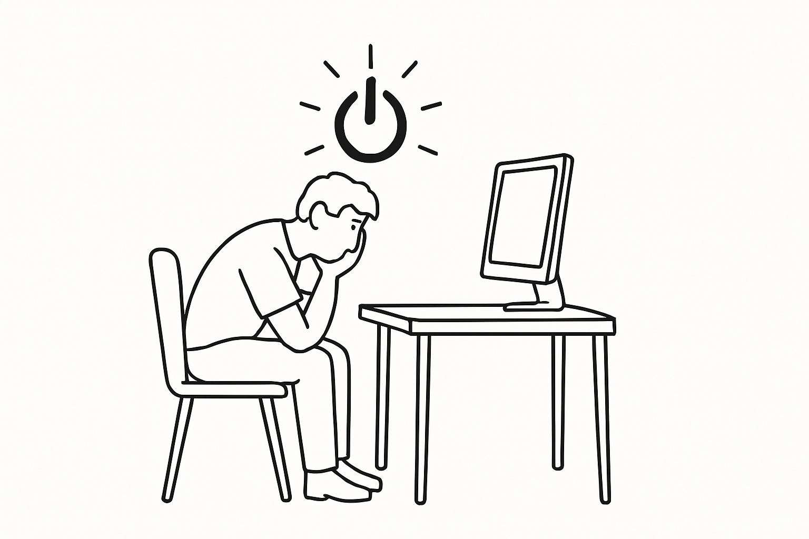

I've been using Linux for about six or so years now and five of those years have been with Arch Linux.
I've customized my development environment a lot over the years and not to sound like a braggart, but I consider myself a power user.
It was hard to imagine moving to a different operating system, because I had a very tailored development environment where I was very efficient.

Arch wasn't perfect, but it was close. If you aren't familiar with Arch - it's a Linux distro that's very barebones and requires the user to place pieces together to have a working system. It's like Subway - you choose all the ingredients. It's also a rolling release distro - meaning the app store almost always will have the latest version unlike Ubuntu or Debian were you will find versions that are older than 2 years. For that reason, Arch is known to be unstable but my 5 year old installation never let me down even with daily `sudo pacman -Syu`.

## Pain of using a desktop machine

For the past year, I have been working exclusively out of my desktop machine.
It has an `Intel i9 14900k` and 32GB of RAM and is seriously a beast of a machine.
And before that I used to work from a `2019 Dell XPS 15` which I gave to my dad so the desktop is the only machine I was left with.

While the desktop is insanely powerful, it's not portable and susceptible to frequent power cuts.
I live in a country where powercuts are a regular thing and my tiny UPS only lasts for about 5-10 minutes.

_created with: Gpt4o_

What made it worse is that suspending was not working for me. It had something to do with NVIDIA drivers and I tried to troubleshoot it but never had any luck.
So, every time there was a powercut, even for a few minutes, I would have to completely shutdown the machine.

The noise, although relatively quiter than other desktops, was still a bit too much for me. I prefer a quiet environment to work.

Beyond these challenges, the most significant drawback was the desktop's inherent inflexibility.
My remote job offers complete freedom regarding when and where I work. However, I couldn't take advantage of this flexibility - working from cafes or during travel was impossible, and I couldn't even work from my own bed. I was essentially tethered to my desk at all times.

So, really the main reason for me to switch to a Mac was that I needed a powerful laptop that was also power efficient - and no one does it better than Apple.
There are a few laptops with arm cpus that are probably more power efficient than Apple Silicon, but nowhere near as powerful.

> It wasn't the OS that made me switch to Mac, but it was the hardware.

So eventually after months or even years of convincing myself that a Mac wouldn't be worth it, I finally decided to make that switch.
_**Spoiler alert**, it has been absolutely worth it._

