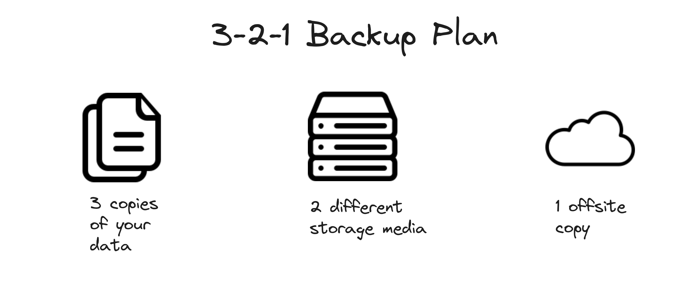
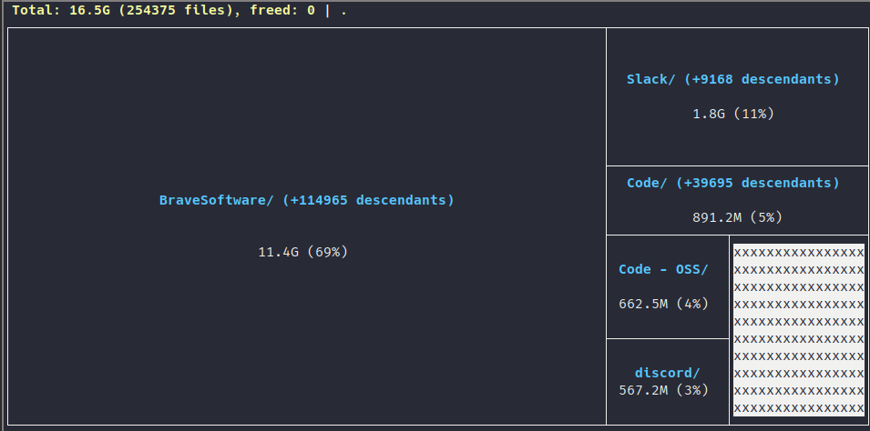
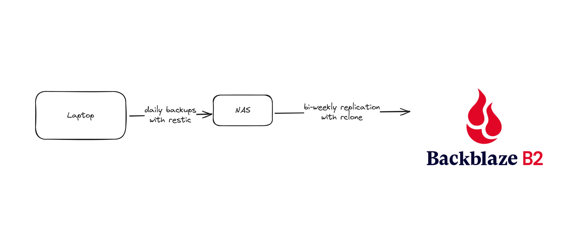
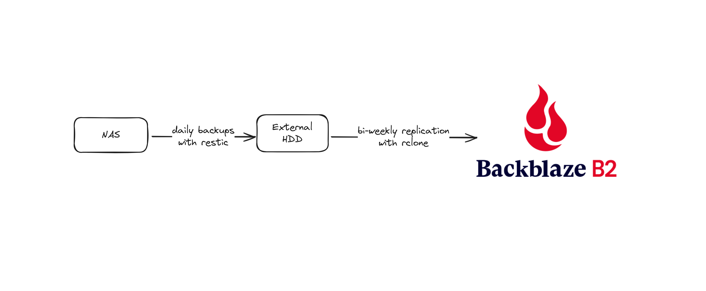

In 2023, I started dabbling with self hosting applications. It all started with a plex server and an SMB share acting as a poor man's NAS. After multiple iterations, I am now [managing about 20-30 self hosted applications](https://github.com/adityathebe/homelab). Self hosting applications is nice because you know you own your data. It's a blessing but also a curse because now you have to manage that data as well.

When you use a cloud provider, the risk of data loss is practically zero. Whether they'll misuse your data or guarantee access to your data is a different story. But in terms of keeping your data from losing, they've got you covered.

## 3-2-1 backup strategy

I came across this strategy through [this video](https://www.youtube.com/watch?v=S0KZ5iXTkzg) by Jeff Geerling. It stands for

- **3** copies
- in **2** different media
- and **1** offsite backup



> The offsite copy does not have to be on the Cloud.

There is another 3-2-1-1-0 strategy that extends on this where the additional 1 and 0 mean - **1** offline backup and a recoverable backup with **0** errors. With Restic, I do get to verify that my backups are not corrupted and can be recovered. However, I do not have an offline backup _(yet)_.

---

Broadly speaking, I would categorize my backups into two types

1. Computer backups
2. Media backups

Computer backups are important, but the media backups are of far more importance to me as those cannot be recreated in case of data loss. Regardless, I have a similar backup plan for both of them.

## Computer backups

I use [Restic](https://github.com/restic/restic) to backup all my configs and some other directories on my system to a TrueNAS server. You can find the backup script [here](https://github.com/adityathebe/dotfiles/blob/master/.local/share/Restic-backup/backup.sh). These are the directories I'm currently backing up with a few exclusions.

```
/etc
/root
/boot
/home/gunners/.config
/home/gunners/.local/share
```

Some sofwares, for whatever reason, have made the decision to use the `XDG_CONFIG_HOME` as a dump to put all the application data _(i.e. logs, cache, session, ...)_. My `XDG_CONFIG_HOME` is 16GB right now of which more than 90% is just from Brave, Slack, Discord and VS Code.


_~/.config disk usage with Diskonaut_

Anyways, this backup script is run twice a day with a cron job

```
# Restic backup
00 11,22 * * * /home/gunners/.local/share/restic-backup/backup.sh
```

Then, on the TrueNAS server I have a cron job that replicates the system backup to Backblaze B2 using rclone. This cron job runs twice a week and is set up using an Ansible playbook that you can find [here](https://github.com/adityathebe/homelab/blob/efc7713d8205d9ec3599274ea027237b1417c026/ansible/truenas/playbooks/backup.yaml).



### Why not directly back up to Backblaze B2 ?

So, this was my initial setup. The advantages of not directly backing up to a cloud provider are

- backups are faster _(honestly not a big deal since it's a background job anyway)_
- but the more important one is the fact that I can perform the integrity check of the backup without needing to download the whole thing from the cloud. This saves time & money.

## Media backups

Media backups include all the photos, videos and my music library. The NAS is the production copy for my media. So, to have another local copy on a different media, I simply backup to an external HDD with Restic.

I wouldn't say I love this approach because I need to have the external drive plugged in at all times to the NAS and also doing lots of IO operations through a USB is probably not a good idea _(don't quote me on this one)_ - but hey, it works. And the alternative would be to have another backup system that would cost equally as the main NAS system.

Then, as a 3rd offsite copy of the backup I, once again, use rclone to replicate the restic backup to backblaze.



## Why these tools?

### Backblaze

The simple answer is that they are the cheapest solution out there. AWS Glacier could be cheaper depending on how much data you have and how often you need to retrieve it, but for me B2, was the best one.

They are also fairly reputed among data hoarders so I am going to stick with B2 for now.

### Restic

Restic is one of my favorite open source tools out there. It's fairly aged, supports encryption out of the box _(in fact it doesn't even support unencrypted backup)_, has configurable compression, and supports a wide range of cloud providers as the backend. It's also written in Go and used by [Fillipo](https://words.filippo.io/restic-cryptography/).

### rclone

Honestly, I chose this one simply because a lot of people have talked highly about it. It was also fairly easy to set up. Offers incremental backup and checksum as well.
