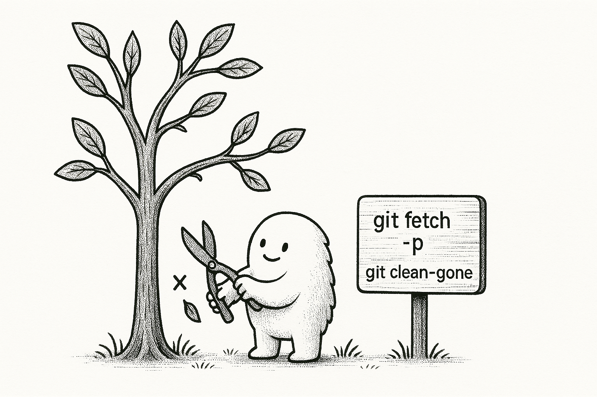

Feature branches in Git can quickly pile up. I like to keep my branches clean because when using auto completion I don't want to go through a list of branches that have already been merged or discarded. And I just like to keep things clean and tidy in general.


_Created with Gpt4o_

## Primer on Git branches

Let's say you have a feature branch `feat/notifications`.
You push that branch to the remote repository to create a PR.
The remote is usually named `origin` so you will have another branch, in your local repository, called `origin/feat/notifications` that tracks the remote branch.

| Branch                      | Description                                                    |
| --------------------------- | -------------------------------------------------------------- |
| `feat/notifications`        | The local branch you created                                   |
| `origin/feat/notifications` | The reference in your local repo that tracks the remote branch |
| `feat/notifications`        | The branch on the **remote** repository                        |

Try `git branch -vv` to see all the branches and their tracking branches.

```sh
git branch -vv
* feat/notifications a84be78 [origin/feat/notifications] feat: add notifications
  main               2831500 [origin/main] chore: remove deadcode
```

## Delete remote branches locally

Now, assume the PR got merged and the branch `feat/notifications` was deleted from the remote repository.

Running `git fetch -p` (short for `git fetch --prune`) will delete the `origin/feat/notifications` branch from your local repository but not the `feat/notifications` branch.

If you list the remote branches again, you'll see that the branch is marked as **gone**.

```sh
git branch -vv
* feat/notifications a84be78 [origin/feat/notifications: gone] feat: add notifications
  main               2831500 [origin/main] chore: remove deadcode
```

So we have just deleted the remote tracking branch. But how do we delete the local branch?

When you run `git fetch -p`, it lists out all the remote tracking branches it just deleted.
Then, for each of those branches, you need to manually run `git branch -D <branch-name>` to delete the branch from your local repository.

This is how I've been doing it so far but there's a better way to do it.

### List out all the stale branches

```sh
git branch -vv | rg '\\[.*gone.*\\]' | sed 's/^..//' | cut -d' ' -f1
```

This uses a few unix commands to extract the name of the branches that have been deleted from the remote repository.
Finally, we use `xargs` to delete the branches from the local repository.

```sh
git branch -vv | rg '\\[.*gone.*\\]' | sed 's/^..//' | cut -d' ' -f1 | xargs -r git branch -D
```

To break it down

- `git branch -vv` - Lists all branches with their tracking information
- `rg '\\[.*gone.*\\]'` - Filters branches that have been marked as "gone" (deleted from remote)
- `sed 's/^..//'` - Removes the first two characters from each line (which are either `* ` for the current branch or `  ` for other branches)
- `cut -d' ' -f1` - Splits the line by spaces and extracts the first field, which is the branch name
- `xargs -r git branch -D` - Passes each branch name to the `git branch -D` command to delete it locally

## Setup an alias in Git config

I have this as an alias in my git config in `~/.config/git/config`

```
[alias]
    clean-gone = "!git branch -vv | rg '\\[.*gone.*\\]' | sed 's/^..//' | cut -d' ' -f1 | xargs -r git branch -D"
```

Now, I can simply run `git pull && git fetch -p && git clean-gone` to clean up those stale branches.

```sh
git pull && git fetch -p && git clean-gone
Deleted branch feat/notifications (was a84be78).
```

<br>
