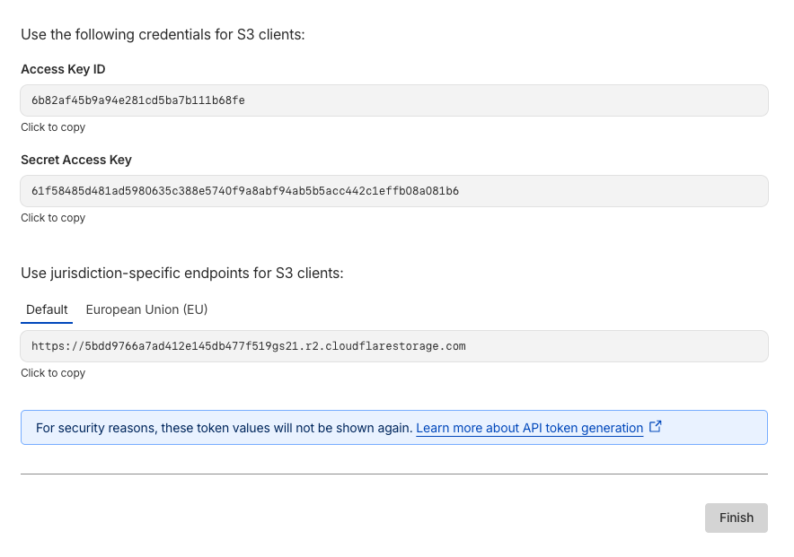

<div class='post-tldr'>

## TLDR

This post explains how to delete all files in a Cloudflare R2 bucket using rclone instead of the web UI or AWS CLI.

Quick steps:

1.  **Get credentials**: Create an Account API Token in R2 dashboard with "Object Read & Write" permission
2.  **Configure rclone**: Add R2 credentials to `~/.config/rclone/rclone.conf` with `type=s3`, `provider=Cloudflare`
3.  **Delete files**: Run rclone delete r2:/bucket-name/ -P
</div>

Object storage services do not allow deleting a bucket without deleting all the files in it first.
R2's web UI doesn't allow a "Select All" button that would make deleting just 2 clicks away.
If you have tons and tons of file, don't even think about using the web UI to clean up the bucket.

Clouflare suggests using the aws cli, however I prefer using `rclone` - https://rclone.org/ simply because I can use one tool with one interface and connect to all sort of cloud service and not just object storage services like minio, s3, backblaze b2, ...
For example: I have upload photos to Google photos using rclone, downloaded files from Google drive, ...

`rclone` has a massive list of services that it supports. See here - https://rclone.org/#providers.
Install `rclone` (guide: https://rclone.org/install/) and let's begin by creating an access key for your bucket.

## Get the Access key

- On the web UI, go to R2's dashboard and on the top right you should see "**Manage API tokens**" button.
- Create an **Account API Token** _(not the User API Token)_. You need to select "**Object Read & Write**" permission with the correct bucket.
- On the next page, you should see the Access Key ID and the Secret Access Key.
  Keep note of them and also the endpoint - we'll need them in a while.



## Setup rclone

You can either use the setup wizard using the `rclone config` command or just use this template and place it in `~/.config/rclone/rclone.conf`.

```toml
[r2]
type = s3
provider = Cloudflare
access_key_id = 6b82af45b9a94e281cd5ba7b111b68fe
secret_access_key = 61f58485d481ad5980635c388e5740f9a8abf94ab5b5acc442c1effb08a081b6
endpoint = https://5bdd9766a7ad14ae145db477f519gs21.r2.cloudflarestorage.com
```

Verify that the config was created properly.

```sh
rclone listremotes --long
```

```output
r2:                  s3
```

## Deleting bucket

My bucket is named `longhorn` so this is the comand I ran. The `-P` flag shows the progress.

```sh
rclone delete r2:/longhorn/ -P
```

```output
Transferred:              0 B / 0 B, -, 0 B/s, ETA -
Checks:                29 / 37, 78%, Listed 100
Deleted:               37 (files), 0 (dirs), 41.254 MiB (freed)
Elapsed time:         1.5s
Checking:
 * backups/backupstore/vo…c759acc982e2aff860.blk: deleting
 * backups/backupstore/vo…f23cab54f4acad0772.blk: deleting
 * backups/backupstore/vo…f27e50d08a22c62ab5.blk: deleting
 * backups/backupstore/vo…e80924cddebd00517b.blk: deleting
 * backups/backupstore/vo…92910deb42c89ff38f.blk: deleting
 * backups/backupstore/vo…6262258659adcdee58.blk: deleting
 * backups/backupstore/vo…f3ebd0010bfda1e995.blk: deleting
 * backups/backupstore/vo…606dd94efb994185b1.blk: deleting
```
