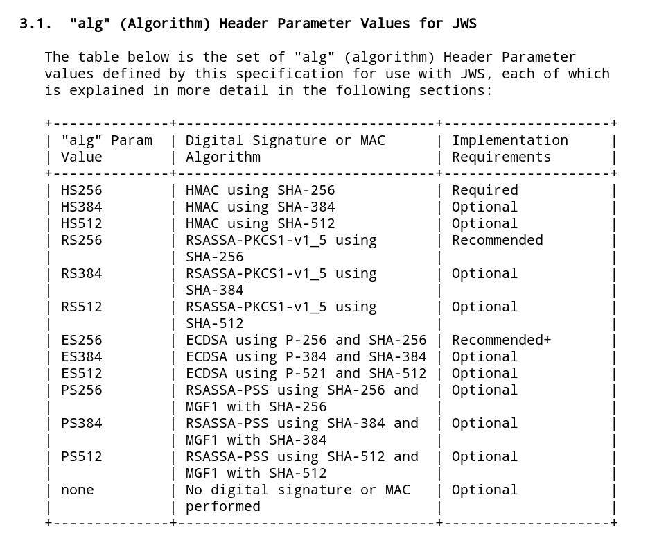
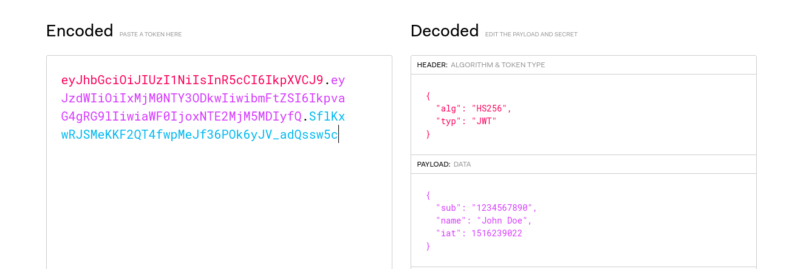

If you're reading this article you probably know what JWTs are. Let's jump straight into the details

# Symmetric key and Asymmetric key Signatures



JWT uses cryptographic keys to generate signatures. It's possible to use one of either a symmetric key or an asymmetric key. There are various factors one should consider when choosing one of these two approaches but that's a discussion for another article.

With a symmetric key, a single key is used to sign and validate the signature. _Technically, with symmetric keys we are encrypting the data and producing MAC (Message Authentication Token) and not Digital Signatures_. And with the asymmetric keys two different keys are used to sign and validate the signature respectively. This article focuses on symmetric key signing.

## Symmetric key algorithms

One of the most popular algorithms for JWT is the `HS256` algorithm. There are other variations to this algorithm like `HS384` & `HS512` which are more secure.

The HS256 algorithm takes in two inputs:

- the message to encrypt (JWT header + JWT payload)
- the secret key used to encrypt the message

## Cracking JWT secrets

Since the JWT is just a base64URL encoded data we can simply decode it to see what the header and the payload are. Here's a pretty handy webapp that let's you play around with JWTs.



With that in our hand we can simply try to generate signature by bruteforcing every single possible characters and see if the generated signature matches the one on the JWT. If we find a match then we have successfully cracked the secret key.

In Golang, you can use this function to generate the HS256 signature. _Find the full code [here](https://github.com/adityathebe/jwt-wordlist-cracker)_

```go
func hs256(data, secret string) string {
	mac := hmac.New(sha256.New, []byte(secret))
	mac.Write([]byte(data))
	return base64.RawURLEncoding.EncodeToString(mac.Sum(nil))
}
```

If the secret key is pretty weak, bruteforcing can be fruitful. However more often than not the secret keys are pretty lengthy for this attack to work.

A dictionary attack can give us better results.

Here's a public Github repository that has scraped JWT secrets from other public github repositories. You can find it here - https://github.com/wallarm/jwt-secrets

You can try using the code I provided above to perform the dictionary attack. But there are more mature tools that are designed exactly for this purpose

### John The Ripper

```bash
john token.txt --wordlist=wordlist.txt --format=HMAC-SHA256
```

### Hashcat

```bash
hashcat -a 0 -m 16500 token.txt wordlist.txt
```

hashcat has better support for GPU and can perform signficantly better than john.

## Recommended practice for generating JWT secrets

It's also important to note than we can perform this attack completely offline. We do not need to make any requests to the web server since we have all the data we need in the JWT itself.

 With a pretty powerful GPU we can test billions of hashes per second. This is why the length of the shared secret for HS256 is of the utmost importance. JSON Web Algorithms defines the minimum key length to be equal to the size in bits of the hash function used along with the HMAC algorithm which in case of HS256 would be 256bits.

# References

- https://pentesterlab.com/exercises/jwt_v/course
- https://auth0.com/blog/a-look-at-the-latest-draft-for-jwt-bcp/
- https://jwt.io
- https://en.wikipedia.org/wiki/HMAC
