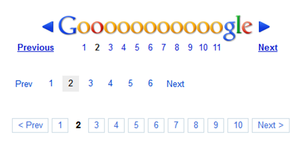
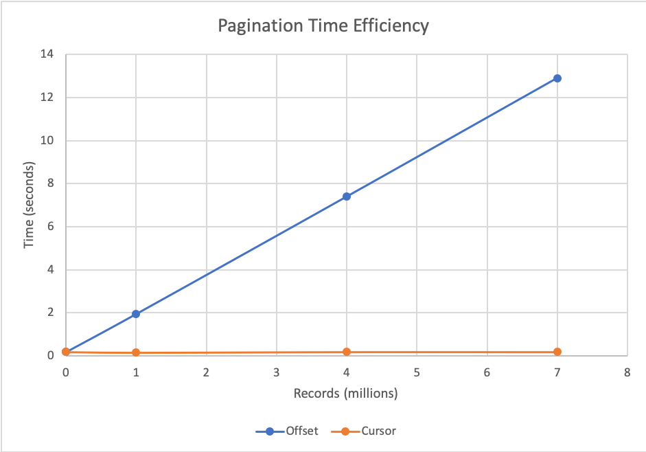

## A. Offset-based Pagination

This is the classic and the simplest way to achieve pagination. In essence, it's basically skipping X amount of data in front.

Example: You have a list of 100 flowers and you want to show 10 of them at a time. On page 1 you fetch 10 flowers and skip 0 of them, one page 2 you fetch 10 and skip 10, and so on ...

In SQL, a query would look something like this

```sql
SELECT * FROM flowers OFFSET ? LIMIT 10;
```

As simple as it is, it is still used heavily because of its sheer simplicity.

_Offset-based pagination in google.com_

### Disadvantages

A big disadvantage, and really a deal-breaker for some use cases, of this method is that it is not at all vialbe for realtime data.

#### 1. Duplicate data

Imagine in the above example a user is browsing on page 4, and 10 new flowers are added to the front. When the user visits page 5, he will see the same flowers again.

#### 2. Skipping data

In contrast, if 10 flowers were removed from the front, then users will miss out on 10 flowers when navgating to page 5 from page 4.

#### 3. Performance

The above SQL may appear innocent but it's not! An `OFFSET`ed sql query will still scan through all the rows in front. So if you're offsetting by 100 rows, the database will still scan them.

Due to this reason, as the offset factor grows, pagination time increases. Imagine cases where you need to offset by millions of rows - that could take a minute.

_Source: https://laptrinhx.com/_

But to say that this is a disadvantage of offset-based pagination is not quite fair since this is a SQL problem. If we were using an index instead, then this wouldn't be a problem at all.

You can see how none of these disadvantages really affect Google because their search index do not change in real time and offset doesn't add overhead.

## B. Cursor-based Pagination

In this method, you have a cursor instead of an offset value. To continue with our example above, a cursor based query would be "Give me 10 flowers after Anthurium". This method is extremely suitable where data changes frequently since you don't have the problem of duplicates or skipping over some data.

### Disadvantages

#### 1.Necessity for a unique cursor

Imagine in the example above you have two rows with the same flower. Suppose we are on page 5 and the first element on the next page is Anthurium. This means our cursor is set to "Anthurium". We start to navigate and reach page 8 and the cursor is set to "Anthurium" again because it's the first element on the 9th page. You can see how this can cause an infinite loop.

To solve this problem, we need to make sure the cursor is guaranteed to be unique for each data. We can change our cursor to be the flower name + row id.

#### 2. Implementation Overhead

Implementing cursor-based pagination can sometimes become really difficult and might limit us from performing sorting on certain fields.

Megan Chan has done an excellent job in describing the implementation quirks which you can read [here](https://medium.com/swlh/how-to-implement-cursor-pagination-like-a-pro-513140b65f32).

## References

- [How to Implement Cursor Pagination Like a Pro](https://medium.com/swlh/how-to-implement-cursor-pagination-like-a-pro-513140b65f32)
- [Is offset pagination dead? Why cursor pagination is taking over](https://uxdesign.cc/why-facebook-says-cursor-pagination-is-the-greatest-d6b98d86b6c0)
