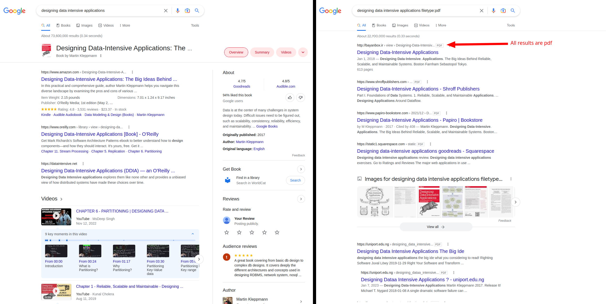
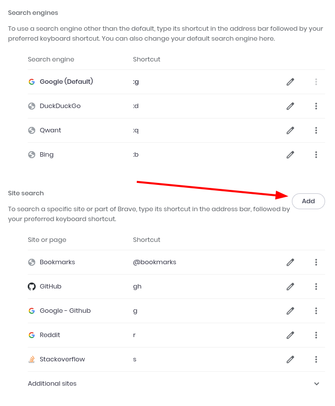
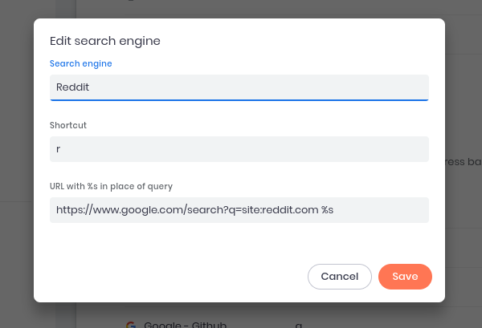
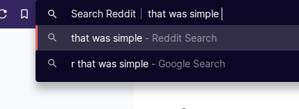

I'm sure you probably already know about Google dorking (also called Google Hacking). For those who don't know what it is - it's a way to narrow down your google search by using filters provided by Google. Example: if you are searching for a pdf of a book, you can narrow down your search using the `filetype:pdf` filter. If you want your search to only include a particular site you can use the `site:<sitename.com>`.

_Without the filetype filter_

I frequently use the `site` filter - mostly with reddit `site:reddit.com`. Ocassionally I also use it with `stackoverflow.com` and `github.com`. However, it's not quite pleasant to type it out!

I just found out about a shortcut you can use to avoid this typing. I've only tried this on chrome-based browser (Brave in particular) but I'm sure there's a similar feature in Firefox also.

## Steps to configure shortcuts

<div class="table-of-contents">

1. [Right click on the address bar](#address-bar)
2. ["**Add**" a new site search](#add)
3. [Configure shortcut](#configure)

</div>

1. Right click on the address bar. Click on the "**Manage search engines & Site search**" context menu. <a name="address-bar"></a>

_Right click on the address bar_

2. You should see the "Search engine" & "Site search" sections. Click on "**Add**" in the site search section. <a name="add"></a>

_Add new site search_

3. Finally just fill in the form <a name="configure"></a>

Here's an example of my shortcut for reddit site filter in google search.

_Reddit site filter_

```
https://www.google.com/search?q=site:reddit.com %s
```

</br>

## Using the shortcuts

This is my favorite part. Usually shortcuts involve chording keys. There's at least 2 keys involved and one's probably the `Ctrl` key. However, to use the site search shortcut you just need to type in the shortcut key that you configured and simply press space!

_Using site search shortcut_

## Search Engine

You can follow the same procedure to add shortcuts for search engines also. I don't really use this because Google works fine for me. But in case you need to search with DuckDuckGo, for example, you have the option to set a shortcut.
