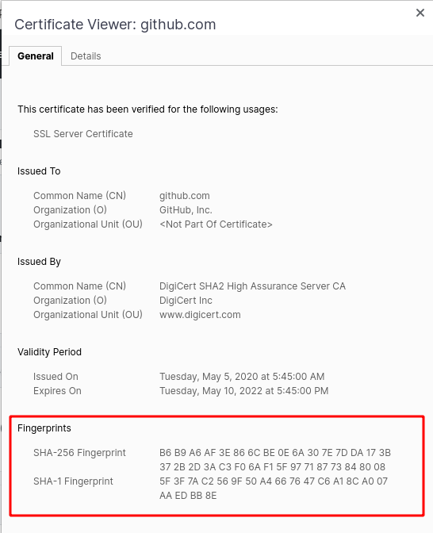
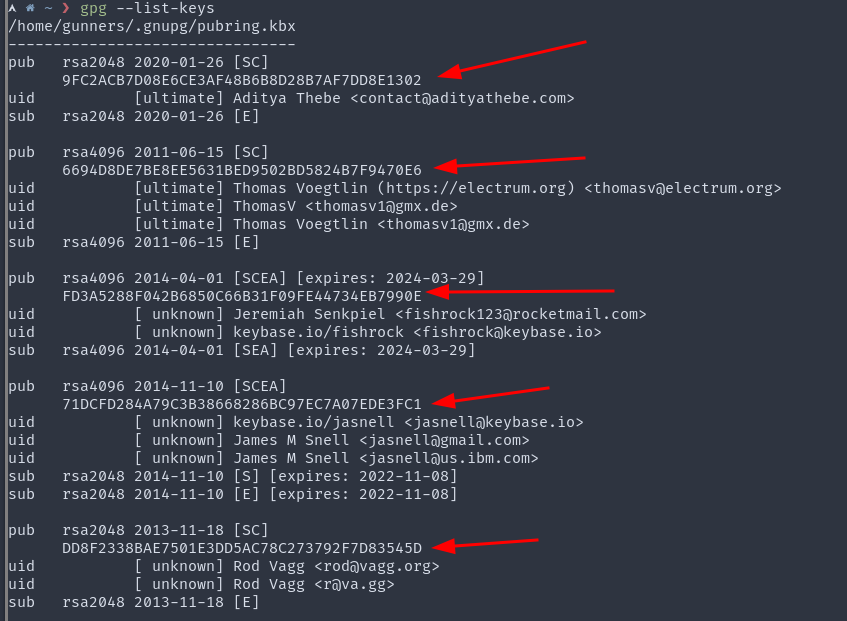
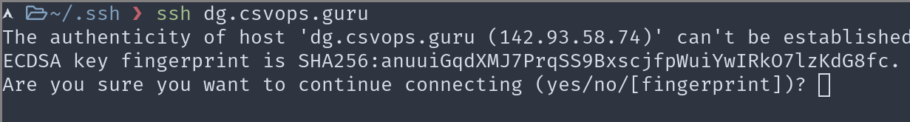

Digital fingerprint, as complex as it sounds, is simply just the digest(output) of a hash function. Example:

```bash
printf 'adityathebe' | sha256sum
62eb9a06b678df7d48eb59929ab07a9858ed940ddfd3d8596482458133babe67
```

There you go - we just created a digital fingerprint of the string 'adityathebe'. As simple as that!

The above command may not run on a Windows machine or on MacOS. In that case, you can try online tools to get the sha256 hash - https://emn178.github.io/online-tools/sha256.html

It's important to mention what hash function was used to generate the fingerprint as we can generate different fingerprints for the same data with other hash functions.

```bash
printf 'adityathebe' | sha1sum
7d6fa418a5cc416fc8e70551b4ea86fbbd9456d3

printf 'adityathebe' | md5sum
0673288a42e614ad56a7da35e5c88153
```

There are many more hash functions in addition to these.

## Why create digital fingerprints ?

Digital fingerprints are created to ensure Intigrity. Let's imagine I have a will that says I want to donate all of my bitcoins to John Mayer. Here's the `will.txt` file where I state just that

```txt
I declare that I sign and execute this instrument as my last will
to grant all of my million bitcoins to John Mayer.
```

With that file in hand, I can create a digital fingerprint using sha256.

```bash
> sha256sum will.txt

7350c9d592a9b8a514efdf050c4ef658f21f497dab2ba4c1b99d8380da9bfcab
```

I submit my will along with the fingeprint to the executor.

Now comes sneaky Kanye. Kanye hacks into the executor's system and then changes the will.

```txt
I declare that I sign and execute this instrument as my last will
to grant all of my million bitcoins to Kanye West.
```

_Kanye having the day of his life_

But hold on, the executor can just create the fingerprint again and check if it matches the fingerprint I provided.

```bash
> sha256sum will.txt

a3571c15b7e5436d7483d26bf01383cf75d2227b298853818c0b8a540d5b2a0b
```

The two fingerprints do not match. And that's how the executor will know the Will was tampered !

_Kanye in shambles_

---

Now, of course, if Kanye was smart he would have changed the fingerprint as well. All he had to do was regenerate the sha256 hash of the modified will.txt file and then saved that as the fingerprint.txt file.

Authentication is not provided by digital fingerprints. Anyone can modify the data and the corresponding fingerprint. There's no way of ensuring that the fingerprint was created by the owner. Due to this reason, digital fingerprints should not be used for security purposes.

This is where digital signatures come in play. Digital signatures offer intrigrity along with authentication.

Read about Digital Signatures on my other blog post.

## Digital Fingerprints of Public Keys

Digital fingerprints are extensively used in Public-key cryptography. Public keys in general are very length. You can find my PGP public key [here](https://www.adityathebe.com/public.pgp) which is around 3000 characters long.

How would you verify that you actually have my correct public keys? Well you can simply check each character one by one or instead compare the digital fingerprint of the public key which is far less tedious. Here's the sha256 digital signature of my public key `76070d7abecae498c02ed11d0f7c41bc9ca97a7108fea93edf3d98386d930e45`

#### 1. Github's SSL Fingerprint

You can visit github.com and then click on the lock screen in the address bar to see the certificates. There you can see the sha256 and sha1 digital fingerprints of Github's SSL public key.



#### 2. Fingerprints in GPG

GPG, an encryption tool, also shows the digital fingerprints of the public keys instead of the entire public key.



#### 3. Fingerprints in SSH

When you try to ssh into a new system, the host system's digital fingerprint will be displayed on the prompt.


