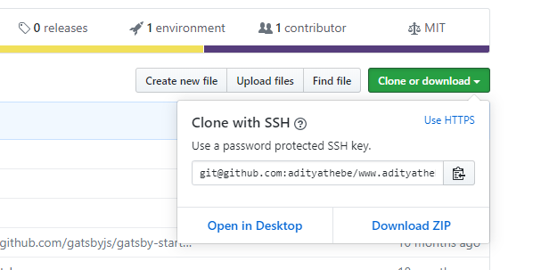

The reason I like to use ssh over https is because I hate to provide my username and password on every remote actions like `git clone`, `git pull`, or `git push`. Sure, I could use a credential manager but why would I do that when I can simply configure ssh keys ?

On the contrary, [Github actually suggest using https over ssh](https://help.github.com/en/github/using-git/which-remote-url-should-i-use) mainly because it is the easiest to set up for novice users and https is almost never blocked by firewalls.

## 1. Generate ssh keys

First thing first - make sure you have a `~/.ssh` directory.

```sh
mkdir ~/.ssh
```

This is the file in which we'll store our keys and configuration for ssh.

Create an ssh key pair with `ssh-keygen` command. It'll ask you for the key name - I'd suggest using `id_rsa_github` just to stay consistent with this post.

```sh
cd ~/.ssh && ssh-keygen -t rsa -b 4096 -C "<your_email>"
```

```output
Generating public/private rsa key pair.
Enter file in which to save the key (/home/gunners/.ssh/id_rsa): id_rsa_github
Enter passphrase (empty for no passphrase):
Enter same passphrase again:
```

This command generates two files: `id_rsa_github` and `id_rsa_github.pub` in your `~/.ssh` directory. One is a public key which you should upload on Github and the other is a private key that you should keep on your local computer.

## 2. Upload the public key to Github.

Go to [https://github.com/settings/keys](https://github.com/settings/keys) and click on **New SSH Key**.

Add a suitable title and copy all the content from the `id_rsa_github.pub` file to the key section. The pub file is just a simple plain text file. You can open it with any text editor like notepad, sublime text, gedit, etc...

## 3. Add ssh-keys

If you try to perform some remote actions, like cloning a repo, you'll get an error like this.

```sh
git clone git@github.com:adityathebe/dotfiles.git
```

```output
Cloning into 'dotfiles'...
git@github.com: Permission denied (publickey).
fatal: Could not read from remote repository.

Please make sure you have the correct access rights
and the repository exists.
```

This is because git does not know where to look for the ssh key (Remember the `id_rsa_github` key we generated in ~/.ssh directory?)

So to let git know that you do indeed have an ssh key use these two commands

```sh
eval "$(ssh-agent -s)"
```

```sh
ssh-add ~/.ssh/id_rsa_github
```

Now you can perform any git remote actions.

However, if you close the current terminal session and try to clone again, you'll get the same error.

You could add the keys manually again with the ssh-add command but I'll show you a much elegant way.

### Permanently add the ssh-keys

Now make sure you have the ~/.ssh/config file. If it's not there you can simply create it

```sh
touch ~/.ssh/config
```

It's important the config file has it's permission set to 600.

```sh
chmod 600 ~/.ssh/config
```

This config file is read by the ssh command on every execution.

Add the following lines to the ~/.ssh/config file.

```
Host github.com
  User git
  IdentityFile ~/.ssh/id_rsa_github
```

And that's it !

## Beware !!

You might still be prompted for your password. This happens if you initially cloned the repository with an https url. So make sure the remote origin url is an ssh url.

#### 1. Check your existing remote's urls

```sh
git remote -v
```

```output
origin  https://github.com/adityathebe/www.adityathebe.com.git (fetch)
origin  https://github.com/adityathebe/www.adityathebe.com.git (push)
```

#### 2. Change your remote's URL from HTTPS to SSH

Grab the ssh clone url from Github



```sh
git remote set-url origin git@github.com:adityathebe/www.adityathebe.com.git
```

#### 3. Verify

```sh
git remote -v
```

```output
origin  git@github.com:adityathebe/www.adityathebe.com.git (fetch)
origin  git@github.com:adityathebe/www.adityathebe.com.git (push)
```

Be sure to clone with ssh from now on :)
