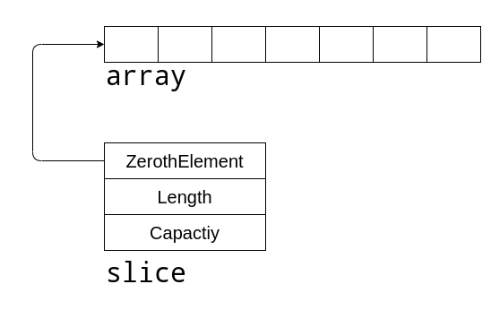
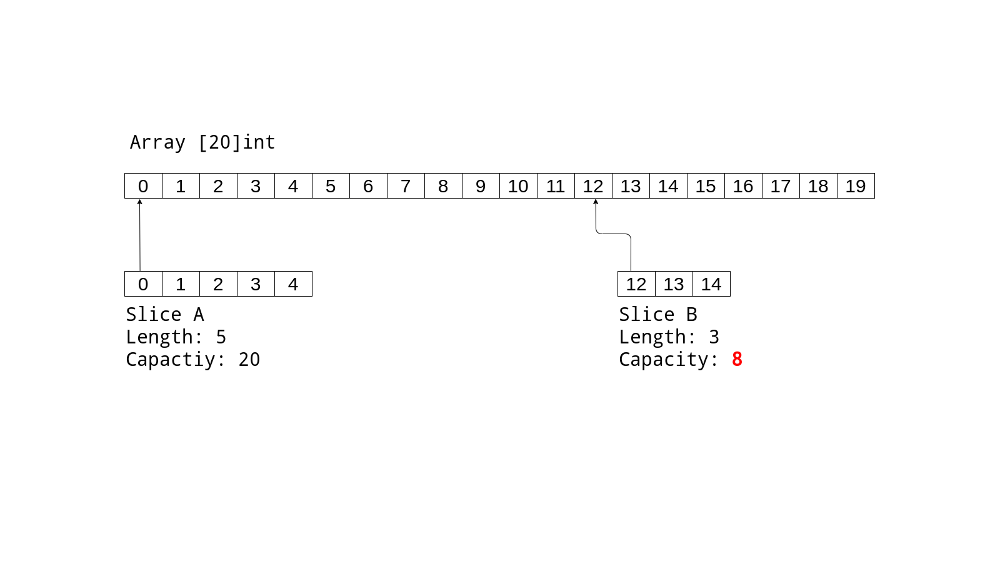

I've started to use a lot of Go recently. I just love the language! Seriously, I don't think I have felt this much love for any other language!

I'm ashamed to admit that it was up until yesterday that I didn't quite understand the behavior and implementations of Slices in Go. There are already so many great blog posts out there that I don't think I have anything to add. However, that shouldn't stop me from writing another blog post on the subject because with that mindset my blog wouldn't even exist. So in addition to the hundred articles out there on Go Slices, here's the 101th. 😁

## Slices

Slices are flexible and they should be preferred over arrays whenever possible. The most important thing to note is that slices have Arrays underneath them. I like to think of slices as the frontend for arrays.

Visualizing a slice as a `struct` as shown below can be helpful

```go
type sliceHeader struct {
    Length        int
    Capacity      int
    ZerothElement *byte
}
```

`ZerothElement` in sliceHeader points to the first* element of the array underneath. It doesn't necessarily have to point to the *first\* element itself as we will see later.



## Slice Capacity

One thing that just seemed a little off to me in the beginning was the need for capacity in slices. How is it any different from the length of the slice itself ? None of the languages that I was familiar with had this concept of length and capacity. Almost always, the length was sufficient to define the size of an array or a list or whatever you want to call it.

The capacity of a slice can be set when creating the slice with the `make` function. If no capacity is supplied then it defaults to the length of the slice.

```go
make([]Type, length, capacity)
make([]Type, length)
```

To put it simply, the capacity of a slice is the size of its underlying array\*. _It's a little complicated than that. We'll cover it in a minute_.

Let's start by making a new slice with a predefined capacity.

```go
mySlice := make([]int, 2, 5)
// [0, 0]
```

This code will internally create an array of integers of size 5. However, the slice will have access to only the first two elements of the array since its length is 2. If we try to access the third element then we get a runtime error.

```go
mySlice[2]
// panic: runtime error: index out of range [2] with length 2
```

Now consider that we need to add a third element to `mySlice`.

```go
myNewSlice := append(mySlice, 10)
// [0, 0, 10]
```

Take a moment to think and tell me this - did the `append` function create a new array?

**It didn't !**

What actually happened here is we created a new slice with an incremented length of `3` and the new element `10` was inserted into the array. But this new slice still points to the same array. We have a situation where both `mySlice` and `myNewSlice` are pointing to the same array. I think that's pretty cool.

> Multiple slices can point to the same array

Now, of course, this was only possible because the array underneath actually had room for growth. If initially, we had set the capacity of `mySlice` to `2` then the `append` function would have no choice other than to create a new array. As an exercise, you can try appending more than 10 items to the slice and observer the behavior.

Let's verify this in code

```go
mySlice := make([]int, 2, 5)
fmt.Println(mySlice)
fmt.Printf("mySlice's Address: %p\n", mySlice) // 0xc000100030

myNewSlice := append(mySlice, 10)
fmt.Println(myNewSlice)
fmt.Printf("myNewSlice's Address: %p\n", mySlice) // 0xc000100030
```

You'll see that the first elements of the two slices still point to the same address.

### A closer look at the Slice Capacity

Earlier when I said "The capacity of a slice is the size of its underlying array", I lied. It can be the case but it's not quite accurate. Let's take a look at the example below



We have that two slices `sliceA` and `sliceB` and both of them have a pointer to the same array but they represent different **"pieces"** of the array. `sliceA` represents the first 5 elements of the array while `sliceB` represents the 3 elements starting from the 12th index.

If you noticed, the capacity of `sliceB` is actually not 20 - it's 8 even though the underlying array has size 20. In order to measure the capacity of a slice, not only do we need to know the size of the underlying array we also need to know where in the array the slice begins. So a more accurate definition of capacity would be

> The Capacity of a slice is equal to the length of the underlying array, minus the index in the array of the first element of the slice (zero in this case).

Let's verify this in code

```go
package main

import "fmt"

func main() {
	parentSlice := []int{0, 1, 2, 3, 4, 5, 6, 7, 8, 9, 10, 11, 12, 13, 14, 15, 16, 17, 18, 19}
	fmt.Printf("Parent Slice: %v\n", parentSlice)
	fmt.Printf("Parent Slice's Address: %p\n\n", parentSlice)

	sliceA := parentSlice[:5]
	fmt.Printf("sliceA: %v\n", sliceA)
	fmt.Printf("sliceA's Address: %p\n", sliceA)
	fmt.Printf("sliceA's Length %d\n", len(sliceA))
	fmt.Printf("sliceA's Capacity %d\n\n", cap(sliceA))

	sliceB := parentSlice[12:15]
	fmt.Printf("sliceB: %v\n", sliceB)
	fmt.Printf("sliceB's Address: %p\n", sliceB)
	fmt.Printf("sliceB's Length %d\n", len(sliceB))
	fmt.Printf("sliceB's Capacity %d", cap(sliceB))
}
```

We start by creating a `parentSlice` and then slicing it to create two new slices `sliceA` and `sliceB`. If you run the program above you can verify by checking the addresses that all the 3 slices are in fact pointing to the same array.

```
Parent Slice: [0 1 2 3 4 5 6 7 8 9 10 11 12 13 14 15 16 17 18 19]
Parent Slice's Address: 0xc000100000

sliceA: [0 1 2 3 4]
sliceA's Address: 0xc000100000
sliceA's Length 5
sliceA's Capacity 20

sliceB: [12 13 14]
sliceB's Address: 0xc000100060
sliceB's Length 3
sliceB's Capacity 8
```

But hold on, sliceB's address is different than the other two. That's because it's showing the address of the 12th element and not the first element. We can verify that by printing the address of the 12th element of the `parentSlice`

```go
fmt.Printf("Parent Slice's 12th element address %p", &parentSlice[12])
// 0xc000100060
```

This address should match the address of sliceB's first element.

## References

- [Arrays vs Slices](https://www.godesignpatterns.com/2014/05/arrays-vs-slices.html)
- [Arrays, slices (and strings): The mechanics of 'append'](https://blog.golang.org/slices)
- [Go Slices: usage and internals](https://blog.golang.org/slices-intro)
- [What is the point in setting a slice's capacity?](https://stackoverflow.com/questions/45423667/what-is-the-point-in-setting-a-slices-capacity)
