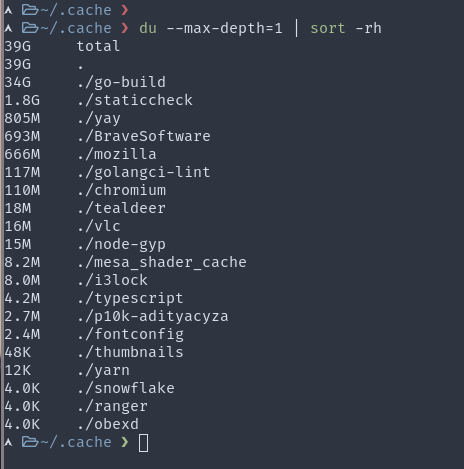
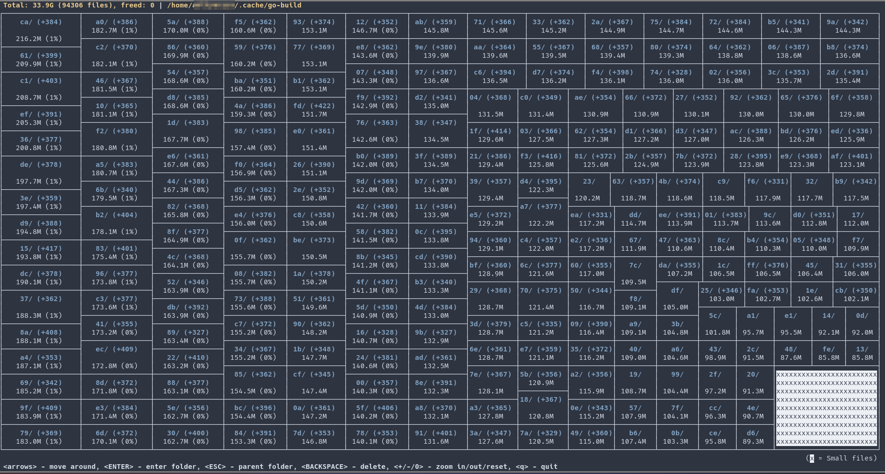

## Useless Anecdote

I realized that my storage was quickly being filled out. I had recently added a new user to my system so I thought maybe that accounted for the sudden spike in storage usage. When I finally checked what was actually going on, I saw that my Go build cache directory was taking up about 35GB!



### Locate Go build cache directory

The default location for build cache data is a directory named **go-build** in the standard user cache directory for the current operating system. For me, on Linux, it is `~/.cache/go-build/`. You can find out yours using this command

```bash
go env GOCACHE
```

Go also conveniently allows you to modify the cache location using the environment variable `GOCACHE`

### Check disk usage of Go build cache

Here's a quick one-liner to see the disk usage of the build cache

```bash
du -hs $(go env GOCACHE)
```

### Content of Go build cache



Finally, to address the question of this article, you can run this command

```bash
go clean --cache
```

This command removes all the subdirectories inside go-build directory and leaves out just two files

- README
- trim.txt

The trim.txt file stores a Unix timestamp. I'm guessing it's the timestamp of the time you run the clean command.

## References

- https://golang.org/pkg/cmd/go/#hdr-Build_and_test_caching
