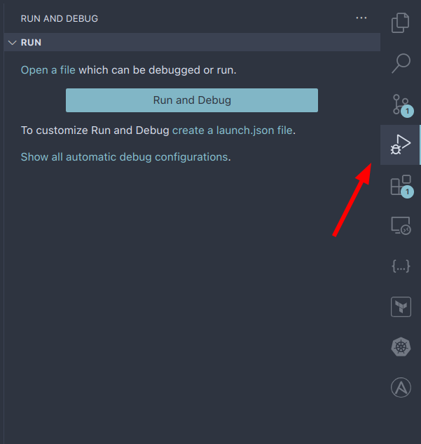
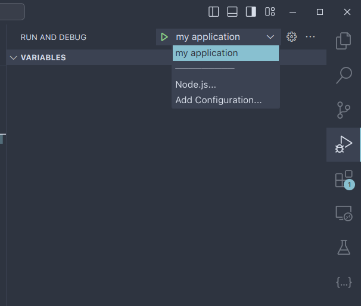
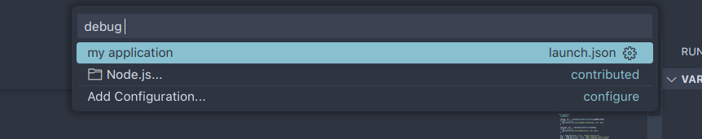

VS Code comes with a native debugger by default. If you have Go's debugger `delve` installed on your system
then you can simply go to the "Run and Debug" view and press the "Run and Debug" button. VS Code will then start
your program and attach the debugger.



This approach serves fine for simple use cases. However, it's likely that your application needs some arguments or flags or environement variables. To pass those in, you can create a `.launch.json` file for vscode to configure.

## Create `launch.json` file

The `launch.json` file in VS Code is a configuration file that defines how the debugger should run your application. It allows you to specify various settings such as the program to debug, command-line arguments, environment variables, and other debug-specific options. You can create the file manually in `.vscode/launch.json` or you can let VS Code create it for you.

Besides the "Run and Debug" button you should be able to see a `create a launch.json file` link. Select "Go: Launch Package" option and the file should be created.

If your application accepts a `--config` flag and an `ENV` environment variable, you can configure your `launch.json` file as follows

```json
{
  // Use IntelliSense to learn about possible attributes.
  // Hover to view descriptions of existing attributes.
  // For more information, visit: https://go.microsoft.com/fwlink/?linkid=830387
  "version": "0.2.0",
  "configurations": [
    {
      "name": "Launch Package",
      "type": "go",
      "request": "launch",
      "mode": "auto",
      "program": "${fileDirname}",
      "args": ["--config", "/tmp/config.yaml"],
      "env": {
        "ENV": "dev"
      }
    }
  ]
}
```

## Attach debugger to a running process

I personally do not prefer to run applications from VS Code's debugger. Instead, I run all the applications in the terminal and then attach the debugger to the running process.

Let's setup `launch.json` to attach the debugger to a running process. You can delete the `launch.json` file and recreate it again. This time, choose the "Go: Attach to Local Process" option.

```json
{
  // Use IntelliSense to learn about possible attributes.
  // Hover to view descriptions of existing attributes.
  // For more information, visit: https://go.microsoft.com/fwlink/?linkid=830387
  "version": "0.2.0",
  "configurations": [
    {
      "name": "Attach to Process",
      "type": "go",
      "request": "attach",
      "mode": "local",
      "processId": 0
    }
  ]
}
```

This is the default configuration generated by VS Code. The only change we will need to make is the `processId` field. While it's named `processId`, it can also take in the name of the process. Say you're running a go binary named 'my-application', you can set the `processId` to `my-application`. We'll also change the configuration name to 'my application'.

```json
{
  // Use IntelliSense to learn about possible attributes.
  // Hover to view descriptions of existing attributes.
  // For more information, visit: https://go.microsoft.com/fwlink/?linkid=830387
  "version": "0.2.0",
  "configurations": [
    {
      "name": "my application",
      "type": "go",
      "request": "attach",
      "mode": "local",
      "processId": "my-application"
    }
  ]
}
```

That's all the configuration we need to do. Now, if you go to the "Run and Debug" view again, you'll see "my application" in the dropdown.



Select it and press the play button to it's left.

Personally, I use the keyboard shortcut `Ctrl + p` to bring up File Search modal. And then I typ in debug and a <space> character.



## Things to keep in mind

### 1. Building go binary with debug symbols

For best debugging experience, you need to build the binary with debug symbols. This will turn of compiler optimizations and enable debug symbols.
To do so, you need to pass in the following flag

```sh
gcflags "all=-N -l"

# example
# go build -gcflags "all=-N -l" .
```

### 2. yama

By default, Linux kernel will not allow a process to attach to another process if it's not running as root. Due to this reason, attaching a debugger to our running application will not work.

To fix this, we need to modify the ptrace scope setting in the Linux kernel's Yama security module.
The ptrace scope setting determines which processes can use ptrace-based debugging tools on other processes. The value `0` sets it to the least restrictive mode, allowing any process to ptrace any other process.

```sh
sudo su
echo 0 > /proc/sys/kernel/yama/ptrace_scope
```

Setting this to 0 is often necessary for certain debugging scenarios, including attaching a debugger to a running process. However, it's important to note that this reduces system security, so it should be used cautiously and typically only in development environments.
