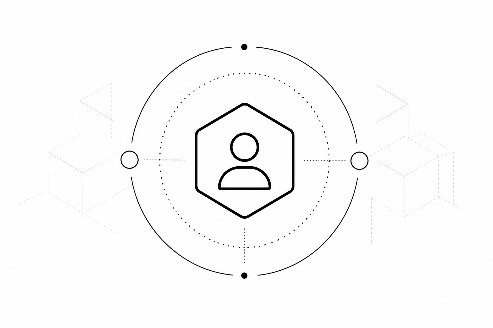

Service accounts in Kubernetes are the identity of the workload.
For every namespace, Kubernetes creates a service account by default and any pod that does not have an explicit service account assigned to it will run as the default service account for that namespace.



In this blog post we will see what permissions a default service account gets by default.
Let's start by creating a fresh namespace so we can clean up everything at the end.


```
kubectl create ns ktm
```

```output
namespace/ktm created
```

Then list all the service accounts in that namespace.

```sh
kubectl get serviceaccounts -n ktm
```

```output
NAME      SECRETS   AGE
default   0         6s
```

As you can see, the service account is automatically created.

We have not created any namespaced Roles or RoleBindings in this namespace yet.

```sh
kubectl get roles -n ktm
```

```output
No resources found in ktm namespace.
```

```sh
kubectl get rolebindings -n ktm
```

```output
No resources found in ktm namespace.
```

You would think that without a role bound to the service account, it would have literally no permission at all.
But that is not the case. Let's see what roles or permissions this service account has in effect in this namespace.

Let's create a short-lived token for this service account and use that to ask Kubernetes what permissions it can exercise in `ktm`.
This is based on a SelfSubjectRulesReview, so it is a useful view of the effective RBAC permissions, but not a complete audit of every possible authorizer decision.

```sh
TOKEN=$(kubectl create token default -n ktm)
APISERVER=$(kubectl config view --minify -o jsonpath='{.clusters[0].cluster.server}')
```

```sh
KUBECONFIG=/dev/null kubectl auth can-i --list -n ktm \
  --server="$APISERVER" \
  --token="$TOKEN" \
  --insecure-skip-tls-verify=true
```

```output
Resources                                       Non-Resource URLs                      Resource Names   Verbs
selfsubjectreviews.authentication.k8s.io        []                                     []               [create]
selfsubjectaccessreviews.authorization.k8s.io   []                                     []               [create]
selfsubjectrulesreviews.authorization.k8s.io    []                                     []               [create]
                                                [/.well-known/openid-configuration/]   []               [get]
                                                [/.well-known/openid-configuration]    []               [get]
                                                [/api/*]                               []               [get]
                                                [/api]                                 []               [get]
                                                [/apis/*]                              []               [get]
                                                [/apis]                                []               [get]
                                                [/healthz]                             []               [get]
                                                [/healthz]                             []               [get]
                                                [/livez]                               []               [get]
                                                [/livez]                               []               [get]
                                                [/openapi/*]                           []               [get]
                                                [/openapi]                             []               [get]
                                                [/openid/v1/jwks/]                     []               [get]
                                                [/openid/v1/jwks]                      []               [get]
                                                [/readyz]                              []               [get]
                                                [/readyz]                              []               [get]
                                                [/version/]                            []               [get]
                                                [/version]                             []               [get]
```

So where is the service account getting these permissions from?

The reason is that when the service account token is authenticated, Kubernetes identifies it as `system:serviceaccount:ktm:default` and includes a set of default groups in the authenticated identity.
RBAC then grants permissions to those groups through default ClusterRoleBindings.

You can view this by running `whoami` with the service account's token.

Note: `KUBECONFIG=/dev/null` points `kubectl` at an empty kubeconfig, so this request uses the token passed with `--token` instead of credentials from your normal kubeconfig.

```sh
KUBECONFIG=/dev/null kubectl auth whoami \
  --server="$APISERVER" \
  --token="$TOKEN" \
  --insecure-skip-tls-verify=true
```

```output
Username                                            system:serviceaccount:ktm:default
UID                                                 9d5ede86-5713-4b9f-abe5-a06610c40958
Groups                                              [system:serviceaccounts system:serviceaccounts:ktm system:authenticated]
Extra: authentication.kubernetes.io/credential-id   [JTI=c333c908-a716-46a3-994a-ee6dfe0a2255]
```

Well there it is. Three groups — `system:serviceaccounts`, `system:serviceaccounts:ktm`, and `system:authenticated` — are included in the authenticated identity for the service account.

These groups are not coming from a `groups` claim in the service account JWT itself.
They are hardcoded into Kubernetes' service account authentication logic.

In the Kubernetes source code, the service account identity is converted into a `user.Info` like this:

```go
info := &user.DefaultInfo{
    Name:   MakeUsername(sa.Namespace, sa.Name),
    UID:    sa.UID,
    Groups: MakeGroupNames(sa.Namespace),
}
```

[`MakeGroupNames`](https://github.com/kubernetes/kubernetes/blob/865560c3d264865c2cf7e86863feb220e7848bba/staging/src/k8s.io/apiserver/pkg/authentication/serviceaccount/util.go#L111) returns the service account groups, such as `system:serviceaccounts` and `system:serviceaccounts:<namespace>`.
Separately, the API server adds `system:authenticated` for successfully authenticated requests.

In a default Kubernetes cluster, some of these groups are subjects of default ClusterRoleBindings: `system:authenticated` is bound to `system:discovery`, `system:basic-user`, and `system:public-info-viewer`, while `system:serviceaccounts` is bound to `system:service-account-issuer-discovery`.

```sh
kubectl get clusterrolebindings system:discovery -o yaml
```

```yaml
apiVersion: rbac.authorization.k8s.io/v1
kind: ClusterRoleBinding
metadata:
  annotations:
    rbac.authorization.kubernetes.io/autoupdate: "true"
  creationTimestamp: "2024-01-28T06:22:41Z"
  labels:
    kubernetes.io/bootstrapping: rbac-defaults
  name: system:discovery
  resourceVersion: "200"
  uid: 6b22a758-6fd0-4348-a241-ad6c1ba36211
roleRef:
  apiGroup: rbac.authorization.k8s.io
  kind: ClusterRole
  name: system:discovery
subjects:
- apiGroup: rbac.authorization.k8s.io
  kind: Group
  name: system:authenticated
```
