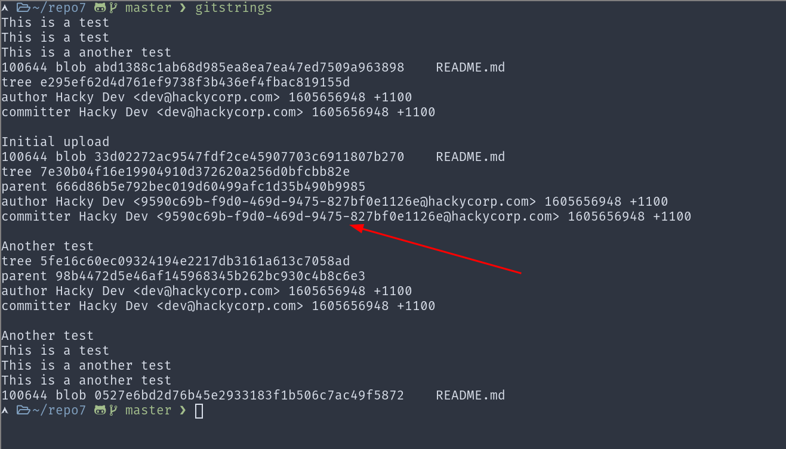
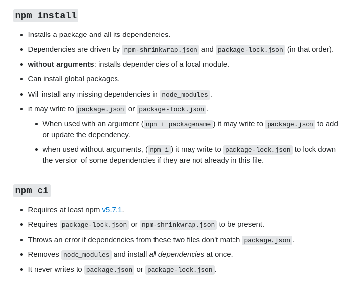

<div class="table-of-contents">

## Table of Contents

1. [Find the files in a git repository that have changed the most](#git-most-changed-file)
2. [List all the strings in a git repository](#git-strings)
3. [NPM install that respects package-lock.json](#npm-ci)

</div>

## Find the files in a git repository that have changed the most <a name="git-most-changed-file"></a>

With a few CLI tools along with the git `log` command, you can see the files that have changed the most over a certain time period.

I've set up a ZSH function in my `.zshrc` file

```bash
gitchangehist() {
  git log --numstat |
    awk '/^[0-9-]+/{ print $NF}' |
    sort |
    uniq -c |
    sort -nr |
    head
}
```

I ran this on my website's codebase and here's the result

```sh
gitchangehist
```
```output
37 src/components/Layout/layout.css
31 gatsby-config.js
23 package.json
20 src/templates/post.css
19 yarn.lock
19 src/pages/index.js
14 content/posts/twitter-bot-tutorial-nodejs/index.md
12 src/pages/portfolio.js
11 src/components/Portfolio/Project.css
10 content/posts/what-does-it-mean-to-own-a-bitcoin/index.md
```

Git provides a convenient way to limit commits with the `--since` option.

```
--since=<date>, --after=<date>
    Show commits more recent than a specific date.
```

You can use it like this to pass in a time frame

```bash
git log --since 1.year.ago
git log --since 1.month.ago
```

There are also other interesting options like `--author` and `--grep`.

## List all the strings inside a git repository <a name="git-strings"></a>

This is probably my favorite git trick provided by the awesome [@TomNomNom](https://twitter.com/TomNomNom)

```
gitstrings() {
  # Print all the strings in .git/objects/pack
  # Credits to tomnomnom - https://twitter.com/tomnomnom/status/1133345832688857095
  {
    find .git/objects/pack/ -name "*.idx" | while read i; do git show-index <"$i" | awk '{print $2}'; done
    find .git/objects/ -type f | grep -v '/pack/' | awk -F'/' '{print $(NF-1)$NF}'
  } | while read o; do git cat-file -p $o; done
}

```

This one-liner will find all the strings in a git repo and just spit it out to the stdout. It's super useful especially to bug-bounty hunters to look for any leaked credentials or API keys. Sometimes developers commit confidential keys and then make another commit to remove them but git stores the entire history and this one-liner will help you find them.

I used this trick to basically glide through the [Recon Badge](https://pentesterlab.com/badges/recon) in PentesterLab.



You can use interesting grep patterns to find some juicy stuff.

## Deterministic NPM install

NodeJS' package manager `npm` keeps track of the dependency graph (the dependencies of the main dependencies and their dependencies and so on) in a `package-lock.json` file. This file is essential to have consistent versions of the dependencies. The next time we need to install dependencies, this file should help us get the right versions.

Sounds good right? Nope. The command, `npm install`, that most of us use, does not use the lock file at all! You may have noticed that when you run `npm install` the lock file gets changed. If a dependency is not in the `package-lock.json` it will be added by `npm install`.

The command you want to use is `npm ci`. It's named after **Continuous Integration**. If any dependencies are missing or have incompatible versions, it will throw an error.


_Source: https://stackoverflow.com/a/53325242/6199444_

In my internship, I had to work on an Angular project but I just couldn't make it run. I probably should have used `ci` instead of `install` 😁.
