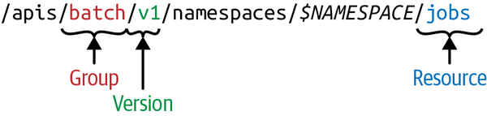

I learn new things about Kubernetes everyday. This is where I'll note them down and keep it updated.

## Labels Vs Annotations

Labels and annotations can appear very similar as they are both key-value metadata attached to a Kubernetes object.
However, they differ in convention in how they are used.

**Labels** are constrained key-value pairs used for _identifying_, _grouping_, and _selecting_ objects. They are commonly used by Kubernetes selectors.
**Annotations** on the other hand are key-value pairs meant to store non-identifying metadata for other tools, controllers, or external systems.

**Examples:**

ReplicaSets use labels on the pods to select which pods they manage.
Services use labels on the pods to determine which pods should receive traffic.

The NGINX Ingress Controller uses annotations for configuration such as timeouts and maximum body size.
Tools like config reloaders may also watch objects with specific annotations.

## Logs of the Previous Container

Container logs are stored on the node running the pod.
`kubectl logs` command hits the kubelet thats responsible for the pod and exposes the logs.

If a container restarts then a new log file is created for that new container by the container runtime.
Kubernetes allows accessing the logs of the current container and the immediately previous terminated container.

```sh
kubectl logs nginx --previous
```

Older logs files are subject eviction

## Liveness vs Readiness Probes

A liveness probe answers whether the container is stuck and should be restarted.
If a container fails the liveness check, the kubelet kills it and the pod's `restartPolicy` determines whether it is restarted.

Readiness on the other hand signals whether the container is ready to accept requests.
On readiness failure, the pod is removed from Service endpoints/EndpointSlices, but the container is **NOT** restarted.

An application's liveness should be as simple as

```pseudo
GET /livez -> 200 OK if the process can respond
```

Whereas readiness may check dependencies required to serve traffic:

```pseudo
GET /readyz -> 200 OK only if required dependencies, such as the database, are reachable
```

## What are Hostpath Volumes for?

Hostpath volumes allow a container to access filesystem of the host node.
It is discouraged to use hostpath for application data.

Hostpath volumes are mainly used for accessing node-scoped resources.
The workload's job is to interact with that specific node (its files, sockets, devices, kernel), so being pinned to the node and seeing its real filesystem is the whole point.

**Examples:**

Monitoring agents and log shippers mounting `/proc`, `/sys`, `/var/log`, etc.

A CNI plugin writes config to `/etc/cni/net.d`.

## Kubectl Commands

I'm only learning about this command after more than 3 years of using kubernetes.

### diff

```sh
kubectl diff -f fixtures/plugins/golang.yaml
```

```output
diff -u -N /var/folders/6c/1xcmj9z9523bn3gkh2mk530r0000gn/T/LIVE-1476133807/mission-control.flanksource.com.v1.Plugin.mc.golang /var/folders/6c/1xcmj9z9523bn3gkh2mk530r0000gn/T/MERGED-246988991/mission-control.flanksource.com.v1.Plugin.mc.golang
--- /var/folders/6c/1xcmj9z9523bn3gkh2mk530r0000gn/T/LIVE-1476133807/mission-control.flanksource.com.v1.Plugin.mc.golang        2026-05-21 21:28:42
+++ /var/folders/6c/1xcmj9z9523bn3gkh2mk530r0000gn/T/MERGED-246988991/mission-control.flanksource.com.v1.Plugin.mc.golang       2026-05-21 21:28:42
@@ -7,7 +7,7 @@
   creationTimestamp: "2026-05-19T14:52:05Z"
   finalizers:
   - plugin.mission-control.flanksource.com
-  generation: 5
+  generation: 6
   name: golang
   namespace: mc
   resourceVersion: "14831571"
@@ -27,7 +27,7 @@
     - Kubernetes::Job
     - Kubernetes::CronJob
   source: golang-mc-plugin
-  version: v1.0.0
+  version: v1.0.6
 status:
   conditions:
   - lastTransitionTime: "2026-05-19T14:52:47Z"
```

### proxy

```sh
kubectl proxy
```

```output
Starting to serve on 127.0.0.1:8001
```

This command creates a proxy for the API server. The proxy authenticates itself using kubeconfig credential.

## Secrets vs ConfigMap

Secrets and ConfigMap may seem interchangeable because they are used in similar manner

- API
- Volumes
- EnvVars

But the difference is that kubernetes does take some measures to protect the secrets.
Even though configmap and secrets are volume mounted, secrets are mounted using `tmpfs` so it never hits the nodes disk.

There are also provision to encrypt secrets at rest in etcd.

Also, secrets have various types like Opaque, TLS, basic auth and kubernetes API validates them.

## Replicaset images are practically immutable.

They are updatable but the Replicaset controller doesn't react to it.
Replicaset is only concerned with maintaining the number of desired replicas.

When a deployment creates a new rollout, a new corresponding replicaset is created.

## RuntimeClass

Kubernetes interacts with the container runtime on the node’s operating system via the Container Runtime Interface (CRI).
You can have more than one container runtime installed on your cluster.
If your workload needs stronger security guarantees, then you can choose to run in a Pod that uses a different container runtime.

```yaml
apiVersion: v1
kind: Pod
metadata:
  name: kuard
  labels:
    app: kuard
spec:
  runtimeClassName: firecracker
  containers:
    - image: gcr.io/kuar-demo/kuard-amd64:blue
      name: kuard
      ports:
        - containerPort: 8080
          name: http
          protocol: TCP
```

## SecurityContext runAsNonRoot vs runAsUser

What's the purpose of `runAsNonRoot` when you can specify a non-root user id via `runAsUser`.
`runAsNonRoot` is a guardrail.
When set, the container will fail to come up if run with a root user.

## Pod Admission Controllers

There's no single monolithic pod validator.
Instead, Kubernetes runs a chain of admission controllers, each handling one narrow concern on the pod spec.
They come in two flavors (some are both):

- Mutating — modify the incoming object. e.g. ServiceAccount injects a default service account; AlwaysPullImages rewrites imagePullPolicy to Always.
- Validating — accept or reject. e.g. ResourceQuota checks the pod's resource requests against the namespace quota.

## Watch Events vs Event Objects

Kubernetes has two kinds of events which are unfortunately both named events but they are very different.

**Watch Events** are transient notifications that the API server streams to listeners that are watching a particular resource type.
These events aren't stored anywhere, they are just a one-time notification that's sent to the listeners.
They stream messages like: ADDED, MODIFIED, DELETED along with the full snapshot of the object.

**Event Object** on the other hand is a "real" kubernetes resource like Pods or ConfigMaps, and is stored in etcd.
It's merely a way for controllers to log changes or events on an object.
Although, unlike other objects, these event objects have a TTL of 1 hour after which they get purged from etcd.
The TTL is controlled by the API server flag `--event-ttl`

## Resource Version vs Generation

`.metadata.resourceVersion` (string) and `.metadata.generation` (number) may appear as if they are both tracking the
version of the object at any given time and that's true but they are tracking versions of different things of the object.
When you update the object spec, both generation and resourceVersion is incremented.

However, the `generation` is only incremented when the spec changes. Whereas resourceVersion is incremented on any change
to the object - example: status, labels, annotations, etc.
The increment on generation is also very predictable - it's incremented by 1 when the spec changes.

`resourceVersion` is a string which contains a number but it doesn't have to be a number - it's just an implementation detail of etcd.
In etcd-backed clusters, the resourceVersion is commonly derived from the etcd revision, which advances whenever data changes in the cluster.
That means you can have an object with `resourceVersion: 1` and then the next change on that object could be `resourceVersion: 20`
because there were 19 other changes in the cluster.

### What are they for?

Why does kubernetes have two fields to track versions because it appears that resourceVersion alone should be enough.
Because they are intended for different purpose.

_resourceVersion_ is for optimisitc concurrency. Operators update the resource without obtaining a lock and and the API server
compares the resourceVersion in the udpate request with the resourceVersion in etcds and returns a conflict error if
the two do not match.

_generation_ is for controllers to catch up on the spec. Controllers often maintain `.status.observedGeneration` to record
which generation they last reconciled.
That's why it's always important to compare the two when looking at the status of an object, because if they don't match
you might get the wrong idea of where the object actually is.

## Kind vs Resource

Kind is the type of object that is returned by or received by Kubernetes API endpoints.
Many Kinds represent persisted objects stored in `etcd`, such as `Pod`,
`Deployment`, and `ConfigMap`, but not all Kinds are persisted.
Some are request/response or operational API types. For example, `Status`, `TokenReview`, `SubjectAccessReview`, and `Scale` are API object kinds,
but they are not normal top-level persisted workload/config objects like `Pod` or `Deployment`.

Resource, on the other hand, is the API-facing name used in REST paths. They are lowercased and usually plural.
Examples: `pods`, `deployments`, `services`.

`kubectl get pods` requests the `pods` resource, for example: `GET /api/v1/namespaces/default/pods`

### GroupVersionKind vs GroupVersionResource

A GroupVersionResource (GVR) uniquely defines an HTTP path.


_Fig: Programming Kubernetes Book_

A GroupVersionKind (GVK) uniquely defines a kind.
A cluster can have two kinds with the same name.
Example: The cluster bewlo has two `Node` kinds but they are under different group version.

```sh
kubectl api-resources | rg Node
```

```output
NAME                                SHORTNAMES        APIVERSION                               NAMESPACED   KIND
nodes                               no                v1                                       false        Node
nodes                               lhn               longhorn.io/v1beta2                      true         Node
```

### Rest Mapping

When a client needs to access an object identified by a GVK, it must determine which GVR serves that object type.
This process of mapping a GVK to a GVR is called REST mapping.

For example: `apps/v1, Kind=Deployment` maps to `apps/v1, Resource=deployments`

The GVR is then used to construct REST paths such as: `/apis/apps/v1/namespaces/default/deployments/nginx`

## Managed Fields & Server-side apply
