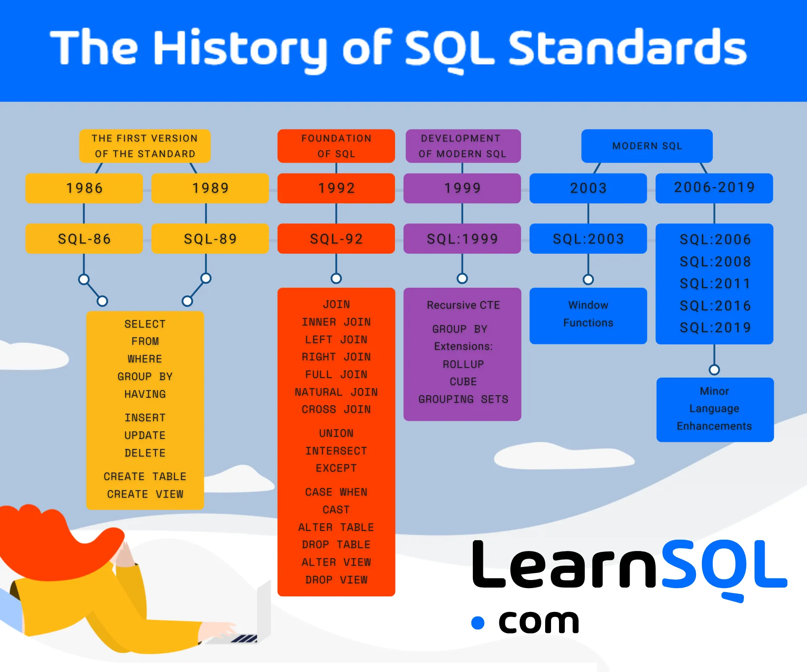

> Episode: https://postgres.fm/episodes/modern-sql/transcript

This was one of my favorite episodes of [postgres.fm](https://postgres.fm) - a podcast I regularly listen to.
The guest - [Markus Winand](https://winand.at/) - had such a fresh perspective on the mundane and conventional wisdom of SQL that it honestly shifted my perspective 
and also inspired me to learn some newer features.

Most of us think of SQL as a query language - I mean, its very name indicates that - however Markus presents a different view.
And his emphasis on SQL window functions has given me enough motivation to take them seriously.
I'd always seen them as this advanced feature I could probably live without. But the way Markus emphasized them made me realize I've been missing out on some seriously powerful tools. It's funny how sometimes it takes someone else's excitement about a seemingly ordinary topic to reignite your own curiosity about it.

## Flavors of SQL

- SQL has different flavors and most people do not know that.
- To most people, SQL means SQL 92.

<div class="section-notes">
I personally wasn't aware of this either.

SQL standard, formally known as ISO/IEC 9075, is maintained jointly by ISO and IEC.
The standard has core features that every conforming SQL vendors like PostgreSQL, MySQL, SQL Server must implement.
How the vendors implement those features are up to them.
There are also a set of optional features that the vendors may choose not to implement.
PostgreSQL, seems to be the one that is highly compliant with the SQL standard.

Here are some major SQL standards and their notable features:

- `SQL-92`: Introduced JOIN syntax, CASCADE operations, and foreign keys
- `SQL:1999`: Added triggers, recursive queries (WITH RECURSIVE), and regular expressions
- `SQL:2003`: Introduced Window functions, MERGE statement, and XML features
- `SQL:2016`: [Added JSON operations, temporal tables, and row pattern matching](https://modern-sql.com/blog/2017-06/whats-new-in-sql-2016)
- `SQL:2023`: Introduced property graph queries & JSON data types
</div>

## Modern SQL

- Modern SQL has features which are not rooted in the relational idea
  - Window functions
  - Recursive queries
  - JSON
- SQL 92 was almost feature complete. So it's difficult to convince people to use modern SQL.
- Why should people use modern SQL when classic SQL has been serving them fine?
  - Eg: With SQL 92, it was very common (almost required) to do self JOINs.
    - Self joins are complex & slow and Window functions are killers of self joins.
    - Window functions are more concise, clear, readable, writable, maintainable, and performant

> "The most undervalued feature of modern sql is, and always was, Window functions."
>
> \- Markus

<div class="section-notes">
My impression is that - modern sql is anything that has to do with more than just the relational stuff.
They also improve the language to do things, that may have been previously possible, but, in a more performant and concise way.
</div>


_https://learnsql.com/blog/history-of-sql-standards/_

## NULL handling

Modern SQL also offers various ways to handle NULL values in unique constraints. Example: here are two new
additions to `SQL:2023` regarding NULL value handling

- `IS DISTINCT FROM` is NULL safe comparison operator.
- `NULLS DISTINCT` deals with how nulls are handled in unique contraints.

  ```sql
  CREATE TABLE users (
      email TEXT UNIQUE NULLS NOT DISTINCT,
      backup_email TEXT UNIQUE NULLS NOT DISTINCT
  );
  ```

  Since Postgresql v15+, it's is now possible to have multiple rows with null values on a column with unique constraint.

<div class="section-notes">
I'm only learning that NULL values in SQL have some nasty qwirks.
Only yesterday, there was a blog post on NULL values in SQL floating around in various subreddits & Hackernews.
</div>

## Modern perspective on SQL

- People in ORM world have misconception of SQL.
  - SQL isn't just about relation anymore; not since 99.
  - A very popular ORM framework in JAVA is JPA. It stands for Java Persistence API. However, SQL isn't just about persistence. It doesn't "just" store data.

> "SQL isn't a query language; it's a transformation language. Look at CSS selectors - that's a query language.
> The focus is on transformation of data to answer a question at hand rather than to issue simple fetch queries."
>
> \- Markus

<div class="section-notes">
Absolutely loved this section. It really emphasises the power of SQL.
</div>

## Data Normalization

- Causes confusion among layman and new comers.
- Just try to figure out in which tables will the data feel comfortable in. Forget the scientific definitions of normalization levels.

<div class="section-notes">
Very much in agreement with this sentiment.

Normalization forms are highly emphasized in schools and I don't think they should be.
It's overwhelming to someone new to databases & learning all the normal forms and conversion between them is not something that a beginner should be spending their time on.
It's like learning all about OOPs and then writing your first hello world.

</div>

## What's new in `SQL:2023`

- Biggest & killer feature - Property Graph Queries (SQL/PGQ). This allows data in tables to be queried as if it were a graph database.
- JSON type

Read more here:

- https://modern-sql.com/standard/2023
- https://peter.eisentraut.org/blog/2023/04/04/sql-2023-is-finished-here-is-whats-new

## Building a mindset to use new features

Data types like `json`, `jsonb`, `boolean`, ... have 3 use cases

- Persistent schema. Eg: SQL 2016 didn't have a JSON data type for the schema but the operations on JSON practically meant JSON data types existed in SQL.
- During the transformation
  - eg: boolean data type is mainly used during transfomation in (WHERE, ON, WHEN clause of CASE) rather than in the schemas. MySQL doesn't even have a boolean type.
  - It's not coming from the disk and it's not going up to the client
- API Layer
  - where json can be very handy (json_array_agg)
  - we don't want normalization in API Layer (normalization is fine for the disk)

</br>