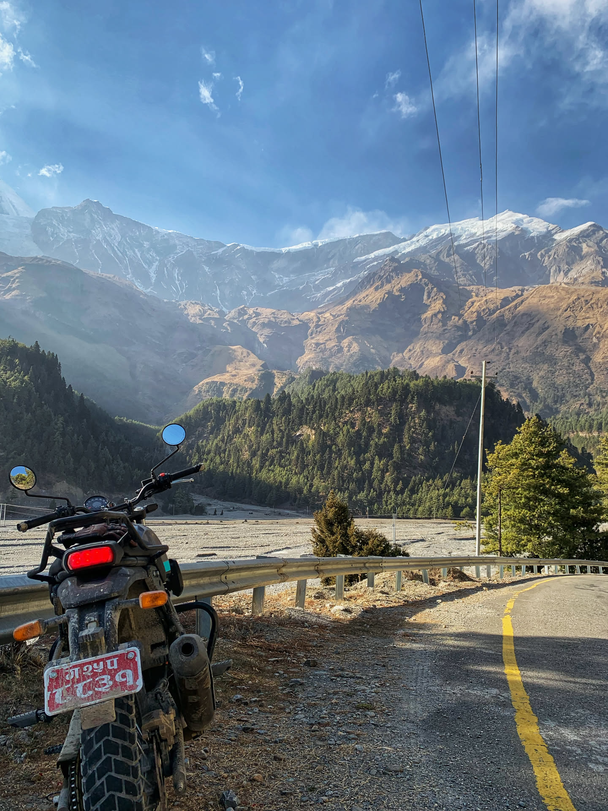

It was a trip planned for 5 days but unfortunately we had to cut it short.

_Thasang, Mustang (near Holiday Camp)_

Here's a very not-so-detailed itenerary.

| Day       | Time              | Location                  | Details                                             |
| --------- | ----------------- | ------------------------- | --------------------------------------------------- |
| **Feb 5** | 09:20am           | Left Pokhara              | Fuel: ₹2,250                                        |
|           | 10:20am           | Dimuwa                    | Traffic violation                                   |
|           | 10:50am - 01:00pm | Kushma                    | Food: ₹850 chicken rice                             |
|           | 01:25pm - 02:20pm | On the way to Beni        | Puncture                                            |
|           | 02:45pm           | Beni                      | Fuel: ₹510                                          |
|           | 03:25pm - 03:50pm | Tatopani                  |                                                     |
|           | 04:10pm - 04:20pm | Rupse Jharna              |                                                     |
|           | 04:30pm           | Ghasa                     | Police checking. Takes 2 minutes                    |
|           | 06:00pm           | Marpha                    | Room: ₹1,200; Food: ₹650 chicken rice               |
| **Feb 6** | 10:10am           | Reached Jomsom            | Food: ₹650 chicken rice                             |
|           | 12:10pm           | Dhumba Lake               | Coffee: ₹100; Entry fee: ₹30                        |
|           | 03:00pm           | Muktinath                 | Room: ₹2,000 (Dolma Inn)                            |
| **Feb 7** | 11:00am           | Reached Jomsom            | Breakfast at MoonLight Hotel. It was good.          |
|           | 12:40pm - 01:30pm | Chhusang                  | They register your vehicle if you cross this point. |
|           | 04:00pm           | Lete                      | Took a lot of pictures. Incredibly beautiful place. |
|           | 06:00pm           | Tatopani                  |                                                     |
|           | 08:10pm           | Kushma (The Cliff, Nepal) | Room with breakfast: ₹8,000, Bungee ₹9000           |

## Notes to Motorcycle Renters

- **Where to Rent:** Most bike rental shops are located in Hallanchowk, Lakeside. Nearly every store in the area, including barber shops and clothing stores, seem to have a few motorcycles available for rent.
- **Bike Condition:** The motorcycles are generally in good condition, with some having less than 1,000 km on the odometer.
- **Price Variation:** Rental prices vary significantly from shop to shop, so take the time to compare. For instance, we found an XPulse being offered for anywhere between Rs 2,400 and Rs 3,500 per day.
- **Pricing Based on Route:** The rental cost depends on your destination. If you're heading to Lower Mustang, expect different rates than for Upper Mustang. We paid Rs 18,000 for a 5-day rental to Lower Mustang.
- **Security Deposit:** Renters require an advance payment, including a security deposit. We paid Rs 40,000 in total, with Rs 22,000 as a deposit.
- **Helmets:** Helmets are provided, but we opted to bring our own.
- **Required Documents:** You must present your original driving license and citizenship ID.

> **Legality Issues**
>
> Technically, renting motorcycles is illegal since all rental bikes have private number plates. Renters will inform you of this beforehand, but it can still be a hassle. We rented a Royal Enfield Scram, and traffic police could immediately tell it was a rental. We had to pay Rs 2,000 as a fine for this, and turns out our bike had already been fined multiple times for the same offense.

### Tips to Avoid Getting Stopped

- Try to rent a newer bike to stay under the radar.
- A bike with a Bagmati number plate is less suspicious.
- A Gandaki number plate will attract attention and likely get you stopped.

### Frequent tyre punctures

- Ensure your rental bike has new tyres. We experienced three punctures in three days.
- Workshops in the region do not repair tubes - they only sell new ones.
- Each replacement tube cost us around Rs 1,000.

 
