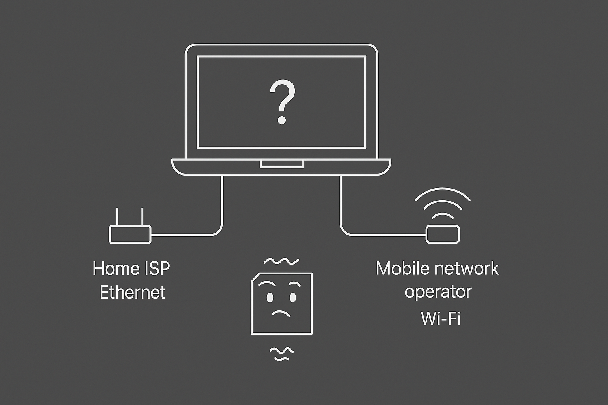

If you want to dip your feet into networking, IP routing is a good place to start.
I think it's the sweet spot because it's low level and at the same time, not very alien - we have all heard of IP addresses.
And not just that but IP routing is something that's much more applicable and relevant than starting from the very low level like the physical layer and data link layer can be a bit daunting.

In this article, we'll be covering how a linux system decides to route packets out of it.
We'll not be covering how the packets traverse the internet to reach their destination.
Although, the concepts we'll cover will apply their as well.
In short, we'll be covering the decision making process of the linux system when it needs to send out a packet.

<div class="section-notes">

Here's a question for you - Say you're connected to your home network via ethernet and also to your mobile hotspot via wifi.

You're connected to two different networks

- Your home ISP
- Mobile network operator

When you visit youtube.com, does it use the ethernet or the wifi? Would it be any different if you were to visit gmail.com?



</div>

This is exactly the question that we'll be covering in this article.

<div class="table-of-contents" markdown="1">

- [Network Interface](#network-interface)
- [ip tool](#ip-tool)
  - [See all interfaces on your system](#see-all-interfaces-on-your-system)
- [Routing Policy Database (RPDB)](#routing-policy-database-rpdb)
  - [Route](#route)
  - [Routing Table](#routing-table)
  - [Rule](#rule)

</div>

## Network Interface

Before we dive into ip routing, it's important to understand what network interfaces are as they are a crucial part of routing.

Network interfaces are devices that act as a point of connection in a network. They are the component that connect your device to a network. It's through them traffic flows in and out of your device.
An interface has a MAC address associated with it that is used to identify it on the network.

For instance: an ethernet port or a wifi interface.

### Virtual interfaces

An interface can also be emulated. These virtual interfaces are mainly used in Virtual machines, Containers, VPNs, and in software development.
Examples:

- **lo** loopback interface (127.0.0.1 aka localhost)
- **docker0** interface (used by docker containers)
- **tailscale0** interface (used by tailscale)
- **wg0** interface (used by wireguard)
- **veth** interface (used by virtual ethernet pair)

<div class="section-notes">

### Analogy to understand network interfaces

I'll use an analogy of social network to explain this.

Let's say you want to upload an image to Instagram. To do that, you need to have an Instagram account - there's no way around it.
You need an entry point to connect to the internet. Likewise, to connect to a network, you need an interface.

Your device can also have multiple network interfaces just like how you can have multiple social media accounts.
Example, your laptop most likely has an ethernet port in addition to a wifi interface.

#### Routing decision

To upload an image you would visit Instagram - to make a tweet you would visit Twitter - to send an email you would log into your email provider.
In a similar way, IP routing involves which network interface should be chosen to send out a packet.

Similarly, your device needs a policy to decide whether to use the ethernet interface or the wifi interface to reach a destination like YouTube

</div>

## `ip` tool

In Linux systems, the `ip` tool is the primary way to interact with networking internals and lower level networking APIs.
It's part of the `iproute2` software suite. It has several commands that manage various aspects of networking. For instance:

| Command    | Description               |
| ---------- | ------------------------- |
| `ip link`  | manage network interfaces |
| `ip addr`  | manage IP addresses       |
| `ip route` | manage routing table      |
| `ip rule`  | manage routing rules      |

There are numerous more but these are the ones we'll be focusing on for this article.

### See all interfaces on your system

Try running `ip link` to see all the interfaces on your system.

```bash
$ ip link

1: lo: <LOOPBACK,UP,LOWER_UP> mtu 65536 qdisc noqueue state UNKNOWN mode DEFAULT group default qlen 1000
    link/loopback 00:00:00:00:00:00 brd 00:00:00:00:00:00
2: eth0: <BROADCAST,MULTICAST,UP,LOWER_UP> mtu 1500 qdisc fq_codel state UP mode DEFAULT group default qlen 1000
    link/ether 26:f4:91:9d:2c:86 brd ff:ff:ff:ff:ff:ff
    altname enp0s18
```

There's a lot of information here. I like to use the `-br` and `-c` flags to get a colored brief output.

```bash
$ ip -br -c link
lo               UNKNOWN        00:00:00:00:00:00 <LOOPBACK,UP,LOWER_UP>
eth0             UP             26:f4:91:9d:2c:86 <BROADCAST,MULTICAST,UP,LOWER_UP>
```

I have two interfaces

- `lo` a loopback interface (virtual) with MAC address `00:00:00:00:00:00`
- and `eth0` a physical interface connected to my home ISP with MAC address `26:f4:91:9d:2c:86`

They are both active as shown by the "UP" flag inside the `<` and `>` brackets.

## IP destination types

Finally, one last thing to keep in mind is the different types of destinations.

| Type                   | Description                                                               | Examples                                                            |
| ---------------------- | ------------------------------------------------------------------------- | ------------------------------------------------------------------- |
| **local**              | These are the ip addresses of the network interfaces on your system       | The loopback address `127.0.0.1`, the local IP address `10.99.99.8` |
| **connected networks** | These are the ip addresses of other devices connected to the same network | `10.99.99.65` considering my device's IP address is `10.99.99.8`    |
| **remote**             | These are the ip addresses that is neither local nor connected networks   | `1.1.1.1`, `8.8.8.8`                                                |

---

Alright, now let's get into the nitty gritty of routing.

## Routing Policy Database (RPDB)

Every Linux system contains a routing policy database. This database is where all the **routes** live.
The routes are organized in a table - conveniently called the **routing table**.

Then, there are also **rules** which tells the kernel which routing table to use for a given packet.

```
RPDB (Rules: priority-ordered)
 └──> Routing Table (chosen by rule)
      └──> Routes (prefix + metric ordered)
```

### Route

A route is a policy that Linux kernel uses to decide the path of every single packet coming out of it.

```
# dummy routes
- route facebook.com via wifi
- route youtube.com via ethernet
```

A route consists of the following key components:

| Component          | Description                                                                                                       |
| ------------------ | ----------------------------------------------------------------------------------------------------------------- |
| Destination        | The destination IP address                                                                                        |
| Gateway (Next hop) | A directly reachable destination to send the packet that'll eventually route the packet to the actual destination |
| Interface          | The network interface to send the packet out of                                                                   |
| Flags              | Flags associated with the route                                                                                   |

Use `ip route` to see all the routes on your system.

```bash
$ ip route

default via 10.99.99.1 dev eth0 proto dhcp src 10.99.99.8 metric 100
10.99.99.1 dev eth0 proto dhcp scope link src 10.99.99.8 metric 100
10.99.99.5 dev eth0 proto dhcp scope link src 10.99.99.8 metric 100
```

The routes above tell you how to reach `10.99.99.1` and `10.99.99.5` from your system. They are on the same subnet as my device and are directly reachable.
That's why there's no gateway specified on them. Any packets destined for these two addresses will be send out via the `eth0` interface as specified by `dev eth0` meaning device `eth0`.

#### Route scope

visibility of a route.

- host (local)
- link (connected networks)
- global (remote)

#### Default Gateway

For any other destination, the packet will be sent to the default gateway which is `10.99.99.1` as specified by `default via 10.99.99.1`.
Essentially, default gateway is the fallback destination when no specific route is found. Think of it like the `default` case in a switch statement.

```go
packet := new_packet()

switch destination {
  case "10.99.99.1":
    packet.src = "10.99.99.8"
    send_via_eth0()
  case "10.99.99.5":
    packet.src = "10.99.99.8"
    send_via_eth0()
  default:
    packet.src = "10.99.99.8"
    send_via_default_gateway()
}
```

#### Query the route for a destination

You can even check which route a packet takes for a given destination using `ip route get` command.

**Local addresses**

```bash
$ ip route get 10.99.99.3
10.99.99.3 dev eth0 src 10.99.99.8 uid 1000
```

**Remote addresses**

```bash
$ ip route get 1.1.1.1
1.1.1.1 via 10.99.99.1 dev eth0 src 10.99.99.8 uid 1000
```

As you can see, `1.1.1.1` is not a device on the same subnet as my device. So, the packet will be sent to `10.99.99.1` - which is the default gateway.

<div class="section-notes">

The router will also have its own routing table.
If the router doesn't have a route specified for `1.1.1.1`, it will send the packet to its own default gateway which is the ISP's router.

Once the packet is inside the ISP's network, protocols like BGP (Border Gateway Protocol) may take over and figure out the best path to the destination.

</div>

### Routing Table

A routing table is a collection of routes. You can have multiple routing tables on a single system upto 255 of them.
By default, there are three routing tables:

- local
- main (ip route uses this table by default)
- default

```bash
$ ip route show table local
local 10.99.99.8 dev eth0 proto kernel scope host src 10.99.99.8
broadcast 10.99.99.255 dev eth0 proto kernel scope link src 10.99.99.8
local 127.0.0.0/8 dev lo proto kernel scope host src 127.0.0.1
local 127.0.0.1 dev lo proto kernel scope host src 127.0.0.1
broadcast 127.255.255.255 dev lo proto kernel scope link src 127.0.0.1
```

The local routing table contains routes for local destinations (i.e. its own IP addresses).

```bash
$ ip route show table main
default via 10.99.99.1 dev eth0 proto dhcp src 10.99.99.8 metric 100
10.99.99.0/24 dev eth0 proto kernel scope link src 10.99.99.8 metric 100
10.99.99.1 dev eth0 proto dhcp scope link src 10.99.99.8 metric 100
10.99.99.5 dev eth0 proto dhcp scope link src 10.99.99.8 metric 100
```

The main routing table contains routes for all other destinations (connected networks & remote destinations).

### Rule

A rule, on the other hand, tells which routing table to use for a given packet.
Why do we need more than one routing table?

```bash
$ ip rule show
0:      from all lookup local
32766:  from all lookup main
32767:  from all lookup default
```

The rule above tells that for all packets, the local routing table should be used.

Precedence

- Longest prefix match
- Metric (lowest metric wins)

```bash
ip rule
```

## References:

- https://developers.redhat.com/blog/2018/10/22/introduction-to-linux-interfaces-for-virtual-networking#team_device
- https://youtu.be/zstdOS_6ajY?si=gCPBv2c_N-7aNssi
- http://linux-ip.net/html/ch-routing.html
