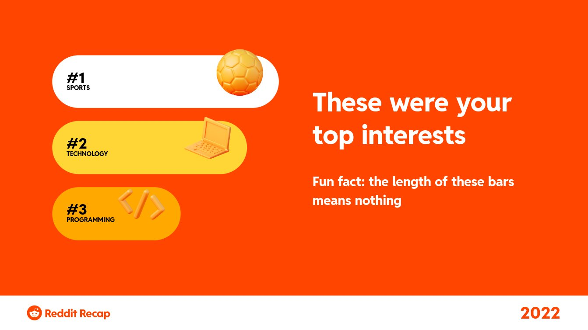

For the past few days I have been trying to decide which of these two topics to begin learning first: databases or Kubernetes. I've grown a sudden interest in these topics because the companies that I want to work at had at least one of the above as a hard requirement - or sometimes both. Now, of course it's not the only reason why I'm interested in them. My interest goes beyond just fulfilling job requirements as they are both highly essential skills to have in any backend engineer's arsenal. But it was for sure the spark that ignited the interest/motivation in me.

While searching for learning resources and companies that are doing amazing things on these topics, I've come across a few talented people. One such personality is Kelsey Hightower. He's an extremely prolific speaker and also a highly decorated software engineer at Google. I've been watching his Talks on Youtube and also scrolling through his tweet history (because that's what I do when I find interesting personalities). One tweet in particular stood out to me

<blockquote class="twitter-tweet">
&quot;What do you say to people who think you&#39;re a one trick pony?&quot;  I&#39;ve been a one trick pony my whole career. At one point I was all in on Python and contributed to tools like pip and virtualenv. Then it was Puppet, then Go, then Kubernetes, and now Serverless.  It&#39;s called focus. <a href="https://t.co/nU7YByRB4T">https://t.co/nU7YByRB4T</a>
&mdash; Kelsey Hightower (@kelseyhightower) <a href="https://twitter.com/kelseyhightower/status/1597993734011879426?ref_src=twsrc%5Etfw">November 30, 2022</a></blockquote> 

"Focus" - that's interesting! But let's put that word aside for a second cuz I have a few more anecdotes to share.

I'm highly active on Reddit - especially on technology subreddits.

_My 2022 Reddit Recap_

I rarely engage though - maybe once in a blue moon. I'm just a lurker.

Anyway, there's this another highly skilled developer - Amos (@fasterthanlime) - who just [hosted an AMA (Ask Me Anything) on reddit](https://www.reddit.com/r/fasterthanlime/comments/zzzabq/end_of_year_ama_ask_me_anything/). I wanted to share one of the questions on that AMA, but unfortunately it was deleted. Nevertheless, the answer alone should suffice to convey what I'm trying to get across here.

> "I'm very selective about what I spend my time on, ..."

It's not rocket science but rather a common knowledge but when you hear it from people you look up to - it really hits you. Advices are nice but I think they only bear weight if they come from someone you respect. (Btw, I'm not saying @fasterthanlime is my hero. Our view on the Go programming language differs radically.)

There are a few others who I've been following just as much

- Thomas Ptacek (I came to learn about him through my job application at fly.io but turns out he's a highly decorated security engineer)
- Fillipo (Just as ~~old~~ young as me and has already led the Go security team at Google!)

## A sudden realization

If you notice one common thing among these guys - it's

> Focus

They specialize in something and they're very frugal with their time.

I made a sudden realization that focus is something that I've been lacking more and more recently.

> Oh look - an interesting blog post on Reddit about creating SVG with Javascript - let's read it!
>
> Shoot! I can barely understand what's going on.
>
> Meh, back to Reddit.
>
> Now what's this...? a reddit post on how 1Password's cryptography is more secure than Lastpass'.
>
> ...CLICK!!!
>
> I don't understand a single thing about any cryptography jargon that's in this post.
>
> I better scroll down to the comments. That might be interesting.

Why am I hopping through these posts reading about things that I have very little understanding of? Is that even "reading" because as soon as I stop understanding some of the jargon, I'll just try to skim through the post and quickly scroll down to read the comments. In the end, I mostly likely will end up without gaining any knowledge. And even if I do, I will forget about it because when will I ever use it?

On the flip side, I don't want to narrow down what I intake so much that I become a one trick pony. Diversity is important! But, the balance is even more important.

## A look back at school

I have learned quite a few technologies in the past year but all of them in surface.

That's not how I learned things when I was at school! I used to sit down and grok on topics for hours to grasp things from the root. I used to love making notes - and in fact I was pretty good at it.

Where are all these good practices that I highly benefited from? I barely pickup pen & paper these days. I don't have any notes and I haven't learned anything in detail lately.

I think it's mainly because of focus. At school, I could stay focused on one thing because there were syllabuses! If I suddenly had a interest on something out of syllabus, I knew not to spend too much time on it because I had a syllabus to cover. The syllabus were a roadmap, an overseer to guide my focus. Oh, I wish there was a syllabus to go from Software engineer to a Staff Engineer - I would have aced it!

So here's my new year's resolution.

> To maintain focus and balance in what I read.

---

## Thanks to

- Stefan Cosma for the Photo <a href="https://unsplash.com/@stefanbc?utm_source=unsplash&utm_medium=referral&utm_content=creditCopyText">Stefan Cosma</a>.

- ChatGPT for providing me with better words.
