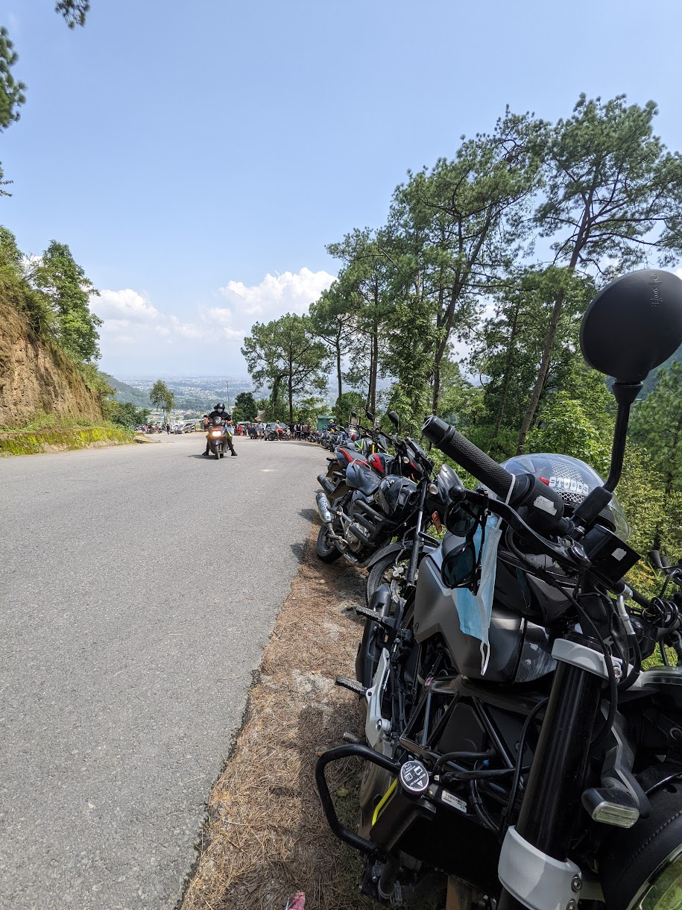

It has been around 2 months since I purchased my motorcycle and I've already exhausted pretty much all the ride destinations around Kathmandu. I guess all riders can relate to this :).

Apart from the obvious popular destinations, it takes a bit of an effort to find the lesser known ones. Few vlogs on YouTube and scouring through Google Maps have helped me find a few. Googling for desinations is pretty much useless as almost all of the handful of blog posts have an identical list of places and they focus more on the desination than the ride. I care about the enjoyable rides than the destination itself. This blog post is my attempt to provide information especially to motorcycle riders.

## My Ride

_Svartpilen 250 at Pilot Baba Bhaktapur_

I have a Svartpilen 250, which does alright on decent offroad. The ground clearance is pretty much one of the least on any bikes you can find on the market right now. And that's why I personally prefer to avoid offroad.

---

I think it's best to categorize the list into two sections

- Good Roads
- Off-roads

## Good Roads

### 1. Nagarkot

You saw this coming from a mile away, didn't you? Obviously, it's number one on the list because there's no rider who hasn't ridden the twisties of Nagarkot. One of my best rides, if not the best, has been on this road on a rainy morning.

_Svartpilen 250 at Nagarkot_

There's probably 3 or 4 different routes (or even more) to reach Nagarkot from Kathmandu and one, in particular, is my favorite. I'm not sure how to show that route here but it's the one that Google Maps suggest.

The road was under construction just a few months ago but at the time of writing this post, it's pretty good. What I like best about Nagarkot ride is that at some point in the middle you'll have to ride through the fogs and drizzle.

### 2. Dadagaun, Shivapuri National Park, Budhanilkantha

If I had to pick my favorite road on this list, it'd probably be this. You get to ride through a mild forest on a road that's probably the best around Kathmandu.

It's fairly close to where I live (just 16kms away) that sometimes I even ride here during my lunch break.

_On The Way To Dandagaun, Shivapuri_

Once you cross Mahargunj, the traffic is pretty light and even the road to Budhanilkantha is quite fun. Just 1 or 2 kms after Budhanilkantha, you'll start to make the climb up and then the fun begins.

Just be aware that this road goes through an Army premise and that means you'll need to register your vehicle before you enter. Make sure you have your driving license and bill book with you as you'll need to provide them during entry registration.

_At Dandagaun Resort_
_View From Dandagaun, Shivapuri_

### 3. Kalu Pandey's Crematorium, Dahachowk

This road actually exceeded my expectation. I was originally headed to Switzerland park, which I found pretty underwhelming (there's literally nothing), but then decided to keep moving.

_Road To Kalu Pandey Crematorium_

To my surprise, I found the Kalu Pandey Crematorium at the end of the road. Yes, THE Kalu Pandey about whom we all read in our secondary school. There's no entry fee and the site is well maintained.

_Kalu Pandey Crematorium_

There're also a few resorts at the top and also a view tower (as seen in the image below).

_View Tower Resort_

### 4. Nuwakot (via Tokha -> Bardalinn Resort-Shivapuri).

In terms of what the journey has to provide, this is probably the top on the list. The road itself is decent as there are quite a few broken segments on the way but my god the scenery is just breathtaking. It feels like you're way away from Kathmandu and are in a different region of the country.

There's a waterfall on the way - Jhor Waterfall, right after you cross Tokha. It's meh! No idea why it's so hyped as you can see all these bikes parked.

_Jhor Waterfall Bike Parking_

_Jhor Waterfall_

Once you cross this waterfall it starts to get better and better. Although I have to warn you, the climbs are pretty stiff and maybe riding with a pillion on this road isn't the best idea.

_National Park Area On The Way To Nuwakot_

_National Park Area On The Way To Nuwakot_

As you keep moving there's another much better waterfall - Mahtong falls, right beside the road.

_Mahtong Falls_

_Mahtong Falls Svartpilen 250_

There's a local restaurant which offers one of the best Sukutis. I don't remember the name and unfortunately it's also not registered on Google Maps but here's a [link to the place](https://goo.gl/maps/XVYSnpcETLYi2Znz6). I don't even have a picture of the Sukuti which should you tell you how good it was as I couldn't stop munching XD.

### 5. Chobhar - Toudaha - Kritipur

Chobhar is arguably the most popular destination for riders simply because it's right around the valley. I've been here more than any other places in the list.

### 6. Dolalghat - Khadichaur

All the other destinations on the list are mainly twisties. If you want to enjoy speed with a twist of twisties, then it can't get any better than this road. The scenary is pretty good, the traffic is light and the road is as good as they come in Nepal. Honestly, I found it quite difficult to believe that a road like this is just an hour away from the valley. For first timers on this road, it'll be quite an experience.

_Dolalghat_

This is definitely a trip for the weekend as it can take up 4-5 hours to get there and be back.

_Khadichaur Bridge_

# OffRoads

1. Chitlang - Markhu

2. Manichud
