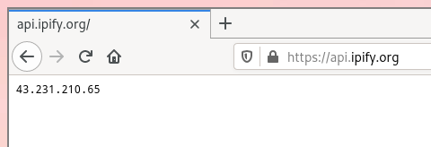

There are plenty websites that show you your public IP address when you visit them. The simplest way would be to just ask google. These sites get the job done but when you want to constantly monitor your public ip it becomes tedious to keep visiting them. You need to have a browser running and the website itself takes 3-4 seconds to load.

There are some handy api services like ipify API. If you visit https://api.ipify.org/ you'll get a plain text http response. This method is slightly faster than asking google due to the smaller response size. It's also handy as you can use it in creating scripts.


_Ipify Api Service_

But there's a faster method. Much much faster! It's crazy how fast it is! It takes no more than a 100-200 milliseconds. This method involves quering a DNS server rather than an HTTP server.

I use the `dig` command to make DNS queries. **Dig** is a DNS lookup utility that comes preinstalled in most linux distros.

You can use dig to find the ip address of a website like this.

```bash
# This will spill out a bunch of metadata
dig adityathebe.com

# This will simply return the ip address
dig +short adityathebe.com
```

But we're here to find the ip address of our router and not some website's. In order to get the ip address of our router, we need to query a special url **myip.opendns.com** to the DNS resolver **resolver1.opendns.com**.

This DNS resolver is programmed to return the requesters ip address when a request is made to that special url. If you simply query myip.opendns.com with any other DNS resolvers then you'll get NXDOMAIN response; which basically means that the domain does not exist.

```bash
# To know you public ipv4 address
dig +short myip.opendns.com @resolver1.opendns.com -4

# To know you public ipv6 address
dig +short AAAA myip.opendns.com @resolver1.opendns.com
```

Besides OpenDNS, Google and Akamai also provide a similar feature

```bash
dig @ns1-1.akamaitech.net ANY whoami.akamai.net +short

dig @ns1.google.com TXT o-o.myaddr.l.google.com +short
```

_Akamai's service was a bit slow for me._

## Alias

I have added an alias to my _zshrc_ file so that I can query my public ip address from the terminal by simply typing `publicip`.

```bash
alias publicip='dig +short myip.opendns.com @resolver1.opendns.com -4'
```

## Polybar

```txt
# Polybar module

[module/publicip]
type = custom/script
exec = dig @resolver1.opendns.com A myip.opendns.com +short -4
interval = 100
label =  %output%
```

---

## Reference

- https://unix.stackexchange.com/questions/22615/how-can-i-get-my-external-ip-address-in-a-shell-script/81699#81699
- https://unix.stackexchange.com/questions/335371/how-does-dig-find-my-wan-ip-adress-what-is-myip-opendns-com-doing
