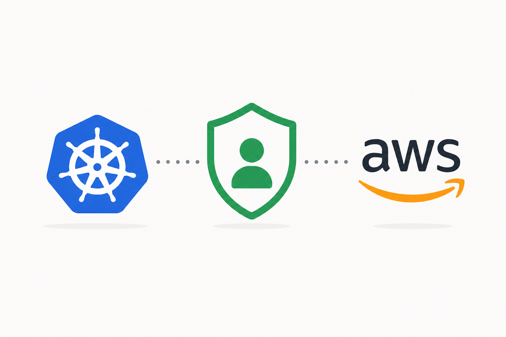
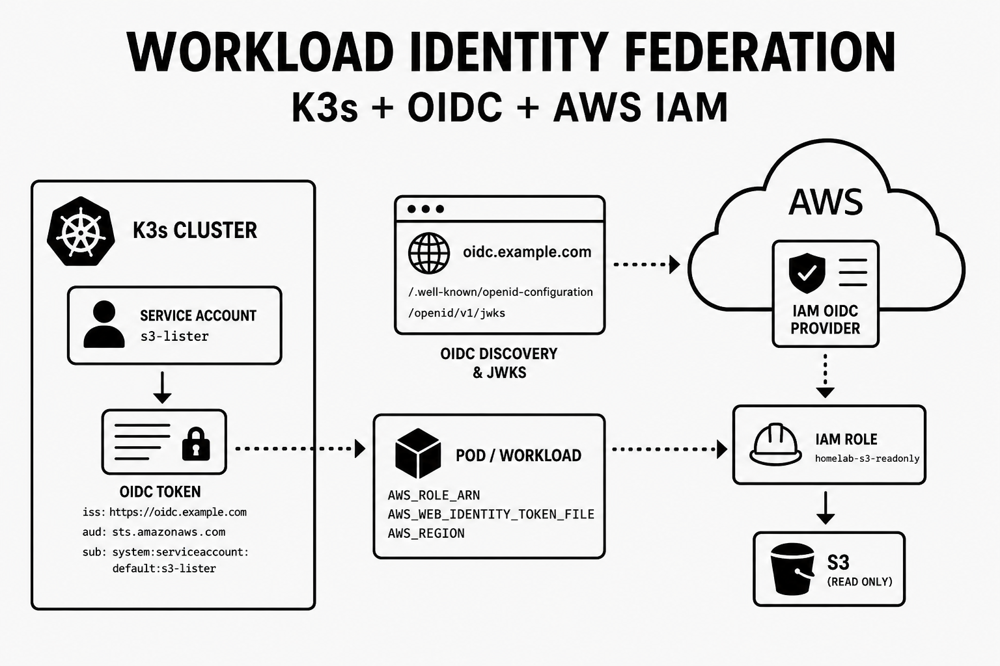

**Federation** is establishing trust between two separate identity systems. It's the explicit act of one side saying, "I'll trust identities signed by that issuer over there".
Example: AWS IAM accepting identities signed by your Kubernetes cluster's OIDC issuer.

This establishment of trust is usually done by exchanging public verification keys and agreeing on which claims to accept.
Without it, the traditional (and still common) approach is to hand credentials directly to the workload.
Example: passing `AWS_ACCESS_KEY_ID` to the pod.

The problem is that these are long-lived credentials - a secret sitting in your cluster, waiting to be leaked or forgotten during a rotation.
Also, you now have the responbility to manage the lifecycle of those tokens.
Creating a non-expiring token is a terrible idea, so you create one that expires in a few months.
You have to issue a replacement before the old one expires and distribute it everywhere it's needed, every few months, forever.

What if the workload could instead get short-lived credentials, automatically managed by the underlying infrastructure? That's **Workload Identity Federation**.
Federation applied so the workload itself gets a _federated identity_, rather than you handing it a static key.

The application proves who it is using a token its own platform issues, and AWS, having agreed to trust that issuer, hands back temporary credentials with nothing secret stored in the pod.

That last case is exactly what we're setting up here: on k3s, your cluster's OIDC issuer is what AWS trusts.

> Instead of creating and distributing your AWS credentials to the containers or using the Amazon EC2 instance’s role, you associate an IAM role with a Kubernetes service account and configure your Pods to use the service account
>
> - docs.aws.amazon.com

---

You'll use `https://oidc.example.com` as the issuer for all service account tokens.
Bear in mind you must own that domain (or subdomain), as you'll need to host some configuration files there and make them accessible to cloud providers.

## 1. Setting up OIDC on K3s

The first step is to configure the issuer for service account tokens in your cluster. The place to configure this is the configuration file `/etc/rancher/k3s/config.yaml` on your K3s server node.
If you run multiple server/control-plane nodes, configure this consistently on each one. This file may not exist on your cluster — just create one if it doesn't.

```yaml
kube-apiserver-arg:
  - 'service-account-issuer=https://oidc.example.com'
```

Once set, you'll need to restart K3s:

```sh
sudo systemctl restart k3s
```

What this does is configure every service account token to be issued with this issuer.
If you exec into a pod and check its service account token at `/var/run/secrets/kubernetes.io/serviceaccount/token`, you'll see that the issuer, `payload.iss`, is `https://oidc.example.com`.

**Example:**

Here's a trimmed-down payload of the service account JWT:

```json
{
  "aud": ["https://kubernetes.default.svc.cluster.local", "k3s"],
  "iss": "https://oidc.example.com",
  "sub": "system:serviceaccount:default:default"
}
```

Once you've configured the OIDC issuer, the next step is to set the audience for the service account token.
If you noticed above, the default audience is the cluster's service.

For AWS, GCP, or any other identity platform to use the service account token, you must set that platform as the audience of the token.
For example, for AWS, the audience must be set to `sts.amazonaws.com`.

For now, just verify that you can create a token with an audience set to STS.

```sh
kubectl create token default \
  -n default \
  --audience sts.amazonaws.com
```

Decode the JWT and verify:

```json
{
  "iss": "https://oidc.example.com",
  "aud": ["sts.amazonaws.com"],
  "sub": "system:serviceaccount:default:default"
}
```

Great, this is all that's needed as far as configuration on the Kubernetes cluster goes.

## 2. Publish the OIDC discovery document and JWKS

The next step is to make your OIDC issuer discoverable so AWS IAM can validate tokens issued by your cluster.

To do that, you need to publicly serve two HTTPS endpoints:

- `https://oidc.example.com/.well-known/openid-configuration`
- `https://oidc.example.com/openid/v1/jwks`

The discovery document tells AWS where to find the issuer's public signing keys, and the JWKS endpoint exposes those keys so AWS can verify service account token signatures.

```sh
kubectl get --raw /openid/v1/jwks
```

The above command will give you the exact JWKS that you must save to a file named `jwks`.

Then create an `openid-configuration` file with the following JSON:

```json
{
  "issuer": "https://oidc.example.com",
  "jwks_uri": "https://oidc.example.com/openid/v1/jwks",
  "response_types_supported": ["id_token"],
  "subject_types_supported": ["public"],
  "id_token_signing_alg_values_supported": ["RS256"]
}
```

### Hosting on Cloudflare Pages

I personally hosted the discovery document and JWKS on Cloudflare Pages. Ensure that those two files are saved in a directory structure like this:

```
oidc/
   ├── _headers
   ├── .well-known/
   │   └── openid-configuration
   └── openid/
       └── v1/
           └── jwks
```

Add a `_headers` file with this content:

```txt
/.well-known/openid-configuration
  Content-Type: application/json

/openid/v1/jwks
  Content-Type: application/json
```

This is Cloudflare Pages' way of setting the HTTP response content type.

Deploy the contents of that directory as the Cloudflare Pages site root, so `/.well-known/openid-configuration` is served directly from `oidc.example.com`.
Then set up the custom domain as `oidc.example.com`.

### Keeping JWKS in sync

It's important to note that the JWKS is not just static metadata.
It contains the public keys that correspond to the Kubernetes service account signing keys.
If the K3s service account signing key changes, or if you rebuild the control plane and it gets new signing keys, the JWKS hosted at `https://oidc.example.com/openid/v1/jwks` becomes stale.

You need to ensure to re-sync the JWKS when the signing keys change.
In a homelab, that usually means republishing the JWKS after discrete events like a control-plane rebuild, restore, or deliberate service account signing key rotation.

## 3. Set up AWS IAM to trust your OIDC issuer

Great, so far you have configured the issuer in your K3s cluster and hosted the OpenID discovery documents.
Now, you need to configure AWS IAM to trust your issuer.
For that, you need to create a new IAM identity provider and point it at your OIDC discovery documents.

You can do this with the CLI, but I found it easier to do from the web UI because you don't have to deal with thumbprints manually.

- Open the AWS Console
- Go to IAM
- In the left sidebar, click **Identity providers**
- Click **Add provider**
- Provider type: **OpenID Connect**
- Provider URL: `https://oidc.example.com`
- Audience: `sts.amazonaws.com`
- Click **Add provider**

AWS will read:

`https://oidc.example.com/.well-known/openid-configuration`

and from there find:

`https://oidc.example.com/openid/v1/jwks`

After creation, the provider ARN will look like:

`arn:aws:iam::<account-id>:oidc-provider/oidc.example.com`

At this point the trust has been established! Your cluster can mint JWTs that AWS IAM trusts. Hooray!

## 4. Create an IAM role for the workload

At this point AWS trusts your OIDC issuer, but that does not mean every pod automatically gets access to AWS resources.

You still need to create an IAM role for the workload to assume. This role has two important pieces:

1. A **trust policy** that defines who is allowed to assume the role.
2. A **permissions policy** that defines what the role is allowed to do after it has been assumed.

The trust policy is where the federation happens.
Instead of trusting an AWS user or another AWS role, this role trusts your OIDC provider.
More specifically, it trusts a token issued by `oidc.example.com` only when the token has:

- `aud` set to `sts.amazonaws.com`
- `sub` set to the exact Kubernetes service account you want to allow

For this example, the service account will be `s3-lister` in the `default` namespace, so the subject claim will be:

```txt
system:serviceaccount:default:s3-lister
```

The trust policy should look like this:

```json
{
  "Version": "2012-10-17",
  "Statement": [
    {
      "Effect": "Allow",
      "Principal": {
        "Federated": "arn:aws:iam::<account-id>:oidc-provider/oidc.example.com"
      },
      "Action": "sts:AssumeRoleWithWebIdentity",
      "Condition": {
        "StringEquals": {
          "oidc.example.com:aud": "sts.amazonaws.com",
          "oidc.example.com:sub": "system:serviceaccount:default:s3-lister"
        }
      }
    }
  ]
}
```

> "oidc.example.com:sub": "system:serviceaccount:default:s3-lister"
>
> This part is extremely important, or else any service account in your K3s cluster can assume the IAM role

Create a role with that trust policy and attach a policy that allows listing S3 buckets. For a quick test, you can attach AWS's managed `AmazonS3ReadOnlyAccess` policy.

The role ARN will look something like this:

```txt
arn:aws:iam::<account-id>:role/homelab-s3-readonly
```

You'll use this ARN in the workload as `AWS_ROLE_ARN`.

## 5. Workload identity in action

Finally, you'll see the power of workload identity federation in action.

You'll create a pod that has the AWS CLI installed and run it with a service account that is permitted to assume the IAM role created above.

By default, service account tokens are intended for the Kubernetes API server, not AWS STS.
You must configure the workload to use a projected service account token that's targeted to AWS STS.

First, create a service account:

```yaml
apiVersion: v1
kind: ServiceAccount
metadata:
  name: s3-lister
```

Then create a deployment that uses that service account and mounts a projected service account token with `sts.amazonaws.com` as the audience.

```yaml
apiVersion: apps/v1
kind: Deployment
metadata:
  name: aws-cli-s3-test
  labels:
    app: aws-cli-s3-test
spec:
  replicas: 1
  selector:
    matchLabels:
      app: aws-cli-s3-test
  template:
    metadata:
      labels:
        app: aws-cli-s3-test
    spec:
      serviceAccountName: s3-lister
      automountServiceAccountToken: false
      containers:
        - name: aws-cli
          image: public.ecr.aws/aws-cli/aws-cli:latest
          command:
            - /bin/sh
            - -c
            - sleep infinity
          env:
            - name: AWS_ROLE_ARN
              value: arn:aws:iam::<account-id>:role/homelab-s3-readonly
            - name: AWS_WEB_IDENTITY_TOKEN_FILE
              value: /var/run/secrets/aws/token
            - name: AWS_REGION
              value: us-east-1
          volumeMounts:
            - name: aws-token
              mountPath: /var/run/secrets/aws
              readOnly: true
      volumes:
        - name: aws-token
          projected:
            sources:
              - serviceAccountToken:
                  path: token
                  audience: sts.amazonaws.com
                  expirationSeconds: 3600
```

A couple of important pieces here:

**A. Use the correct Kubernetes service account**

`serviceAccountName: s3-lister` makes the pod run as the Kubernetes service account whose subject matches the IAM role trust policy:

```txt
system:serviceaccount:default:s3-lister
```

**B. Project a service account token for AWS STS**

```yaml
volumes:
  - name: aws-token
    projected:
      sources:
        - serviceAccountToken:
            path: token
            audience: sts.amazonaws.com
            expirationSeconds: 3600
```

This tells Kubernetes to project a service account token into the pod with `sts.amazonaws.com` as the audience. The token is mounted at `/var/run/secrets/aws/token`.

**C. Tell the AWS SDK which IAM role to assume**

`AWS_ROLE_ARN` points the AWS SDK / AWS CLI at the IAM role this workload should assume.

**D. Tell the AWS SDK where to find the web identity token**

`AWS_WEB_IDENTITY_TOKEN_FILE` points to the projected service account token.

Once the pod is running, first confirm that the AWS CLI is actually using the IAM role from web identity federation:

```sh
kubectl exec -it deploy/aws-cli-s3-test -- aws sts get-caller-identity
```

The ARN should look like an assumed role session for the role you created:

```json
{
  "UserId": "...",
  "Account": "<account-id>",
  "Arn": "arn:aws:sts::<account-id>:assumed-role/homelab-s3-readonly/..."
}
```

Then test S3 access:

```sh
kubectl exec -it deploy/aws-cli-s3-test -- aws s3 ls
```

## Summary



### Reference

- [Keynote: Introduction to SPIFFE by Kelsey Hightower](https://www.youtube.com/watch?v=6e4snGCTLOk)
- [SPIFFE](https://spiffe.io/docs/latest/spiffe-about/spiffe-concepts/)
- [IAM roles for service accounts](https://docs.aws.amazon.com/eks/latest/userguide/iam-roles-for-service-accounts.html)
