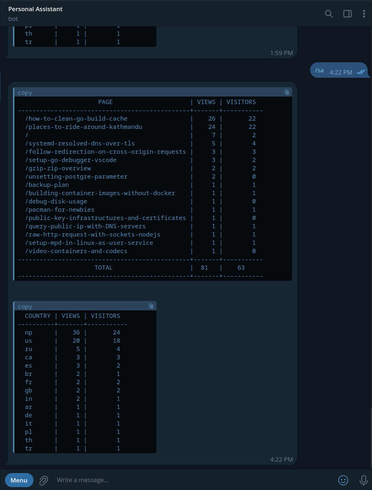

Analytics are super fun to look at. When you first integrate any analytics tool to your webiste - you can't stop refreshing
the page cuz it's just so fun.

I personally have been using [SimpleAnalytics](https://simpleanalytics.com) to monitor this blog
for, I think, almost 5 years now.

Few things that I really like about it are

- It has an API
- True to its name - it's in fact simple (I don't even want to remember the google analytics dashboard)
- It allows you to bypass ad-blockers by serving the "tracking" js via your own subdomain.
  _(I must clarify that no personal identifiable information is collected. This blog serves it via stats.adityathebe.com.
  [I've written about this before](https://www.adityathebe.com/journal/2/#web-analytics))_
- Exporting data. I'm a huge proponent of owning your own data. I have a [homelab](https://github.com/adityathebe/homelab)
  where I run bunch of open source softwares in favor of proprietary softwares just so I can own my data.

I'm sure it has a few other cool features too (I can see they've added an AI feature), but these are my favorites.

While I like their UI, I very rarely use it. Instead, I use their API.

I have a telegram bot which presents today's analytics in response to a `/sa` command.



The source code to this bot is private as it does a lot of other things than just serving the analytics.

However, I can share the bit of code that deals with simple anlaytics

```go
func (t *SimpleAnalytics) callAPI(options map[string]string) (*APIResponse, error) {
	r := &APIResponse{}

	req, err := http.NewRequest("GET", t.apiURL, nil)
	if err != nil {
		return r, err
	}

	q := req.URL.Query()
	q.Add("version", "5")
	q.Add("info", "false")
	q.Add("fields", "histogram,pages,countries")
	q.Add("timezone", "Asia/Kathmandu")
	for k, v := range options {
		q.Add(k, v)
	}
	req.URL.RawQuery = q.Encode()
	req.Header.Set("Api-Key", t.apiKey)

	client := &http.Client{}
	resp, err := client.Do(req)
	if err != nil {
		return r, err
	}
	defer resp.Body.Close()

	if err := json.NewDecoder(resp.Body).Decode(&r); err != nil {
		return r, err
	}

	return r, nil
}

func (t *SimpleAnalytics) DailySummary() (string, error) {
	options := make(map[string]string)
	options["start"] = time.Now().In(nepalLoc).Format("2006-01-02")

	apiResp, err := t.callAPI(options)
	if err != nil {
		return "", err
	}

	return t.renderDailySummary(apiResp)
}

func (t *SimpleAnalytics) renderDailySummary(r *APIResponse) (string, error) {
	tableString := &strings.Builder{}
	tableString.WriteString("<pre>")

	// Views by Page
	tablePageView := tablewriter.NewWriter(tableString)
	tablePageView.SetHeader([]string{"Page", "Views", "Visitors"})
	tablePageView.SetBorder(false)

	for _, p := range r.Pages {
		tablePageView.Append([]string{p.Value, fmt.Sprint(p.Pageviews), fmt.Sprint(p.Visitors)})
	}

	for _, h := range r.Histogram {
		tablePageView.SetFooter([]string{"Total", fmt.Sprint(h.Pageviews), fmt.Sprint(h.Visitors)})
	}

	tablePageView.Render()
	tableString.WriteString("</pre>\n\n<pre>")

	// Views by Country
	tableCountries := tablewriter.NewWriter(tableString)
	tableCountries.SetHeader([]string{"Country", "Views", "Visitors"})
	tableCountries.SetBorder(false)

	for _, c := range r.Countries {
		tableCountries.Append([]string{c.Value, fmt.Sprint(c.Pageviews), fmt.Sprint(c.Visitors)})
	}
	tableCountries.Render()

	tableString.WriteString("</pre>")

	return tableString.String(), nil
}

```

---

It's been serving me great so far. ~~A slight complaint I have is that they only email based login.~~
Wait, they do actually support passwords now (or have they always had this ...?).
