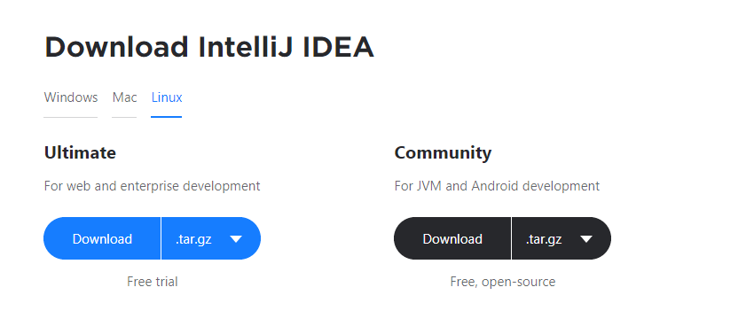

One of the main reasons I migrated to Linux from Windows was the ease of software management. I could install, update and remove "_any_" software with just a few commands from the command line.

Life was fun and easy until it wasn't when I had to install a software which wasn't in the distro's **software repository**. A distro's software repository is basically a database of application installation packages and upgrade packages. If the software you want to install is not listed in the software repository then you'll have to look for other ways to install.

In Windows, almost every software provides an installation wizard but that's rarely the case in Linux.

So, what are some other ways to install a software when it's not available to install via the package manager? That's what you will be learning in this article.

## 1. Distro's Package Manager

This is my (and most peoples') preferred way of installing softwares because the distro's package manager makes it extremely easy, to not only just install, but also to update, remove and manage paths & the launchers of a software.

Ubuntu uses `apt` for package management and so does Debian and Linux Mint. Different distros have different package managers. Arch based distros use `pacman`, Red hat uses `rpm`, CentOS uses `yum` ...

Every distro has its own set of software repositories. What may be available to install with `apt` in Ubuntu may not be available to install in Debian even though both distros use `apt`.

The package manager a distro provides can be a deciding factor in choosing a distro for many people. To give you an example: Debian is known for its solid stability and hence the softwares available in its official repositories may not be a latest release but a stable one. So Debian may not be a good choice for people who want the latest bleeding edge softwares.

The package manager will not always be able to help you because well obviously the software repository cannot include every software in existence. Sometimes although the software is available, the required version isn't.

Apart from the official software repositories, you can also add third-party software repositories. You may have noticed Google Chrome is not listed in any of the Ubuntu software repositories and so running `sudo apt update google-chrome` will not work. There are various other ways to install it and one of them is to add the Google Chrome's sofware repository. Once you add the repository, it's the same basic routine to install any software from that repository.

> Read: [How to install Google Chrome in Ubuntu](https://askubuntu.com/questions/510056/how-to-install-google-chrome)

If in case the software is not available through third-party repositories then you'll have to look for other options mentioned below.

## 2. A programming language's package manager

Some softwares are available to install through a programming language's package manager. Python has `pip`, NodeJs has `npm` (or `yarn`), GoLang provides the convenient `go get` command and there are a lot others.

Some of the softwares I install via a programming language's package managers are

- [localtunnel](https://github.com/localtunnel/localtunnel), [tldr](https://github.com/tldr-pages/tldr), [http-server](https://github.com/http-party/http-server), [typescript](https://github.com/microsoft/TypeScript) (via NPM)
- [wpm](https://github.com/cslarsen/wpm), [sublist3r](https://github.com/aboul3la/Sublist3r), [httpie](https://github.com/jakubroztocil/httpie) (via pip)
- amass (via go get)

It goes without saying that you need to have the programming language and the package manager installed. As far as I know, the package manager does come along when you install the programming language.

## 3. Compile the source code

The above two methods are fairly straightforward. Now comes the time to get our hands dirty.

Some softwares provide the source code, which could be in C, C++, Go, ... you name it, and you're supposed to compile them. Being provided with the source code enables a user to compile the the source code specifically tailored and optimized to his/her system.

I have to say this is not an easy thing to do although I've never done it myself.

> _I am skipping this section for now_

## 4. Download the compiled binary

Conveniently, you can also find the compiled binaries of a software. It may be provided by the official software developers or by some third party. The compiled binary is usually archived in a single [tar](<https://en.wikipedia.org/wiki/Tar_(computing)>) file. In some rare cases you may find a zip or a rar archive. All you need to do to install the software simply download the tar file, extract it and then run the binary file inside the extracted directory.

As for an example: Jetbrains provide the [compiled binary for its IDEs](https://www.jetbrains.com/idea/download/#section=linux). Check out the image below. Look! There's the tar file I told you about.



There are handful of softwares that provide the compiled binaries in a tar file. Here are some to name a few:

- [Postman](https://www.getpostman.com/downloads/)
- [Telegram](https://desktop.telegram.org/)
- [Sublime Text](https://www.sublimetext.com/3)
- [Golang](https://golang.org/dl/)

Once you download the tar file you should extract it with the `tar` command.

```sh
# Extract an archive into a target directory:
# tar xf source.tar -C directory

# Extract Intellij Idea to /opt directory
sudo tar xf ideaIC-2019.3.2.tar.gz -C /opt
```

If you look at the extracted directory you'll see a binary file. You may need to look a bit further if you do not find it in the main directory. Some softwares place the binary file in a `/bin` directory while some place them in the main directory itself. This directory structuring is unique to each software, but, more often than not, you'll find the binary file in the bin directory.

Here's what the extracted directory of the Intellij tar file looks like

```sh
ls -al idea-IC-193.6015.39
```
```output
total 68K
drwxr-xr-x  8 root root 4.0K Jan 27 20:50 .
drwxr-xr-x  4 root root 4.0K Jan 27 20:50 ..
drwxr-xr-x  2 root root 4.0K Jan 27 20:50 bin (binary file in here ??)
drwxr-xr-x  7 root root 4.0K Jan 27 20:50 jbr
drwxr-xr-x  4 root root  12K Jan 27 20:50 lib
drwxr-xr-x  2 root root 4.0K Jan 27 20:50 license
drwxr-xr-x 44 root root 4.0K Jan 27 20:50 plugins
drwxr-xr-x  2 root root 4.0K Jan 27 20:50 redist
-rw-r--r--  1 root root   14 Jan 21 12:01 build.txt
-rw-r--r--  1 root root 1.9K Jan 21 12:01 Install-Linux-tar.txt
-rw-r--r--  1 root root  12K Jan 21 12:01 LICENSE.txt
-rw-r--r--  1 root root  128 Jan 21 12:01 NOTICE.txt
-rw-r--r--  1 root root  370 Jan 21 12:04 product-info.json
```

You can run the software by simply running the binary file. To run, open the terminal in the extracted directory and simply write the name of the binary file prepending it with `./`. In case of Intellij, there's an `idea.sh` file inside the /bin directory.

```bash
# To Run Intellij
./idea.sh
```

#### Where to place the extracted directory ?

Practically you could place it anywhere you want; be it the /home directory or even the /Downloads directory itself but, it's a standard practice to place it in one of these two directories

- /usr/local
- /opt

_Did you notice that I extracted the IntelliJ tar file inside the `/opt` directory?_

You might want to checkout these discussions in stackoverflow to get a better idea on where to place the software directory

- [Where to install programs?](https://askubuntu.com/questions/6897/where-to-install-programs)
- [When installing user applications, where do “best practices” suggest they be located?](https://askubuntu.com/questions/1148/when-installing-user-applications-where-do-best-practices-suggest-they-be-loc)

#### How to add path to PATH variable

Isn't it a bit tiresome to first open the terminal, then navigate to the software directory and only then being able to run the program? If you want to be able to run the program from anywhere in the terminal then you need to add the software's binary path to the Linux's PATH variable.

To do so, first figure out where the binary file resides. In my Intellij example, it resides in the `/opt/idea-IC-193.6015.39/bin` directory.

Now add this line to the `~/.profile` file.

```bash
# export PATH=$PATH:<new-path>

# Add Intellij binary to path
export PATH=$PATH:/opt/idea-IC-193.6015.39/bin
```

You won't be able to run the idea command just yet because the `~/.profile` is read only once when the computer first starts up. You can restart your system and everything will work fine. However, you could instead add line to `~/.bash_profile` file instead and the command will run immediately. The `~/.bash_profile` is run everytime you open your terminal. But, it's considered a good practice to export PATH variables in the .profile file.

---

_This post is just much as a guide to others as it is to me. I'll keep updating this post as I learn ..._
