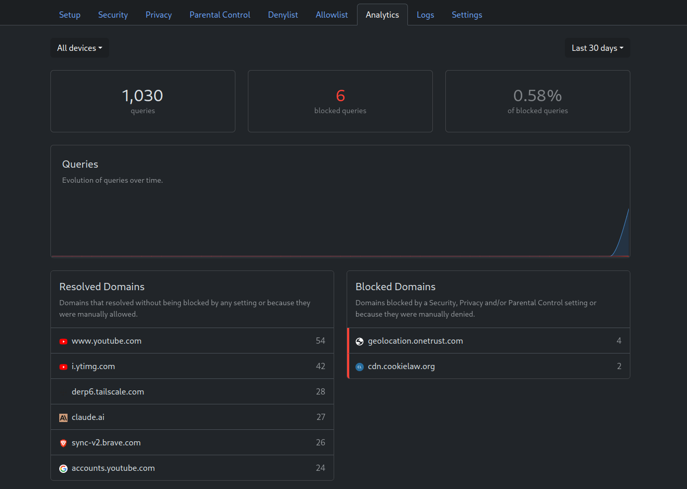
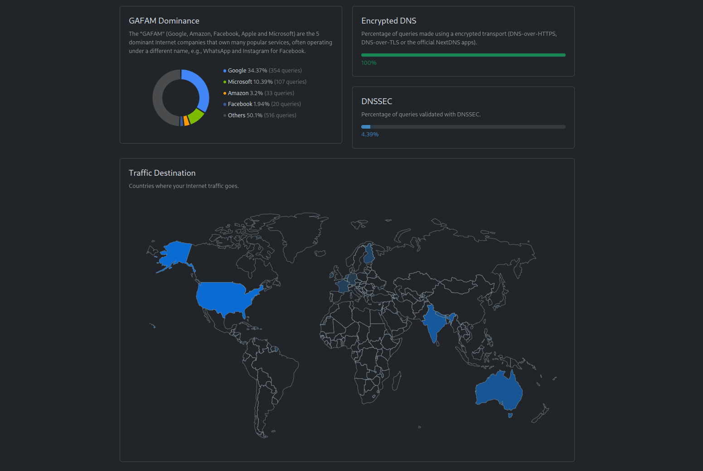

I've been using Adguard home for a few years as my DNS resolver.
It runs in a virtual machine in my homelab.
Some of the essential benefits it provides me are

- Adblocking _(ofcourse)_
- Privacy _(I use quad9 and clouflare as the upstream DNS over HTTPS)_. My ISP sees nothing.
- Bypass censorship _(unblock 'DNS' banned sites in the country)_
- Monitoring _(Logs & Usage overview. I don't use this a lot, but incase I need it - it's there)_
- DNS overwrites _(I use it for a couple of my own websites that I frequently visit)_

_My Adguard Home instance_

_DNS Rewrites_

I have setup my router to use the Adguard Home instance as the upstream DNS server
which means every devices connected to my network get adblocking and censorship bypassing benefits
out of the gate.

This has been a fantastic solution so far. The only downside here is that when I'm
not on my network I lose all those benefits.

For this reason, I wanted to look for an alternative DNS solution that would work on whichever network I connect to.
This means I needed a local resolver that would connect to a public DNS server over HTTPs or TLS.

## systemd-resolved as the resolver

I had some experience using `systemd-resolved` before, so I looked at it as the first option.
Currently, I have a bare minimum setup where Network manager sets up the DNS server on the machine.

Fortunately, network manager & systemd-resolved work together prefectly. The only change I needed
to make on Network manager side was to tell it to use `systemd-resolved` as the DNS resolver

```bash
> cat /etc/NetworkManager/conf.d/dns.conf

[main]
dns=systemd-resolved
```

systemd-resolved was also disabled on my machine, so I had to enable it

```bash
sudo systemctl enable systemd-resolved
sudo systemctl start systemd-resolved
```

At this point, `systemd-resolved` was serving the DNS requests.

```bash
> cat /etc/resolv.conf

# Generated by NetworkManager
nameserver 127.0.0.53
options edns0 trust-ad
```

## Configuring DNS over TLS

`systemd-resolved` doesn't seem to support DNS over HTTPS (DoH) but it does support
DNS over TLS (DoT) which is fine with me.

> DoH is the preferred option over DoT
> since the former is indistinguishable from a normal HTTPs connection whereas the later
> is easier to notice & hence censor because it works on port `853`.

To configure the upstream DNS server, I simply edited systemd-resolved config and
enabled `DNSOverTLS`.

```text title="/etc/systemd/resolved.conf"
# /etc/systemd/resolved.conf

[Resolve]
DNS=1.1.1.1#cloudflare-dns.com 1.0.0.1#cloudflare-dns.com
DNSOverTLS=yes
Cache=yes
```

### Troubleshooting slow DNS responses

I could tell the DoT was working because I was able to access cencsored sites.
However, the surfing felt noticeably slow. Sites that used to open in few milliseconds
were now taking about 10 seconds (or more) just for the first contentful paint.
Something was off ...

```bash
sudo resolvectl log-level debug
```

I enabled verbose logging on `systemd-resolved` and then tailed the logs

```bash
journalctl -u systemd-resolved -f
```

I could see a lot of Connection refused error and systemd-resolved would just
use my router as the DNS server.

```text
Connection failure for DNS TCP stream: Connection refused
Retrying transaction 10768.
Cache miss for 0pointer.de IN A
Transaction 10768 for <0pointer.de IN A> scope dns on wlp2s0/*.
Using feature level TLS+EDNS0 for transaction 10768.
Sending query via TCP since UDP isn't supported or DNS-over-TLS is selected.
```

[Reference GH issue](https://github.com/systemd/systemd/issues/18060#issuecomment-803494767)

I checked the status of systemd-resolved and I could see that the network interface
was still pointing to my router as the DNS server even though the global config
was pointing to the cloudflare DNS server.

```bash
> resolvectl status

# This text is altered as I'm now I'm using a private DNS server

Global
           Protocols: +LLMNR +mDNS +DNSOverTLS DNSSEC=no/unsupported
    resolv.conf mode: foreign
  Current DNS Server: 1.1.1.1#cloudflare-dns.com 9.9.9.9#dns.quad9.net 8.8.8.8#dns.google 2606:4700:4700::1111#cloudflare-dns.com 2620:fe::9#dns.quad9.net 2001:4860:4860::8888#dns.google

Link 2 (enp5s0)
    Current Scopes: DNS LLMNR/IPv4 LLMNR/IPv6
Current DNS Server: 192.168.254.254
```

I think I just needed to point my lan interface to use the same DNS server.

I found this section quite confusing. `resolvectl status` shows that my LAN interface
is using my router as the DNS server, however when I make a DNS query, it's still
served by the cloudflare servers ...

For now, I've configured Network manager IPv4 & IPv6 method to point the DNS server
to `127.0.0.1`.

## NextDNS

Cloudflare DNS works pretty well but now I've lost some of the benefits I had with an Adguard Home setup.
Mainly, Ad blocking, DNS logs & privacy (cloudflare still sees all my dns queries although not as big of a deal
as it can't really point back to my identity).

I gave NextDNS a try which I suppose is kind of like your own private Adguard Instance on the cloud.
It has a free plan and offers

- logs
- analytics
- dns rewrites
- safe browsing
- ad blocking

_NextDNS Analytics_

_NextDNS Traffic Analytics_

I updated `systemd-resolved` & `networkd` configs to use my private next dns resolver.

So far it looks amazing! Although I'm not sure if the 300k req/mo is going to be sufficient for me.
I guess we will find out ...
