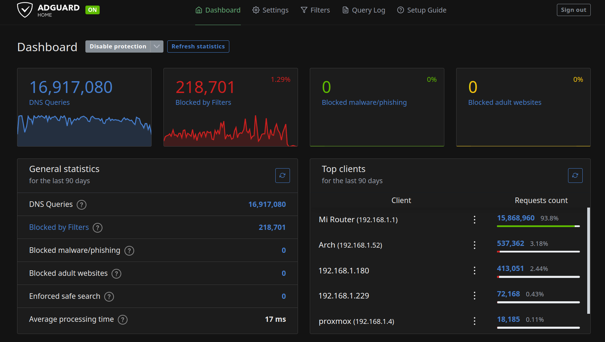

I've been using Adguard home for a few years as my DNS resolver. It's runs in a virtual machine
in my homelab. Some the essential benefits it provides me are

- Adblocking (ofcourse)
- and privacy (I use quad9 and clouflare as the upstream DNS over HTTPS)
- bypass cencorships (sites like tiktok are 'DNS' banned in Nepal)
- monitoring (I don't use this a lot, but incase I need it it's there)
- DNS overwrites (I use it for a couple of my own websites that I frequently visit)




I have setup my router to use the Adguard Home instance as the upstream DNS which means every device
connected to my network gets adblocking and cencorship bypassing out of the gate.

This has been a fantastic solution so far. The only downside here is that when I'm
not on my network I lose all that benefit. For this reason, I wanted to look for a
DNS solution that would work on whichever network I connect to. This means I needed
a local resolver that would connect to a public DNS server over HTTPs or TLS.

## systemd-resolved as the resolver

I had some experience using `systemd-resolved` before, so I looked at it as the first option.
Currently, I have a bare minimum setup where Network manager sets up the DNS server on the machine.

Fortunately, network manager & systemd-resolved work together prefectly. The only change I needed
to make on Network manager side was to tell it to use `systemd-resolved` as the DNS resolver

```text title="/etc/NetworkManager/conf.d/dns.conf"
[main]
dns=systemd-resolved
```

systemd-resolved was also disable so I had to enable it

```bash
sudo systemctl enable systemd-resolved
sudo systemctl start systemd-resolved
```

At this point, `systemd-resolved` was serving the DNS requests.

```text title="/etc/resolv.conf"
# Generated by NetworkManager
nameserver 127.0.0.53
options edns0 trust-ad
```

## Configuring DNS over TLS

`systemd-resolved` doesn't seem to support DNS over HTTPS (DoH) but it does support
DNS over TLS (DoT) which is fine with him.

> DoH is the preferred option over DoT
> since the former is indistinguishable from a normal HTTPs connection whereas the later
> is easier to notice & hence censor because it works on port `853`.

To configure the upstream DNS server, I simply edited systemd-resolved config and
enabled `DNSOverTLS`.

```text title="/etc/systemd/resolved.conf"
[Resolve]
DNS=1.1.1.1#cloudflare-dns.com 1.0.0.1#cloudflare-dns.com 2606:4700:4700::1111#cloudflare-dns.com 2606:4700:4700::1001#cloudflare-dns.com
DNSOverTLS=yes
Cache=yes
```

### Troubleshooting slow DNS responses

I could tell the DoT was working because I was able to access cencsored sites.
However, the surfing felt noticeably slow. Sites that opened in few milliseconds
were now taking about 10 seconds (or more) just for the first contentful paint.
Something was off ...

```bash
sudo resolvectl log-level debug
```

I enabled verbose loggin on `systemd-resolved` and then tailed the logs

```bash
journalctl -u systemd-resolved -f
```

I could see a lot of Connection refused error and systemd-resolved would just
use my router as the DNS server.

```text
Connection failure for DNS TCP stream: Connection refused
Retrying transaction 10768.
Cache miss for 0pointer.de IN A
Transaction 10768 for <0pointer.de IN A> scope dns on wlp2s0/*.
Using feature level TLS+EDNS0 for transaction 10768.
Sending query via TCP since UDP isn't supported or DNS-over-TLS is selected.
```

[Reference GH issue](https://github.com/systemd/systemd/issues/18060#issuecomment-803494767)

I checked the status of systemd-resolved and I could see that the network interface
was still pointing to my router as the DNS server even though the global config
was pointing to the cloudflare DNS server.

```bash
resolvectl status
```

```text
# This text is altered as I'm now I'm using a private DNS server

Global
           Protocols: +LLMNR +mDNS +DNSOverTLS DNSSEC=no/unsupported
    resolv.conf mode: foreign
  Current DNS Server: 1.1.1.1#cloudflare-dns.com 9.9.9.9#dns.quad9.net 8.8.8.8#dns.google 2606:4700:4700::1111#cloudflare-dns.com 2620:fe::9#dns.quad9.net 2001:4860:4860::8888#dns.google

Link 2 (enp5s0)
    Current Scopes: DNS LLMNR/IPv4 LLMNR/IPv6
Current DNS Server: 192.168.254.254
```

I think I just needed to point my lan interface to use the same DNS server.

### Configuring DNS on a specific interface

In `/etc/systemd/network`, I created a new file `10-enp5s0.network` where `enp5s0`
is my lan interface. I don't think the file name really matters but this is probably
the convention.

```text title="10-enp5s0.network
[Match]
Name=enp5s0

[Network]
DNS=1.1.1.1#cloudflare-dns.com 9.9.9.9#dns.quad9.net 8.8.8.8#dns.google 2606:4700:4700::1111#cloudflare-dns.com 2620:fe::9#dns.quad9.net 2001:4860:4860::8888#dns.google
DNSOverTLS=yes
```

After this change I restarted `systemd-resolved.service` but that had no change.
Apparently, it was also necessary to restart `networkd`

```bash
sudo systemctl restart systemd-networkd
```

And finally at this point, all the configuration was complete.

## NextDNS
