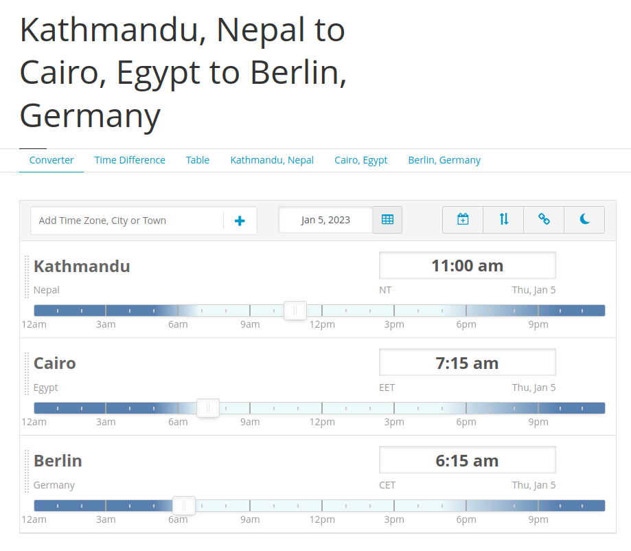

How nice would it be to have a turn off switch for your body? I would turn myself off every night at around 9/10 pm. Hold on ... that didn't sound right. A "sleep switch" might be a more appropriate word. Yes - that sounds better. I would press the sleep button every night at 9/10pm.

There are some people out there who have this gift - a virtual sleep switch they can turn on to dose off whenever & wherever they want. I, unfortunately, am not one of those people.

Why does it matter _when_ you sleep if you get 8 hours of sleep, you say? Because, just as important as it is to get adequate sleep it's also important that you get the morning sunlight ([shout out to Dr Andrew Huberman](https://www.youtube.com/watch?v=yBjUR16AiBM)).

And also if you happen to live with someone else who isn't a night owl, it would be nice to have a coherent schedule so you can get chores done & have meals together.

There's one other problem for late risers - and it's that you don't really have a good sense of where you are at your actual day. You see, I personally wake up at around 11am. By the time I wakeup and get ready for work it's almost noon. This gives me a feeling that half of my day has already passed but in fact it hasn't - it just started. I just woke up! Even worse, if it's winter - it's already dark 5/6 hours after you wake up.

This has been a pretty major problem for me. This dissonance of your internal clock with your external clock affects how you set yourself up for the day. So, here's a hack I came up with (_just this morning actually_).

> Follow a different timezone where you wake up at 6 in the morning.

I know it's super silly but it works. I have found that Cairo/Egypt (GMT+2) or Berlin/Germany (GMT+1) suits me perfectly. When I wake up at 11 am (GMT +05:45) it's 6:15am in Berlin.

_Timezone difference: https://savvytime.com/converter/nepal-kathmandu-to-egypt-cairo-germany-berlin_

Here's how my time differs

|            | Local Time | Berlin Time |
| ---------- | ---------- | ----------- |
| Wakeup     | 11:00 am   | 06:15 am    |
| Start Work | 12:00 pm   | 07:15 am    |
| First meal | 02:00 pm   | 09:15 am    |
| Sleep      | 02:00 am   | 09:15 pm    |

I have a much better track of where I am at the day now.

There you go - that's how you wake up early without actually waking up early.

---

## Thanks

- Photo by <a href="https://unsplash.com/@qstevenson?utm_source=unsplash&utm_medium=referral&utm_content=creditCopyText">Quin Stevenson</a> on <a href="https://unsplash.com/photos/3oyeaivM_fE?utm_source=unsplash&utm_medium=referral&utm_content=creditCopyText">Unsplash</a>

- https://savvytime.com/
