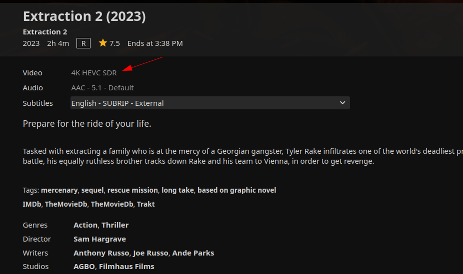
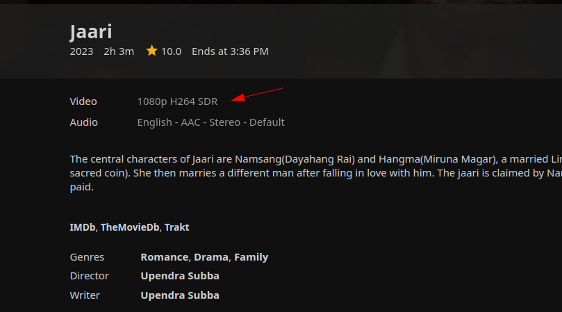
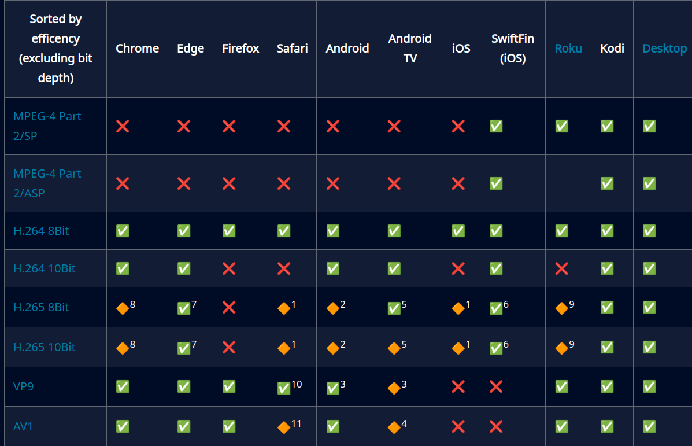

For the past couple of years I have been running Jellyfin on my [homelab](https://github.com/adityathebe/homelab); think of it as a self-hosted Neflix.
I host all of my movies & TV shows in there and then watch them from various clients - mobile app, TV & web app.
It's a great piece of software - however I don't particularly use its webapp.
The reason being - it doesn't play **some** movies very well.
It stutters so much and the server cpu usage goes through the roof.

And that's why I prefer to watch the movies on Jellyfin from my media player instead of from the web app.
To do that, I simply grab the stream URL from Jellyfin and play it on the media player as

```sh
mpv '<jellyfin-stream-url>'

# or
# vlc '<jellyfin-stream-url>'
```

I had very little idea why some movies wouldn't play well on the web UI.
And interestingly, on the other hand, the TV app handles pretty much any video with ease.

Now, I wasn't totally clueless here. I knew that _some_ videos needed to be transcoded with `ffpmpeg`
and that pins the CPU to 100% _(I don't have GPU attached so the transcoding is entirely performed on the CPU)_. But I didn't really know why that was required for some videos
and not for others. And honestly, I didn't know what "transcoding" was to begin with.

This curiousity led me to learn quite a bit about video files and ultimately
to write this blog post.

## The two defining characterstics of a video file

The unusual thing about video files is that the file extension doesn't tell
you anything about the video format.

When you encounter an `.mp3` file, you know that the file contains an mp3 encoded
audio data. Likewise, a `.jpeg` file contains a jpeg encoded image and a `.json` file contains json encoded
data.

> Aside: I know you can rename the file to have an
> incorrect extension, but let's assume that the file is named correctly with the appropriate extension.

However, with video files, the extension doesn't give you the entire picture about
what's inside the file. Your media player could support one `.mp4` file but may not support another `.mp4` file.
i.e. two different mp4 files may have been encoded with two separate codecs.

A video content thus has two distinct characterstics that defines it

- the file type (commonly referred to as the Container)
- the encoding algorithm (Compression / Codec)

## Containers

The thing that we commonly refer to as the video format like `mp4`, `mkv`, `flv` are actually
the just the file types. They are containers.

Think of them as different types of lunchboxes:

- The container alone doesn't reveal its contents.
- Some containers are like multi-compartment lunchboxes, capable of neatly organizing different "food items" (such as multiple audio tracks or subtitle files).
- What the container does indicate is its capacity and structure.

Some popular container formats are: `mp4`, `mkv`, `3gp`, `wEBm`, `flv`, `avi`, ...

Container formats differ from each other in various ways but here are some prominent defining characterstics

| **Characteristic**          | **Description**                                                                                                             |
| --------------------------- | --------------------------------------------------------------------------------------------------------------------------- |
| **Compression**             | Different formats use various compression algorithms, such as H.264, VP8/VP9, or lossless codecs like FLAC.                 |
| **Metadata support**        | Ability to store metadata, including subtitles, chapter markers, and custom tags.                                           |
| **Audio and video tracks**  | Some formats support multiple audio and video streams, while others are limited to a single track.                          |
| **Compatibility**           | Different formats have varying levels of compatibility with different devices, operating systems, or software applications. |
| **Licensing and royalties** | Container formats may be open-source (e.g. mkv), royalty-free (e.g. webm), proprietary (e.g. MP4, QuickTime,)               |

## Codecs

Codecs are the algorithms that encode the raw video data and compress them. The output of a codec is what's put inside the
containers. Codecs could also mean a hardware that is specifically designed to efficiently run the codecs.

Here are **some** of the most prominent characterstics of codecs to consider:

| **Characteristic**    | **Description**                                                                                         |
| --------------------- | ------------------------------------------------------------------------------------------------------- |
| **Compression Ratio** | Amount of data reduction achieved by the codec, with higher ratios indicating better compression.       |
| **Licensing**         | Whether the codec is open-source (free) or requires royalties or licenses from patent holders.          |
| **Complexity**        | Computational resources required to encode and decode the video, affecting device performance.          |
| **Color Space**       | Range of colors supported by the codec, impacting suitability for different applications (SD, HD, HDR). |
| **Bit Depth**         | Number of bits used to represent each pixel's color information, affecting overall quality and detail.  |

Some popular codecs are:

| Codec              | Description                                                                                                                                                                                                                          |
| ------------------ | ------------------------------------------------------------------------------------------------------------------------------------------------------------------------------------------------------------------------------------ |
| H.264 _(**AVC**)_  | most popular and most well-supported codec                                                                                                                                                                                           |
| H.265 _(**HEVC**)_ | More efficient than H.264 i.e. similar quality with lesser file size. However, has lesser support and it's patented. In fact, on windows, you need to purchase the codec for $0.99 from Microsoft - but there are free alternatives. |
| VP9                | _(Open source)_ developed by Google and YouTube uses this.                                                                                                                                                                           |
| AV1                | _(Open source)_ relatively newer and the considered the future of video compression. Isn't supported widely.                                                                                                                         |

### Why it's important to be aware of the codec

- **For General Users**: Understanding codecs helps you troubleshoot issues with video playback.
  By knowing which codecs are supported by your media player, you can diagnose and potentially fix problems when a video file won't play.

- **For Videographers**: Being mindful of the codec used in your footage ensures that you can work seamlessly with your preferred editing software or share your content without
  conversion issues.
  For instance, if you record with HEVC but Davinci Resolve doesn't support it, you'll need to purchase the codec to edit your files.

- **For Video Providers**: Choosing efficient and compatible codecs for your videos saves time and resources by avoiding unnecessary transcoding requests from clients.
  By encoding in a format that's widely supported, you can ensure that your content is accessible and easily playable on various devices and platforms.

## Looking back at the original problem

To circle back to the original problem, the reason why some movies weren't supported by the Jellyfin Webapp was because
those movies were encoded with HEVC.


_HEVC encoded movie on Jellyfin_

My web browser (and most browsers today) doesn't [natively support hevc](https://caniuse.com/hevc)
encoded media files. The Jellyfin server then has to convert the hevc encoded files to a format that the client supports.
This process of converting a video file from one codec to another is called **Transcoding**.

Most people running Jellyfin servers pre-transcode necessary files into h264 so all clients can support it and the playbook
is smooth. Or, they have run the transcode on the fly when the client starts streaming.

On the other hand, h264 encoded movies are natively supported by most browsers these days.


_AVC encoded movie on Jellyfin_

Here's a list of codecs and their support on different Jellyfin clients


_https://jellyfin.org/docs/general/clients/codec-support/_

## Who's responsible in supporting a codec

- The media player application is responsible in supporting a given codec.
- The operating system however provides system libraries and drivers that support various video codecs and facilitate communication between software and hardware components.
  The application can either implement their own support for codec or use the OS's system libraries.
- The hardware accelerates specific codec operations using GPUs, SoCs, or specialized A/V codec chips.
