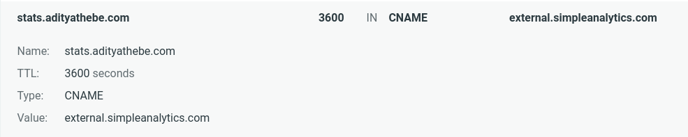
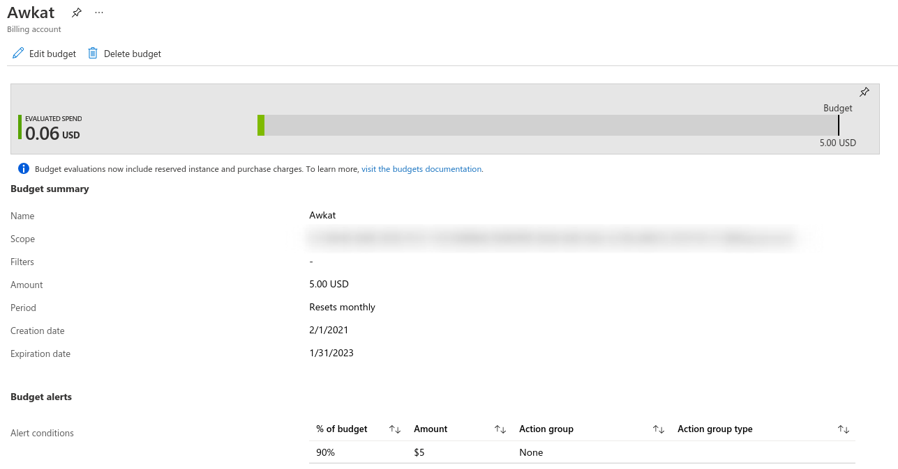

<div class="table-of-contents">

## Table of Contents

1. [Security Stuffs](#security)
   - Using TLS as a mechanism to attack web-based systems
   - Migrated away from Lastpass to Bitwarden
2. [Website Analytics](#web-analytics)
   - Bypass ad-blockers with a custom subdomain
   - A better way to embed external script in GatsbyJS
3. [Fixed a bug in Subdomain-Takeover scanner to reduce Azure cost](#azure-subdomain-takeover)

</div>

## Security Stuffs <a name="security"></a>

### 1. Using TLS as a mechanism to attack web-based systems

- https://www.youtube.com/watch?v=udpamSmD_vU
- https://portswigger.net/daily-swig/when-tls-hacks-you-security-friend-becomes-a-foe

Most of the things in this talk went over my head. The researcher demonstrated a novel way to use TLS with DNS rebinding to perform SSRF attacks that were previously considered impractical to achieve.

TLS provides a custom field (session id - size upto 65KB) which can be controlled by the TLS client. The attacker injects the malicious payload as a session id.

### 2. Migrated away from Lastpass to Bitwarden

Lastpass recently [announced](https://blog.lastpass.com/2021/02/changes-to-lastpass-free/) that they are restricting the free subscription to just one device. I've been wanting to shift away from Lastpass for quite some time now mainly because of their bad UI in their chrome extension and also because security nerds don't speak highly of them.

Besides Lastpass, there were a couple of other good choices but I wanted one with a free version and a nice chrome extension. Bitwarden ticked all my requirements and it's also fully open source! The transition was pretty simple. All I had to do was export a CSV from Lastpass and import it on Bitwarden. I believe it took me about 5-10 minutes.

## GoatCounter to SimpleAnalytics <a name="web-analytics"></a>

Analytics are super fun! When I first deployed my website, I used to have google analytics running on my phone at all times; just staring at the stats checking if a new user visited my site. However, analytics add overhead to your website and privacy is another issue. A couple of months ago I ditched Google Analytics and started using [Simple Analytics](https://simpleanalytics.com) in favor of a simpler UI and better privacy policy. However, after some thought, I got rid of Simple Analytics. The main motivation was to make my website free from any tracker.

But recently, I tried [GoatCounter](https://www.goatcounter.com/) - an open source web analytics platform. I used it for a week or so. It was simple and pretty fast but I wasn't a big fan of the UI. And now I'm back again with SimpleAnalaytics 😁. I remember them having a free version but apparently now they don't. I got a free 1-year subscription from my Github Students Benefit though.

### Bypass ad-blockers with a custom subdomain

Generally, when you add a tracker, the tracker sends all the data to its own server. Adblockers and privacy extensions block any requests to these tracker servers. In order to circumvent this, Simple Analytics provides a nice [feature](https://docs.simpleanalytics.com/bypass-ad-blockers) to setup our own subdomain to collect the data. All we need to do is setup a CNAME DNS record that points to Simple Analytics' server. Easy Peasy!



### A better way to embed external script in GatsbyJS

I'm using GatsbyJS for this site and guess what? There's actually a plugin to add an analytics tracking script! How ridiculous is that! All I need to do is add one line of script tag and there's an NPM module for that? I'm not sure what the plugin offers but I'm for sure not installing it. I just added the simple analytics script tag to my Layout component.

```jsx
const Layout = ({ children }) => (
  <>
    <Navbar />
    <main className="page-content">
      <div className="wrapper">{children}</div>
    </main>
    <Footer />
    <script async defer src="https://stats.adityathebe.com/latest.js" />
  </>
);
```

However, this layout component was embedded inside a div and I wanted the script tag to be as the first level child of `body` like this.

```html
<div id="___gatsby">...</div>
<script async="" defer="" src="..."></script>
```

Thankfully, gatsby provides a way to do this with `gatsby-ssr.js`.

```jsx
import React from 'react';

export const onRenderBody = ({ setPostBodyComponents }) => {
  setPostBodyComponents([
    <script async defer src="https://stats.adityathebe.com/latest.js" />,
  ]);
};
```

I found the solution [here](https://github.com/gatsbyjs/gatsby/issues/11013#issuecomment-610886184).

## Fixed a bug in Subdomain-Takeover scanner to reduce Azure cost<a name="azure-subdomain-takeover"></a>

I've been running a scanner on my VPS for about a year now to hunt for subdomain takeover bugs. For that, Azure Free Student's subscription had been serving me well until I had to create Azure instances in regions that weren't available in the student's subscription. Due to that, I had to create a premium account. In the first 3 months of migrating, I racked a bill of $152! Although, I have to say it's not as bad as the guy who got a bill of [$72k overnight](https://blog.tomilkieway.com/72k-1/).

Yesterday, I figured out the cause and fixed it. I was running an Azure App Service Plan 24x7! Now, the script creates one only when it's required and also uses a free version instead of the standard version. All I had to do was add two words `--sku F1`.

As a precaution, I've also added a new budget in Azure Cost Management so that I get an alert when I'm near the end of my budget.


