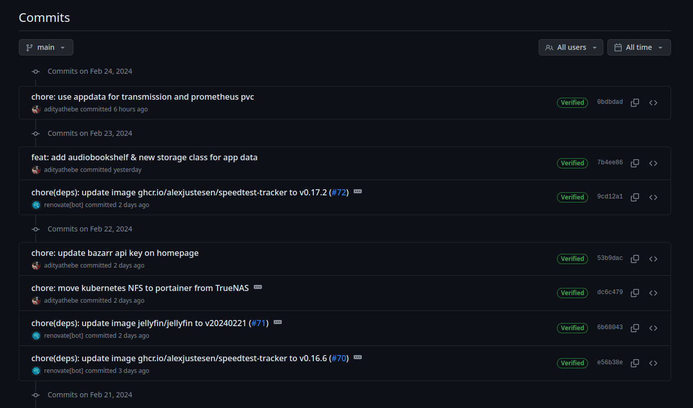
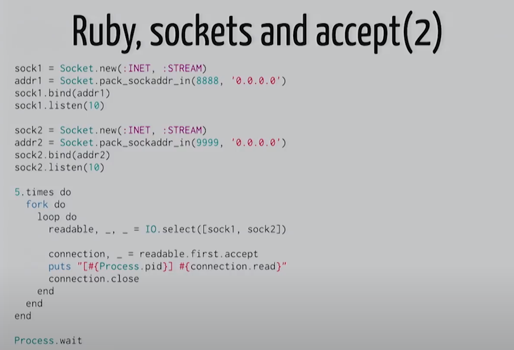

## Table of Contents

1. [Git Aliases](#git-aliases)
2. [Software Engineers' salaries made public](#salaries-made-public)
3. [SSH Signing keys](#ssh-signing-keys)
4. [Unix Magic in Unicorn](#unix-magic-in-unicorn)

I can't believe it's been 3 years since my last weekly journal! It felt more like a year. Anyways, here's what I've learned so far this week.

## Git Aliases

- Git branch better
  https://gist.github.com/schacon/e9e743dee2e92db9a464619b99e94eff

- Video: https://www.youtube.com/watch?v=aolI_Rz0ZqY&list=WL&index=2&t=505s

- Force with lease (could be an article)

## Salaries made public

A list of compensation history of software engineers.

- https://xeiaso.net/salary-transparency/
- https://tomwithers.dev/salary
- https://blog.heyal.co.uk/income/
- https://brunty.me/salary/
- https://thorlaksson.com/salary/
- https://carol.gg/salary/
- https://www.jvt.me/salary/

I found out all these websites (except Xe Iaso's) through [jvt.me](https://jvt.me) who I discovered through the [Changelog podcast](https://changelog.com/friends/31).

I think it's pretty cool but I'm not sure if I'll ever do it myself. 1% of me thinks it's interesting to share but the other 99% thinks that this will do more harm than good.

## SSH Signing key

I recently added a new GPG key as a signing key to my GitHub account. If you're not aware of this, `git` has a feature to sign a commit which tells that the commit made from your email was actually made by you. Otherwise, I can just as easily set the commiter's email to YOUR email in my git config and and then push that commit to GitHub and GitHub will associate that commit to your account. By signing the commit, I can guarantee that the commit was made by me.

Once you configure the signing key locally in git, you also need to tell GitHub that you're gonna be signing with that key. Once that's setup, GitHub will show "verified" status in the commit history.

_Verified commits in Github_

What I didn't know was that you can use a **SSH key** to sign commits. This means I can use the same SSH Key to both authenticate & sign commits. The benefit of this is, to me, is simply that I just have one key to maintain & I can delete the GPG key.

[People seem to not like the idea of using SSH keys to sign though](https://news.ycombinator.com/item?id=32835335) as ssh keys are supposed to be ephemeral while the signing keys are supposed to be long lived. But no one says you can't keep your ssh keys for a long term.

## Unix Magic in Unicorn

I finally caught up to this [video on Unix Magic by Thorsten Ball](https://youtu.be/DGhlQomeqKc?si=0IK1YwHhbM4JMr9g). It's being sitting on my YouTube's "Watch later" playlist for a while now.

In this video, he talks about multi process workers in the Unicorn web server. Things I learned

### IPC (inter process communication) through Unix Pipe:

As a Linux user, I interact with unix pipes numerous times daily. But I never imagined that it was a common way to communicate between processes.

### `sockets` & `select`:

Sockets are one of the fundamental features to working with anything networking related in UNIX. Life cycle of sockets

- socket
- bind
- listen
- accept

`select` seems to be very similar to the `select` keyword in Go. In fact, Go might have probably derived the term from Unix. Basically, a `select` syscall allows us to accept from multiple sockets. i.e. if you have multiple sockets, `accept` on of the sockets blocks until it receives a message. No other sockets can be accept at the same time and `select` enables exactly that.

### Signal

I'm not sure I fully understood this section but the interesting bit here was how signals are handled by Unicorn - or more specifically asynchronous signals. Techniques like self-pipe and queuing were used but I didn't fully get it.

Some other cool use cases of signals were

- Scaling workers using `TTIN` signals was also pretty cool.
- Hot reloading with `USR2` signal.

## References

- https://www.gnu.org/software/coreutils/manual/html_node/Signal-specifications.html
