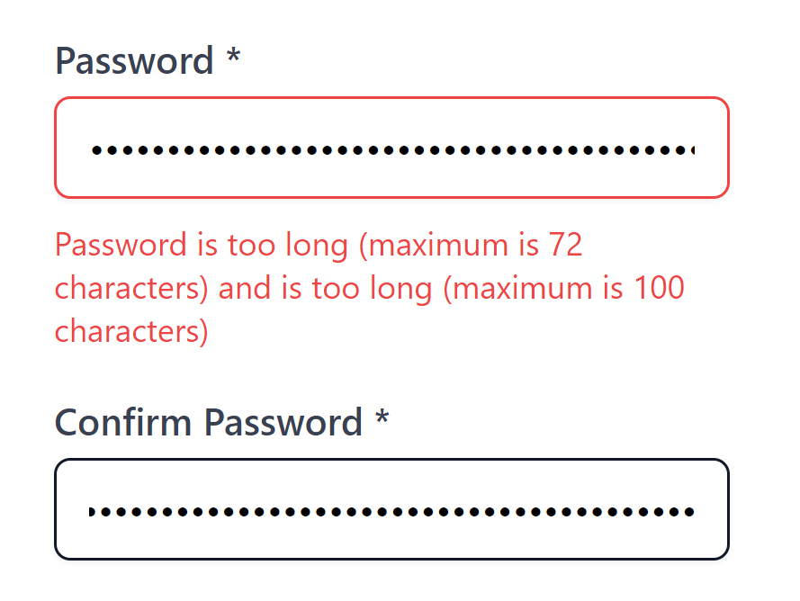

<div class="table-of-contents">

## Table of Contents

- [Website updates](#website-updates)
- [Developing on a Virtual machine](#developing-on-a-vm)
- [NixOS](#nixos)
- [Self Hosting Podcast](#self-hosting-podcast)
- [Neovim](#neovim)
- [Logictech udev rule](#preventing-logictech-from-waking-up)
- [BCrypt](#bcrypt-72-bytes-limit)

</div>

## Website updates

I added 2 new pages to my website & also exposed my movary instance.

### /now

I've been seeing a [/now](/now) page in quite a few blogs these days. The /now page, unlike the /about page, is more frequently
updated.

> /now is a more personal look at what people are doing right now, what they care about, and what they could use help with.
>
> \- https://aboutideasnow.com/about

### /links

[/links](/links) is another page that's quite common these days. People put all kinds of things in their /links page - like links
to podcasts they listen to, their favorite books or blogs, etc.

I'm not quite sure what I should put in here but I mainly added this page to share the [movary]("https://movies.adityathebe.com/users/adityathebe/dashboard")
instance. It's a web app that's currently running on my homelab but exposed to the internet via Cloudflare Tunnel.

## Developing on a VM

I've been wanting to develop on a VM for a over two years now. The goal is to have a beefy desktop
at home and ssh into it for all development purpose from my laptop.

Developing on a VM means you can have a fairly basic laptop and still run huge projects.
It can be kept in one corner of your house so you don't have to deal with noise.
And remote development shouldn't be problem with Tailscale.

What about when I'm working away from home and there's a power outage? Who's gonna turn the PC back on?
Well, turns out you can configure the BIOS to automatically turn on when there's power.
You don't need to login because systemd turns on the ssh daemon automatically.
This is how one of my coworkers used to work.

My laptop is getting old now and its fans are driving me nuts.
The keyboard also gets quite hot but I rarely use it.
A thin fanless laptop with a good battery backup developing off of a
beefy nixos vm would be my dream setup for now.

- Mt.lynch's homelab for all developerment
  https://mtlynch.io/building-a-vm-homelab/

- <blockquote class="twitter-tweet"><p lang="en" dir="ltr">&quot;Between VSCode, WSL, and Intel’s latest desktop chips, I’ve been living with a PC that runs my programming tests faster than an M3 Max, and generally feels like a completely viable alternative to macOS.&quot; <a href="https://t.co/tP4UQNk1Ss">https://t.co/tP4UQNk1Ss</a></p>&mdash; DHH (@dhh) <a href="https://twitter.com/dhh/status/1761830698758066298?ref_src=twsrc%5Etfw">February 25, 2024</a></blockquote> <script async src="https://platform.twitter.com/widgets.js" charset="utf-8"></script>

## Nixos

I learned about NixOS a few weeks ago and I've wanted to migrate to it ever since.
It's not the most friendly OS and it has the worst in the business error messages.

To test developing on a VM, I wanted to deploy it in a proxmox vm and see how
that turns out. However, [I haven't been able to deploy it](https://discourse.nixos.org/t/error-secret-key-is-corrupt-when-building-flake/40440)
and no one seems have the solution to the issue. Installing it is fine but migrating to flakes is where I'm stuck right now.

- https://mtlynch.io/notes/nix-first-impressions/

## Self Hosting Podcast

I installed AudioBookShelf this week to be my ultimate Podcast player. It looked
great at first but turned out it has some fatal issues.

- Can't browse the episodes.

  ABS is fully local. That means discovering new podcasts through it is not possible.
  While I can search for podcasts I can't really see/listen to the episodes without
  first subscribing and then manually downloading episodes.

- You can't download episodes from mobile

  This was the fatal flaw that turned me away from ABS. If you add a podcast, it'll only download
  future episodes! You have to configure it to download past episodes. And worse,
  that's not possible from the mobile app.

- Doesn't have an iOS app right now.

  There's a beta release but it's over the limit.

I have installed AntennaPod which I think will be my ultimate player.
I'll also try out podfetch or podgrab next week.

## Neovim

This week I got a lot done with neovim. I did two days of development entirely
on Neovim. It's fun but I'm still not as productive with it as I am with VSCode.
But, I certainly feel much more comfortable now. In fact, I'm writing this journal in
Neovim right now.

### Things VSCode does better

- Find and replace from all files in the workspace
- Multi cursor
- AI code completion
- Discovering new plugins
- Installing new plugins

### Vimimum browser extension

This is an extension that lets you use vim bindings on your browser. I had tried
this before but didn't like it as it interferes with your normal keybindings. Example:
on YouTube, pressing "F" doesn't go full screen anymore. You have to get into
the "Insert mode" and then press F. Also, the "Insert mode" has a floating bar on the
bottom left panel that stays up when you're in insert mode; so after you press F you
need to exit out of the insert mode again.

`Ctrl+C` to copy also doesn't work in visual mode as that's default for ESC binding. I've now
disabled vimimium on youtub.com.

It's been an ok experience so far & it doesn't get in your way most of the time
so I'm going to continue using it.

### Vim setup series by TypeCraft

Watched this really good series by TypeCraft. The guy's really funny and you should
check him out.

https://www.youtube.com/playlist?list=PLsz00TDipIffreIaUNk64KxTIkQaGguqn

### Vim Plugins & exploration

#### Better escape is pretty cool

When I was starting out with vim, getting out of the insert mode was a pain
because I had to press `ESC` key which isn't very accessible. You need to lift your hand
for that and I'm realizing that this sounds like a first-world problem while I'm writing it.
Nonetheless, it's still a problem.

Then I started using `Ctrl+C` which is much more easier but still not the best
keymapping.

This week I found out about [better escape](https://github.com/max397574/better-escape.nvim)
which lets you exit insert mode by pressing `jj` in quick succession.
AstroNvim ships this plugin be default so I got it for free.

This was definitely my favorite vim finding of the week.

#### Telescope for other stuffs

I use telescope for finding files and greping files but it seems to have lot of other
cool use cases.

- `<leader>gt` for git status and easier access to the diffs on the right panel
- `<leader>gb` to show all the git branches was coool
- similary, `<leader>gc` to show all the git commits was also pretty nice.

## Preventing logictech from waking up

I have a MX Master mouse which has a USB dongle that needs to be plugged in to my
laptop for wireless connection. It's been a pain so far to remember to plug it out
when I suspend my laptop because it wakes the computer.

I added this udev rule and now all's good.

https://wiki.archlinux.org/title/Udev#Waking_from_suspend_with_USB_device

```sh
ACTION=="add", SUBSYSTEM=="usb", DRIVERS=="usb", ATTRS{idVendor}=="046d", \
  ATTRS{idProduct}=="c548", ATTR{power/wakeup}="disabled", ATTR{driver/1-1.1.1.4/power/wakeup}="disabled"
```

## Bcrypt 72 bytes limit

When I saw this tweet, my immediate reaction was that this limitation is probably
coming from the `VARCHAR(72)` field on the database and that sha256 hashing
the password before bcrypting it would solve it.


_Source https://x.com/_JohnHammond/status/1762360967844012418_

Interestingly, there was a different genuine reason behind it.

I learned that bcrypt has a 72 bytes input limit! If your password is longer than that
then the remaining bytes are simply discarded.

Sha256 hashing beforehand doesn't help because it outputs 256 bits (just 32 bytes) and the 72 bytes
entropy that your password initially had gets reduced tremendously. https://stackoverflow.com/a/16597402

Whether the reduction is significant or not, it certainly doesn't help those
who want to use long passwords.

## Vitess

I watched this really interesting [interview with Sugu Sougoumarane](https://youtu.be/qTwDfW_T7Bg?si=wbNj4mTiSeQixAEc&t=2502)
where they talk about Vitess - a mysql proxy that enables horizontal scaling with sharding.

### Interesting bit:

- At the `42` minute mark, he says that YouTube was initally built outside of the Google
  Monorepo and then the YouTube build was pulling code from his laptop's home directory (which
  was mounted to Google storage).

- Vitess got its name from a japanese Anime. The word itself is derived from the
  French word "Vitesse" (meaning speed).

## DevOps Reimagined

System Initiative is a company that's rethinking devops. Not sure how much I'm
buying into it but it definitely looked interesting.

https://www.youtube.com/watch?v=zyEOYl23pd8&t=252s&pp=2AH8AZACAQ%3D%3D

I think their greatest asset is their mock up of cloud services like AWS for instance.
You can run your infra in their mockup as a precheck before deploying which tremendously
speeds up the feedback loop and makes testing changes much much faster & safer.
