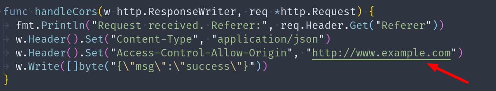

If you've ever tried to perform cross origin requests to a server that doesn't support CORS then you'll get a `net::ERR_FAILED` which is the expected behaviour. Sometimes, we just need the redirection to occur even though we cannot access the response. This article shows how you make the browser perform the redirections when CORS isn't supported by some or even all of the urls involved in the redirection ...

### Same Origin Policy (SOP)

The image below demonstrates what happens when a cross origin request is made to `localhost` from `example.com` (_two different origins_).

_Accessing localhost from example.com_

A common misconception about [Same Origin Policy](https://developer.mozilla.org/en-US/docs/Web/Security/Same-origin_policy) is that it prevents making requests from one origin to another origin. That is a false assumption. SOP prevents **accessing** the response, it doesn't prevent **making** the request.

So, in the example shown in the image above a request was actually made to localhost, although the response wasn't accessible. If we check our server log, we'll in fact see the request.

_Server Logs_

### Cross Origin Resource Sharing (CORS)

Now, how do we make the resources on localhost available to example.com ? To circumvent this restriction by SOP, we can use CORS.

Let's add a new endpoint that supports CORS. It's as simple as adding the header `Access-Control-Allow-Origin: http://www.example.com` to the response.

_Enable CORS with the Access-Control-Allow-Origin header_

And now if we make a request to localhost from example.com we will be able to access the response.

_Access response from the client with CORS enabled_

### Redirection with CORS support

Let's add a new endpoint `/cors-redirect` that redirects the user to `/cors`.

_Endpoint that redirects to /cors_

On the browser we can make a request to this new endpoint. We'll see that the redirection does occur and the response is in fact from `cors`.

_Redirection successful_

If we check our server log, we can see all the requests that were received.

_Server Logs_

So far so good ...

### Redirection without CORS support

Let's add a new endpoint `/no-cors-redirect` that redirects the user to `/cors`.

```go
func handleNoCorsRedirection(w http.ResponseWriter, req *http.Request) {
  fmt.Println("[/no-cors-redirect] Request received")
  fmt.Println("Referer:", req.Header.Get("Referer"))
  w.Header().Set("Location", "/cors")
  w.WriteHeader(http.StatusFound)
}
```

If we try to call this endpoint, the browser will throw an error.

_Error on redirection with no CORS support_

Even though the endpoint `/cors` supports CORS, the redirection does not occur because on the very first response itself the browser will terminate the request.

It doesn't matter whether the subsequent redirected urls support CORS or not if the ones before doesn't support it. For a redirection to occur, every urls on the redirection should support CORS.

We can verify that the redirection didn't occur by checking our server log.

_Server Logs_

#### no-cors mode

The fetch API provides a special option called `mode`. It takes 5 possible values "same-origin", "cors", "no-cors", "navigate", or "websocket" and the default value is "cors" although the specs suggest that "no-cors" is the default value 🤷‍♂️.

_Fetch Mode Specification https://fetch.spec.whatwg.org/_

Let's use the `mode: 'no-cors'` option this time and see if the redirection occurs.


Yay ! The redirection does occur. We can verify that by checking our server log.

_Server Logs_

But if you noticed we have an error on the browser console. The error occurs because this time SOP prevents us from accessing the response of `/cors`.

**Remember, the endpoint `/no-cors-redirect` doesn't support CORS.**

And if you look at the code we are calling the `response.json()` which tries to access the response body.

Let's modify our code a little bit.

_Opaque response type_

This time we're not trying to access the response body. We're simply logging the response to the console. This is an special type of response classified as - "Opaque" response. You can see in the log above.

There other types of request too. You can read about them here - https://developer.mozilla.org/en-US/docs/Web/API/Response/type

Let's take a step back and see the response type of the requests that we have made before.

_Response types_

---

## Summary

- SOP prevents accessing response from a different origin
- CORS helps us access response from a different origin provided that the server supports it
- By default, cross origin redirects are prohibited if the server doesn't support CORS
- We used mode 'no-cors' to make the redirections

---

This blog post was inspired by

- [Github OAuth bypass write-up by Teddy Katz](https://blog.teddykatz.com/2019/11/05/github-oauth-bypass.html)
- [Pentester Lab Course - OAuth2: Github HTTP HEAD](https://pentesterlab.com/exercises/oauth2_github/course)

Find the server-side go code [here](https://gist.github.com/adityathebe/f5905b9e28bbc78ba2abbd69e88a5c0d)
