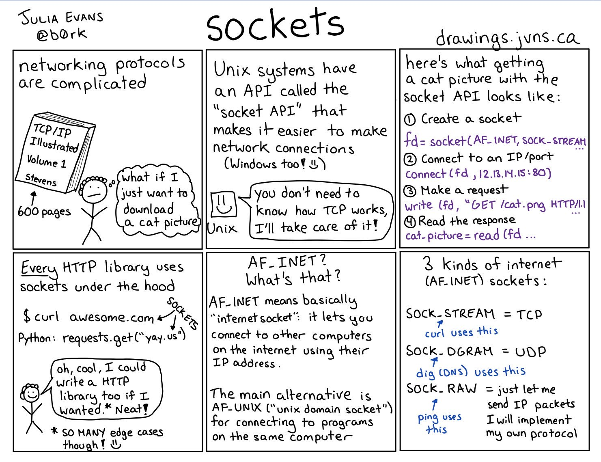
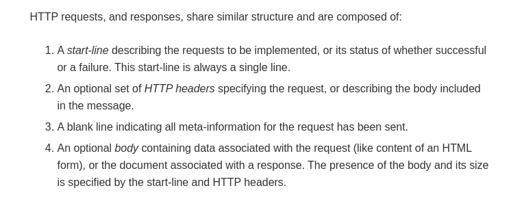

I love programming in NodeJs; mainly due to the speed in which I can quickly get an application up and running. Need to make an http request ? `npm install axios` and a few lines of code will do the trick. Need to create an http server? `npm install express` and with few lines you've an http server running. Now take a look at this [StackOverflow answer](https://stackoverflow.com/a/1359700/6199444) on how to make http request in Java. There's just so much of code to write ...

But this convenience comes at a cost. All these fancy easy-to-use libraries abstract the nitty gritties that's happening under the hood.

I learned about sockets years after learning to make http requests in NodeJs. The convenience provided by RequestJs and ExpressJs never made the need for me to learn sockets. In fact I didn't even know that there's such thing as sockets just a while ago and I am sure many new devs don't either.

## What are sockets ?

You've probably heard about TCP. It's the protocol that governs the exchange of data over network connections.

HTTP works over TCP (Any other protocol like UDP is fine as well but TCP is the standard). This means whenever you need to make an http request to a server - via whatever means like nodejs, python, curl or web browsers - you first need to establish a TCP connection with the server. Once the TCP connection is established, http requests and responses can be exchanged to-and-fro over the connection.

So how do we establish a TCP connection? That's where sockets come in. A socket is an interface provided by the operating system, that enables end users to make TCP connections (UDP too but let's stick to TCP sockets). Every programming language has a socket interface. NodeJs provides the `net` library, python provides the `socket` library and likewise there's `java.net.Socket` in Java.

_Zines by Julia Evans_

## Establish a TCP connection in NodeJs with sockets

To establish a TCP connection we need the IP Address and the port number of the two communicating devices. As an example, if I want to establish a TCP connection with google's server then I'll need

- Google Server's IP Address
- Google Server's Port Number
- My IP Address (The OS takes care of this)
- My Port Number (The OS takes care of this one too)

There's a webserver running on adityathebe.com on port 80. Let's try to establish a TCP connection with that server.

```js
const net = require('net');

const port = 80;
const host = 'adityathebe.com';

// Create a new socket
const socket = new net.Socket();

// Establish a TCP connection
socket.connect(port, host);

socket.on('connect', () => {
  console.log(`Established a TCP connection with ${host}:${port}`);
  socket.destroy();
});
```

That's it. If you run the code above, you'll establish a TCP connection and then also kill it right away. TCP connections remain active for as long as days or even months or, theoretically, forever as long as there's no network connection issues. That's why it's important to kill the connection after's there's no need for it.

## Make an HTTP request over the socket

Now, let's try to send some data over the TCP connection. The data could be anything from a simple text to a large media file. In our case, the data will be an [HTTP messages](https://developer.mozilla.org/en-US/docs/Web/HTTP/Messages).

HTTP is a really simple protocol - it's literally just plain texts! You can even craft http requests & responses by hand. There are standards & structures to HTTP messages.

_HTTP Structure_

As a fun demo, let's try to make an http request to example.com. We can send a very bare minimal http request like this that only consists of http header.

```text
GET / HTTP/1.1
Host: example.com
   
```

Notice the blank line at the end ? That's important. The blank line separates http header from the http body. If you leave out the blank line, then example.com's server will respond with an error because the http request is invalid. It's also important to note that the blank line is actually a [CRLF](https://developer.mozilla.org/en-US/docs/Glossary/CRLF) `\r\n` and not the `\n` character.

```js
const net = require('net');

const port = 80;
const host = 'example.com';

// Instead of \n as a line break we use \r\n
// Because that's how it's defined in the http specification
// https://stackoverflow.com/a/5757349/6199444
const rawHttpRequest = 'GET / HTTP/1.1\r\nHost: example.com\r\n\r\n';

const socket = new net.Socket();
socket.connect(port, host);

socket.on('connect', () => {
  console.log(`Connected to ${host}:${port}`);
  console.log(`Local port ${socket.localPort}\n`);

  socket.write(rawHttpRequest);
});

socket.on('data', data => {
  // data is a buffer. We need to transform it to string
  console.log(data.toString());
  socket.destroy();
});
```

### HTTP Response from example.com

```text
HTTP/1.1 200 OK
Age: 267333
Cache-Control: max-age=604800
Content-Type: text/html; charset=UTF-8
Date: Sun, 22 Mar 2020 17:23:08 GMT
Etag: "3147526947+ident"
Expires: Sun, 29 Mar 2020 17:23:08 GMT
Last-Modified: Thu, 17 Oct 2019 07:18:26 GMT
Server: ECS (nyb/1D2A)
Vary: Accept-Encoding
X-Cache: HIT
Content-Length: 1256

<!doctype html>
<html>
<head>
    <title>Example Domain</title>

    <meta charset="utf-8" />
    <meta http-equiv="Content-type" content="text/html; charset=utf-8" />
    <meta name="viewport" content="width=device-width, initial-scale=1" />
    <style type="text/css">
    body {
        background-color: #f0f0f2;
        margin: 0;
        padding: 0;
        font-family: -apple-system, system-ui, BlinkMacSystemFont, "Segoe UI", "Open Sans", "Helvetica Neue", Helvetica, Arial, sans-serif;

    }
    div {
        width: 600px;
        margin: 5em auto;
        padding: 2em;
        background-color: #fdfdff;
        border-radius: 0.5em;
        box-shadow: 2px 3px 7px 2px rgba(0,0,0,0.02);
    }
    a:link, a:visited {
        color: #38488f;
        text-decoration: none;
    }
    @media (max-width: 700px) {
        div {
            margin: 0 auto;
            width: auto;
        }
    }
    </style>
</head>

<body>
<div>
    <h1>Example Domain</h1>
    <p>This domain is for use in illustrative examples in documents. You may use this
    domain in literature without prior coordination or asking for permission.</p>
    <p><a href="https://www.iana.org/domains/example">More information...</a></p>
</div>
</body>
</html>
```

I hope this was fun and helpful. Under the hood, the libraries like axios, request, express, etc are doing all of these and much more ...
