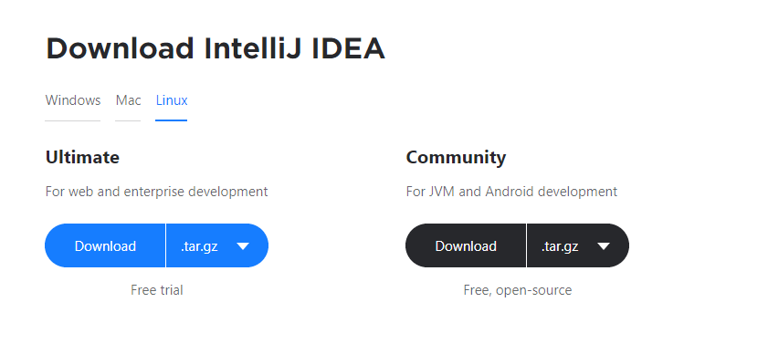

One of the main reasons I migrated to Linux from Windows was the ease of software management. I could install, update and remove 'any' software with just a few commands from the command line.

Life was fun and easy until it wasn't when I had to install a software which wasn't in the distro's software repository. A distro's Software Repository is basically a database of application installation packages and upgrade packages. If the software you want to install is not listed in the software repository then you'll have to look for other ways to install.

In Windows, almost every software provides an installation wizard but that's rarely the case in Linux.

So, what are some other ways to install a software when it's not available to install via the package manager? Well, some softwares provide the source code, which could be in C, C++, Go, ... you name it, and you're supposed to compile them. I have to say this is not an easy thing to do although I've never done it myself.

Conveniently, you can also find the compiled binary. It may be provided by the official software developers or by some third party. The compiled binary is usually archived in a single [tar](<https://en.wikipedia.org/wiki/Tar_(computing)>) file. All you need to do is download the tar file, extract it and then run the binary file inside the extracted directory.

To give you a brief overview of this post, I will be explaining 4 different ways to install softwares in linux.

## 1. Distro's Package Manager

This is my preferred way of installing softwares because the package manager makes it extremely easy, to not only just install, but also to update, remove and manage paths & the launchers (shortcuts). Ubuntu uses `apt` for package management and so does Debian and Linux Mint. Different distros have different package managers. Arch based distros use `pacman`, Red hat uses `rpm`, CentOS uses `yum` ...

Every distro has its own set of software repositories. What may be available to install with `apt` in Ubuntu may not be available to install in Debian even though both distros use `apt`.

The package manager a distro provides can be a deciding factor in choosing a distro for many people. To give you an example: Debian is known for its solid stability and the software in its official repositories may not be the latest release but a stable one. So Debian may not be a good choice for people who want the latest bleeding edge softwares.

The package manager will not always be able to help you because well obviously the software repository cannot include every software in the world.

Apart from the official software repositories, you can also add third-party software repositories. You may have noticed Google Chrome is not listed in the Ubuntu software repositories and so to install it you'll need to first add the Google Chrome's sofware repository. Once you add the repository, it's the same basic routine to install any software from that repository.

> Read: [How to install Google Chrome in Ubuntu](https://askubuntu.com/questions/510056/how-to-install-google-chrome)

If incase the software is again not available through third-party repositories then you'll have to look for other options.

## 2. A programming language's package manager

Some softwares are available to install through a programming language's package manager. Python has `pip`, NodeJs has `npm` (or `yarn`), GoLang provides the convenient `go get` command and there are a lot others.

Some of the softwares I install via a programming language's package managers are

- [localtunnel](https://github.com/localtunnel/localtunnel), [tldr](https://github.com/tldr-pages/tldr), [http-server](https://github.com/http-party/http-server), (via NPM)
- [wpm](https://github.com/cslarsen/wpm), [sublist3r](https://github.com/aboul3la/Sublist3r), [httpie](https://github.com/jakubroztocil/httpie) (via pip)
- amass (via go get)

It goes without saying that you need to have the programming language and the package manager installed. As far as I know, the package manager does come along when you install the programming language.

## 3. Compiled binary

The above two methods are fairly straightforward. Now comes the time to get our hands dirty.

As I already mentioned, you can install some softwares by simply downloading the compiled binary. The compiled binary is almost always packaged in a single tar archive file. In some rare cases you may find a zip or a rar archive.

Jetbrain provides the [compiled binary for its IDEs](https://www.jetbrains.com/idea/download/#section=linux). Check out the image below and look there's the tar file I told you about.



Likewise, if you want to [install postman](https://www.getpostman.com/downloads/) you also need to download the tar file.

Once you download the tar file you can extract it with the `tar` command

```bash
# Extract a (compressed) archive into the current directory:
tar xf source.tar[.gz|.bz2|.xz]

# Extract an archive into a target directory:
tar xf source.tar -C directory
```

If you look at the extracted directory you'll see a binary file. You may need to look a bit further if you don't find it in the main directory. Some softwares place the binary file in a `/bin` directory while some place them in the main directory itself. This directory structuring is unique to each software, but, more often than not, you'll find the binary file in the bin directory.

You can practically run the software by simply running the binary file. To run, open the terminal in the extracted directory and simply write the name of the binary file prepending it with `./`

```bash
# ./binaryFile

# To Run Intellij
./intellij

# To run postman
./Postman
```

Isn't it a bit tiresome to first open the terminal, then navigate to the software directory and only then be able to run the program? If you want to be able to run the program from anywhere in the terminal then you need to add the software's binary path to the Linux's PATH variable. But before that, let's discuss on where we shall place the extracted directory.

Practically you could place it anywhere you want; be it the /home directory or even the /Downloads directory itself. But, it's a standard practice to place it in one of these two directories

- /usr/local
- /opt

You might want to checkout this discussions in stackoverflow to get a better idea on where to place the software directory

- [Where to install programs?](https://askubuntu.com/questions/6897/where-to-install-programs)
- [When installing user applications, where do “best practices” suggest they be located?](https://askubuntu.com/questions/1148/when-installing-user-applications-where-do-best-practices-suggest-they-be-loc)

#### How to add path to PATH variable

Add this line to the `~/.profile` or `~/.bash_profile` file.

```bash
# export PATH=$PATH:<new-path>

export PATH=$PATH:/opt/postman

export PATH=$PATH:/opt/intellij/bin
```

## 4. Compile the source code
