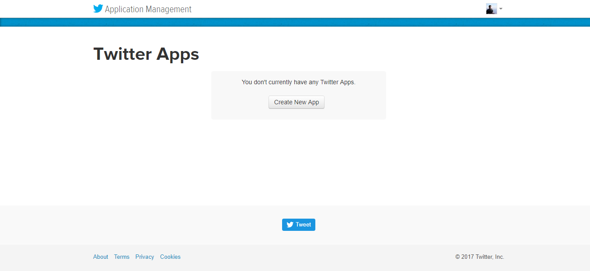
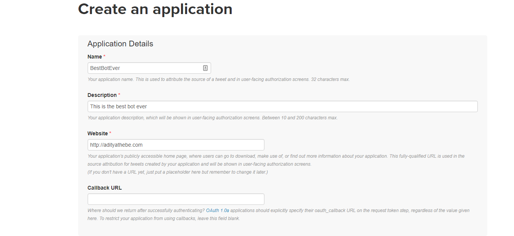
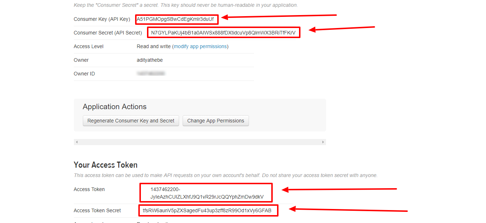
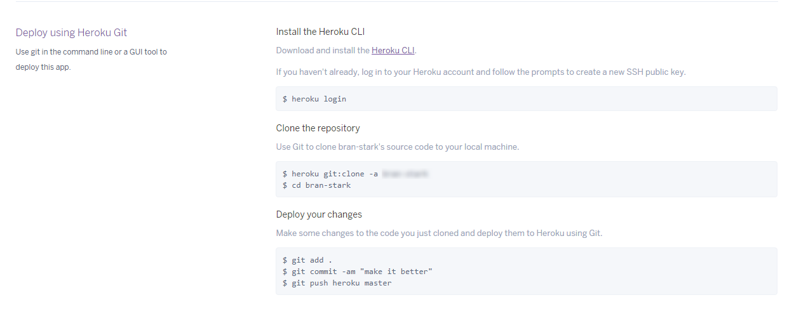
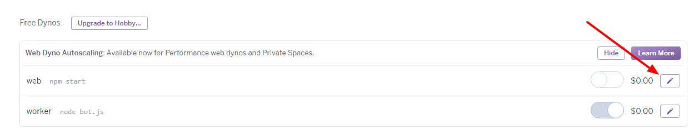

Chat bots are growing in power with the increase in social media users and advancement in technology. They will be the app of the future and heck they probably already are. They can be useful in many aspects of the customer experience, including providing customer service, presenting product recommendations and engaging customers through targeted marketing campaigns. Although chat bots have still a long way to go in terms of AI, they're still powerful.

This tutorial doesn't require you to be a programmer although having a prior programming experience will definitely come in handy to understand the codes a lot better. We’ll code our Twitter Bot in JavaScript and run it in a Node JS environment. I have tried my best to be as detailed as possible and I hope you won’t have any trouble following along.

Before we start writing any code let us first set up all these requirements

1. A Twitter Account and a Twitter App
2. A command line interface which you probably already have (Command Prompt, Terminal …)
3. A text editor to write the codes (Sublime Text / Atom / VS Code)
4. Install and Set up Node JS ( A Javascript runtime )

> NOTE: If you want to host it on a web server then you will be needing a Heroku account. Heroku lets you host your Twitter Bot online for free. We'll cover hosting in the later part of the tutorial.

## Contents

1. [Create A Twitter App](#1-creating-a-twitter-app)
2. [Set up and Install NodeJs](#2-installing-and-setting-up-node-js)
3. [Setting Up The Project](#3-setting-up-the-project)
4. [Installing Twit Module](#4-installing-twit-module)
5. [Writing Codes](#5-writing-codes)
6. [Deploying our Bot on Heroku](#6-deploying-our-bot-on-heroku)

### 1. CREATING A TWITTER APP

You can’t create a bot without a twitter account. Sign up for a new account [here](https://twitter.com/signup?lang=en). Great! Now we’ll need something called API keys. API keys are the ‘username and password’ for Bots. Your Bot will require this to make API calls, or in simple words, interact with the data on Twitter’s server.

To get your API keys, you need to first create a Twitter app. Go to [apps.twitter.com](https://apps.twitter.com) to get them.

_Create new app on Twitter_

Click on ‘Create New app’. Then on the next page fill up all the details. If you don’t have a website just put a placeholder in the Website field. You can leave out the Callback URL field. Tick the Developer Agreement and then finally click on ‘Create Your Twitter application’ at the bottom. We now have a Twitter application. Let’s get the API keys.

_Create new app on Twitter_

On the next page go to ‘Key and access Tokens‘ tab. We’ll need four different key from here out of which 2 (Consumer Key and Consumer Secret) are already created. We need to generate a thing called “access tokens”. On the bottom of the page, click on the “Create my access tokens”.

_Grab the api keys_

If you did everything right, you shall now have the following information:

- Consumer Key
- Consumer Secret
- Access Token
- Access Token Secret

<center> <b>NEVER EVER SHARE YOUR KEYS. </b>  </center>

Now we need to create a new file called config.js. Open your text editor and make a JavaScript object exactly like this filling up the necessary information. Do not modify the parameters. For example : Do not change consumer_key to Consumer Key. The format should be exactly as shown below.

```js
module.exports = {
  consumer_key: '<YOUR_CONSUMER_KEY_HERE>',
  consumer_secret: '<YOUR_CONSUMER_SECRET_KEY_HERE',
  access_token: 'YOUR_ACCESS_TOKEN_HERE',
  access_token_secret: 'YOUR_ACCESS_TOKEN_SECRET_HERE',
};
```

### 2. Installing and Setting up Node JS

Now, let’s install Node JS. The instructions will vary a bit depending on your operating system, so just follow the official download and installation guide. It’s pretty simple.

Once you have Node JS installed, fire up your command line and type

```bash
node --version
```

If you get something like ‘v6.10.3‘ then your installation was successful. The number you get back is the version of Node. If you get something like 'not recognized', there was some error in the installation. Try reinstalling.

Node JS comes with NPM (Node Package Manger) with which you can download Node Modules. Node modules are simply JavaScript libraries. Don’t worry about it right now. Once again in your command line, type

```bash
npm --version
```

You should get a back a version number like before. Great! We now have all the requirements fulfilled.

### 3. Setting Up The Project

Hold your horses folks. Few more minutes and then we’ll get into coding. Lets set up our project first. This process takes about a minute or so.

Create a folder to store all your bot files. Inside the Folder you should have the config.js file we created earlier. Create another file called bot.js (you can name it anything you want but it should have .js extension). This is the file where we’ll be writing all our codes.

Now we need to create a package.json file. This file will contain all the metadata of our project like project name, project version, lisence and most importantly the dependencies. Dependencies are the node modules that we use in our program. You can manually create this file but there's a much better way.
Open up your command line and then navigate to this folder. Then type the following command

```bash
npm init
```

It’s not necessary to fill the details. In fact you can leave everything blank. Just press enter to skip the fields. Finally you should have a package.json file created on your main folder. You folder should have 3 files by now

- config.js
- bot.js
- package.json

### 4. Installing Twit Module

We’ll be using a Node Module called Twit. This module helps us communicate with Twitter Server using our API keys. This is the only module we’ll need for our Twitter Bot.

Open your terminal and navigate to the main folder. Run the following command

```bash
npm install --save twit
```

This will install the Twit Node Module. If you check your package.json file you should see "twit" in your dependencies.

```json
{
  "name": "your-project-name",
  "version": "1.0.0",
  "description": "",
  "main": "index.js",
  "dependencies": {
    "twit": "^2.2.9" // twit module
  }
}
```

Every time you install a node module it’ll automatically be added to your package.json file. But it’s necessary that on your command line you must be on the same path where you want to install the module.

### 5. Writing Codes

Open your bot.js file on a text editor. Let's write our first line of code :)

```js
// Import Node Modules
let Twit = require('twit');

// Import Config File
let config = require('./config');
```

The first line of code imports the Twit module and assigns it to the ‘Twit’ variable. Similarly the second line of code imports the config.js file on our Folder. Make sure you have added all the required consumer keys and access tokens on the config.js file.

> Note: config.js is our own custom module on our directory which is why we have added './'
> before 'config' to import it.

We now create a Twit Instance.

```js
// Create a Twit Instance
let Bot = new Twit(config);
```

The variable **"Bot"** holds the TWIT instance. **Bot** has a function called ‘post’ which enables us to make a tweet. This post function takes 3 different arguments

- method
- input
- callback function

```js
// tweet 'hello world!'
Bot.post('statuses/update', { status: 'Hello World' }, (err, data) => {
  if (err) return console.log(err);
  console.log('Successfully Tweeted');
});
```

Let’s breakdown and understand this code.

#### a. The first argument: –

‘statuses/update’ means we want to update the status. There are other various methods like ‘media/upload’ to upload a media, ‘favorites/create’ to favorite a tweet, ‘direct_messages/new’ to send direct messages, and many more. Read more about Twitter API here.

#### b. The second argument: –

{ status: ‘hello world!’ } is a JavaScript object with a property ‘status’ and a value of ‘hello world!’. This means we want to make a tweet ‘hello world’. To make any other tweets just edit the ‘hello world!’ part like this { status: ‘Best bot ever’ } , { status: ‘I love Twitter Bots’ } …

#### c. The Third Argument:-

This argument is a function or more specifically a callback function.

So now what our function does is updates the status ‘hello world!’ right? As soon as the post function makes the tweet or if there occurs any error while tweeting, this callback function is invoked!

Inside this function we have three variables ‘error’, ‘data’ and ‘response’. If any error occurs while tweeting, this error variable will contain the information of the error, if everything goes right then we’ll get a response.

Now your bot.js file should look something like this

```js
const Twit = require('twit');
const config = require('./config');

let Bot = new Twit(config);

Bot.post('statuses/update', { status: 'Hello World' }, (err, data) => {
  if (err) return console.log(err);
  console.log('Successfully Tweeted');
});
```

Great! With these lines of code we can already make a tweet. Open up your command line and navigate to your project folder. Now run the command

```bash
node bot.js
```

This should make a tweet! Go check your bot’s twitter account.

It’s tedious to write that long string of function to make a tweet. Let’s wrap that Twit.post function in our own custom function.

```js
const Twit = require('twit');
const config = require('./config');

let Bot = new Twit(config);

const makeTweet = tweet => {
  Bot.post('statuses/update', { status: tweet }, (err, data) => {
    if (err) return console.log(err);
    console.log('Tweet Made Successfully');
  });
};

makeTweet("I am tweeting from my command line and it's awesome");
```

Now everytime we need to make a tweet we can just call the makeTweet() function and pass in the tweet like this

```js
makeTweet("I am tweeting from my command line and it's awesome");
```

This is great but what’s the fun if we need to run a command everytime we need to make a tweet? Let’s automate the process so that our bot will make a tweet in certain time interval. We can achieve this by using the setInterval() function in JavaScript that runs a task in a certain set of intervals. Add this line of code at the bottom

```js
setInterval(makeTweet, 60000, Math.random() * 20);
```

This code runs the makeTweet() function every 60 seconds ( 60,000 milliseconds). If you run the bot from your command line the bot will tweet a random number every minute.

> Do not spam and post every few seconds or so. Twitter will block your app! But you can make new one again.

#### Streaming Tweets

Alright so we have made a bot that can post tweets. But that's not enough. We will step up our game by streaming realtime tweets! For example, we can track any words like ‘Donald Trump’ so that whenever someone makes a tweet with the word ‘Donald Trump’ anywhere in the tweet, our bot will grab that tweet in realtime. We can track twitter accounts, words, hashtags, etc with this method.

Lets create a **trackTweet** function. This function takes a parameter, that we name **keyword**, which stores the word we want to track. Once someone makes a tweet with that keyword, we'll program our bot to print the tweet in the command line. Let’s track ‘trump’.

```js
const Twit = require('twit');
const config = require('./config');

let Bot = new Twit(config);

const makeTweet = tweet => {
  Bot.post('statuses/update', { status: tweet }, (err, data) => {
    if (err) return console.log(err);
    console.log('Tweet Made Successfully');
  });
};

// Lets not call this function right now
// setInterval(makeTweet, 60 * 1000, Math.random() * 20)

const trackTweet = keyword => {
  let stream = Bot.stream('statuses/filter', { track: keyword });
  stream.on('tweet', function(tweet) {
    console.log(tweet.text);
  });
};

trackTweet('trump');
```

The last line calls the function and the bot will start tracking every tweets with ‘trump’

#### Track tweets and favorite the tweet

We're not done yet! Currently the **trackTweet** function track tweets and print it on the command line. Let’s modify it so that we can not only track tweets but also _favorite_ the ones we like.

We’ll create a **favoriteTweet** function that will favorite tweets we pass to it. Then inside our **trackTweet** function we'll use this function to favorite tweets we like.

```js
const Twit = require('twit');
const config = require('./config');

let Bot = new Twit(config);

const makeTweet = tweet => {
  Bot.post('statuses/update', { status: tweet }, (err, data) => {
    if (err) return console.log(err);
    console.log('Tweet Made Successfully');
  });
};

const favoriteTweet = tweet_id => {
  Bot.post('favorites/create', { id: tweet_id }, (err, data) => {
    if (err) return console.log(err);
    console.log('Successfully favorited Tweet!');
  });
};

const trackTweet = keyword => {
  let stream = Bot.stream('statuses/filter', { track: keyword });
  stream.on('tweet', function(tweet) {
    console.log(tweet.text);
    favoriteTweet(tweet.id_str);
  });
};

trackTweet('nepal');
// setInterval(makeTweet, 60 * 1000, Math.random() * 20)
```

If you are smart you must see a pattern in the functions we've created. They're almost identical except for the parameters it takes.

Go to the [Twitter API Documentation](https://developer.twitter.com/en/docs/api-reference-index) and try to make a function that follows twitter users. **Please** take your time and try to figure this yourself. Because you can use plenty of other features that twitter provides if you learn how to read the documentation.

Did you succeed? Well done if you did. The code must look something like this.

```js
// Pass it the username and your bot will follow the user.
function followUser(username) {
  Bot.post('friendships/create', { screen_name: username }, (err, data) => {
    if (err) return console.log("Couldn't Follow!");
    console.log('Followed!', username);
  });
}
```

So basically this is all our coding part. We have created a twitter bot that tracks a keyword and favorites the tweet if it finds one. I know it’s not the most exciting bot. I tried to focus this tutorial mainly for beginners. To summarize this tutorial, We have learnt to

- Track realtime tweets
- Make tweets
- Follow users
- Favorite tweets

There’s still so much more to explore. Visit the [Twitter API Documentation](https://developer.twitter.com/en/docs/api-reference-index) page and try doing more on your own.

### 6. Deploying our Bot on Heroku

Currently the twitter bot runs on our PC and that’s not what we want. We want to run it on a server online. Heroku is a service that provides this facility for free. Of course there’re some limitation to the free package but you can get their premium packages if you want.

#### A. Create a Heroku account

Create an account here. If you create a free account then you can host up to 5 different applications. Once you create a new account create a new app. Now there’s a whole bunch of things we need to do here. Basically there are 3 different ways we can add our code on heroku

- Through Heroku Command Line (_Preffered and the programmer's way_)
- Github (_Easy way_)
- Dropbox (_Easy way_)

I would recommend the first way although it's a bit harder to get at first. However you can just follow along by using the syntax I provide here

#### B. Heroku Command Line Interface (CLI) and GIT:

Download Heroku Command Line from [here](https://devcenter.heroku.com/articles/heroku-cli) or simply click on the link below.

- [For Windows](https://cli-assets.heroku.com/heroku-cli/channels/stable/heroku-cli-x64.exe)
- [For Mac OS](https://cli-assets.heroku.com/heroku-cli/channels/stable/heroku-cli.pkg)

Now we need to download one more thing and that’s GIT – a CLI for GitHub. Download GIT [here](https://git-scm.com/downloads). Run those two installation files. If you have any trouble installing look for tutorials online, there are plenty.

_Deploy on Heroku_

By now you should have Heroku CLI and GIT installed. To check if you have successfully installed those two application open your command line and type

```bash
heroku --verion
```

If you get a reply something like this

```bash
heroku-cli/6.14.22-f598c4a (windows-x64) node-v8.4.0
```

then the app was installed successfully. Likewise type

```bash
git --version
```

and you should see the git version. Please proceed to rest of the tutorial only if you have installed Heroku CLI & Git.

### C. Creating a Procfile

Heroku requires a special file called **Procfile**. _If you're hosting your bot on any other hosting service then this file is not require_. This file does not have any extension like .js or .txt, but only a name ‘Procfile’. So in your Project folder, create a new file and name it as Procfile. Inside this file, write

```
worker: node bot.js
```

and save it. That’s all we need to do with Procfile.

This Procfile tells heroku to run node bot.js command just like we did on your command line. The ‘worker’ is a type of dyno in heroku which I better not talk about right now.

#### D. Creating a New App in Heroku

On your terminal, type heroku login. Type your Heroku email and password and log in. Now, to create a new app type the following command

```bash
heroku create <your_app_name>
```

Replace <you_app_name> with your app name. The app name should be in lowercase. That’s how easy it is to create an app in heroku. All we need to do now is upload our code to the Heroku app that we created just now.

On your browser go to [www.heroku.com](https://www.heroku.com) and login. You’ll see a list of all your apps. Click on the app you created just now. Then go to the ‘Deploy’ tab section. If you scroll down you’ll see this :

As I mentioned earlier, there are various methods to deploy your code on heroku. We are using the Heroku CLI because its cooler than using GUI 😀 .

#### E. Creating a Git Repository and Uploading our Twitter Bot code:

We first need to create a Git Repository of our bot and only then we can upload(push) it to Heroku. Open command line and navigate to your project file and type

```bash
git init
```

This command initializes an empty git repository. Now we must add all the files in our project to the repository. To do so use the following two commands

```bash
git add .
git commit -m "first commit"
```

Great! Now before we upload our code, we first need to tell where to actually upload the code. We can do that by using the command below

```bash
heroku remote:set -a <your app name>
```

Now the final step is to upload(push) the code. Use the following command

```bash
git push heroku master
```

#### F. Final Step – Turning on Worker Dyno

There’s one last thing we need to do. Go to your heroku app page on your browser. On the **‘Resources’** tab you should see your dynos.

_Heroku Dynos_

We need to turn on the worker dyno to start our bot. Click on the edit button and disable the web dyno and turn on worker dyno. This is where the Procfile comes into play! Without the Procfile, we wouldn’t have this option to turn on worker dyno.
