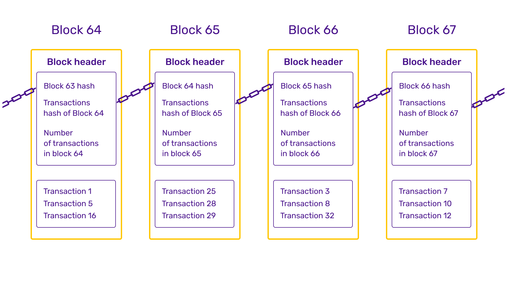
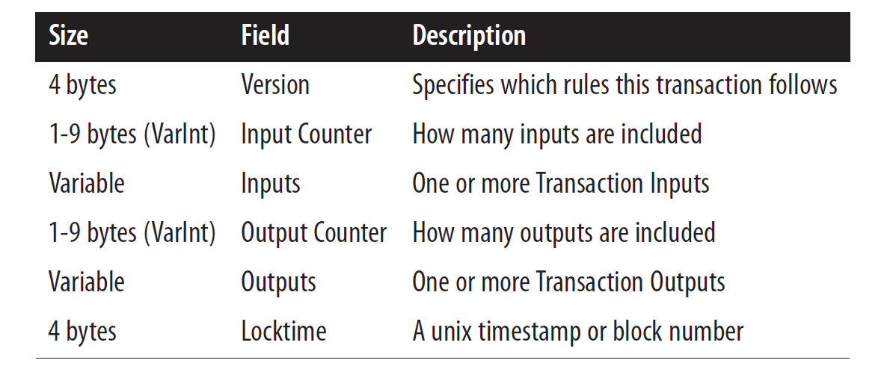
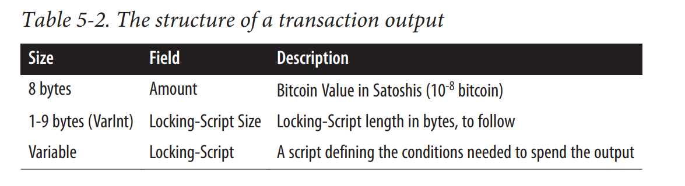
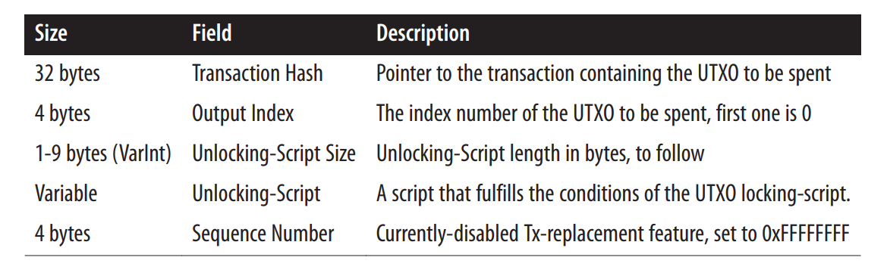
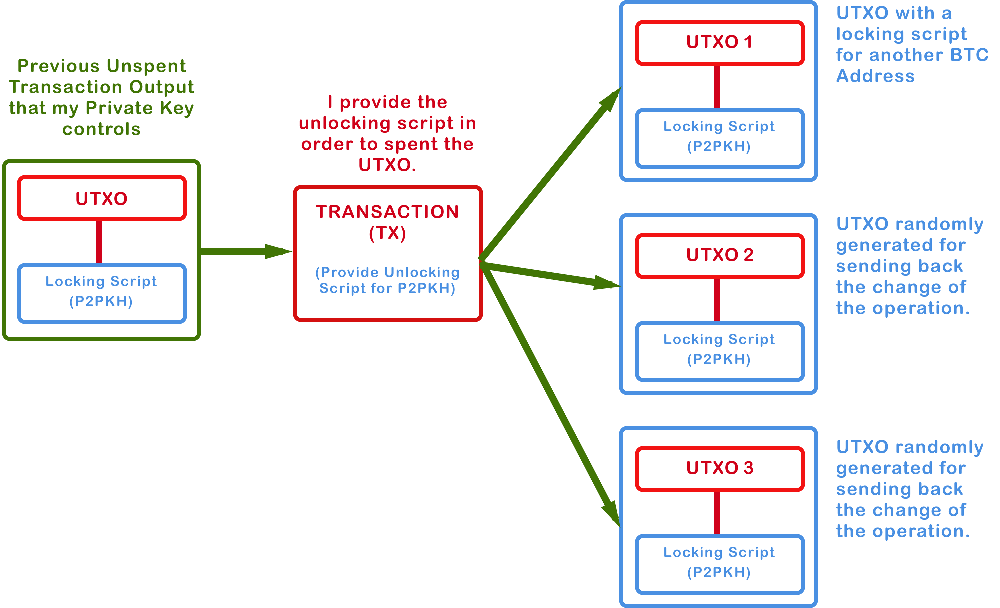
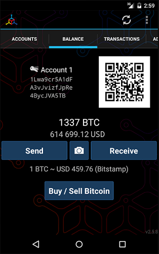

What does it mean to "have" bitcoins? Where exactly are they stored? Where can one sign up for a bitcoin account? These were some of the questions that I had when I first started to study Bitcoin.

The notion of owning bitcoins can be difficult to grasp to anyone who has dealt with cash all their lives. There's nothing physical to hold and everything is digital.

When Bob says he has $5 we can understand that he either has a $5 bill or \$5 in his bank account. But what does it mean when Alice says she owns 5 BTC? Well, that's what we are going to find out ...

Bitcoin can mean both the currency and the protocol that governs the currency. The Bitcoin protocol differs fundamentally from our traditional financial system. And so to understand it, it's important to learn the fundamental concepts and the underlying building blocks.

## Blockchain

The blockchain is a double-entry bookkeeping ledger. The name is derived from the fact that it is literally a linear chain of blocks. A block consists of numerous transactions. Every single bitcoin transaction that has ever happened has an entry in one of the blocks in the blockchain.

_Structure of a blockchain. Source: https://blockspoint.com_

The blockchain is public, and anyone can download it and look through the transactions that's not just theirs but anyone else's. If I have your bitcoin address then I can see all the transactions going in and out from your address. Despite the popular belief that Bitcoin is untraceable, it is actually the opposite. In fact, one would need to take extreme measures to stay anonymous in the Bitcoin network.

The important thing to understand, for now, is just that the blockchain is a database of transactions.

> Every single bitcoin transaction that has ever happened has an entry in one of the blocks in the blockchain.

## Transactions

A bitcoin transaction is just an entry in the blockchain that indicates transfer of bitcoins. Transaction of bitcoins is quite different from a banking transaction. In a banking system, you have an account where you store all your money. To make a transaction you'd transfer money from your account to the receiver's account. In Bitcoin, there's no such thing as an Account.

Recall, the blockchain is just a list of transactions. There is no such entry in the blockchain that states that Bob's account has 5 BTC or even that there's an account that belongs to Bob. To put it precisely, there's no concept of balance in Bitcoin.

So how and where does one store bitcoins? To answer that we need to understand _transactions_.

A transaction comprises of a bunch of metadata which are shown below.

_Structure of a bitcoin transaction. Source: Mastering Bitcoin by Andreas Antonopolous_

The fields that are of interest to us are `inputs` and `outputs`. The input to a transaction is the source of funds, and the output is the destination. If there are no accounts in Bitcoin, then what is the source of funds and where is the destination?

### Transaction Outputs

The output of a transaction is called **UTXO** (_Unspent Transaction Outputs_). A UTXO consists of a locking script & the amount that is to be transferred. The locking script locks the transaction amount. For someone to use the transaction amount, an `unlocking script` is required.

_Structure of a Bitcoin UTXO. Source: Mastering Bitcoin by Andreas Antonopolous_

Think of UTXO as a safe-deposit box that locks some amount of bitcoin. Anyone that has the key to that safe can spend that bitcoin.

So to make a transaction, Bob asks Alice for her bitcoin address. He then creates a UTXO with an amount of 5 BTC and a locking script using Alice's bitcoin address such that only Alice can create an unlocking script using her private key.

> Sending someone bitcoin is basically creating an unspent transaction output (UTXO) that is cryptographically locked and can only be accessed by the receiver's private key.

### Transaction Inputs

The input to a transaction is actually a pointer to another transaction that's in the blockchain. Precisely, the input is a pointer to a UTXO.

_Structure of a transaction input_

So essentially, when Bob wants to make the 5 BTC transaction, he needs to provide the following input.

- A `transaction hash` which is a unique id that identifies the transaction.
- An `output index` that points to a UTXO (_fund source_) in that transaction referenced by the transaction hash (_there can be more than one UTXO in a single transaction_).
- An `unlocking script` indicating authority over the UTXO.

This transaction will be placed on the blockchain as a new transaction with a unique transaction hash. In future, Alice can refer to this transaction and the UTXO to use the fund locked in the UTXO.

_Bitcoin UTXO transaction model. Source: https://medium.com/coinmonks_

### Calculating Bitcoin Balance

You might have seen some bitcoin wallet applications that show the balance of a bitcoin address.

_Mycelium wallet application_

If there are no accounts then how is the bitcoin balance calculated? The concept of a user’s bitcoin balance is a derived construct created by the wallet application.

The Bitcoin network actually keeps track of all the available unspent UTXO. A wallet application calculates the user’s balance by scanning the blockchain and aggregating all UTXO belonging to that user.

A user's bitcoin balance is the sum of all unspent UTXO that can be unlocked by the user.

### How are Bitcoins generated ?

Hold on... so Alice got her 5 BTC from Bob. Bob must have gotten them from someone else and that someone must have gotten from some other person. But where is the point of origination in this chain of ownership? How are bitcoins added into the blockchain? Who adds them?

Bitcoins are generated by miners. They are the ones who introduce new bitcoins into the Bitcoin network.

Did you not find it odd that the transactions are stored in blocks ? Why is it not just a single block but rather a chain of blocks?
The answer to that certainly deserves another article but just know that when you make a transaction it does not get added into the blockchain immediately. They are temporarily stored in the miner's computer. In order to put the transactions from their computer into the blockchain they need to perform a lot of calculations.

Miners compete against each other to put a block into the blockchain. This process of placing a block into the blockchain is called mining. When a miner successfully mines a block, he/she gets some amount of BTC as a reward called a [**Block Reward**](https://www.investopedia.com/terms/b/block-reward.asp).

The block reward gets halved every 210,000 blocks or approximately every 4 years. When Bitcoin started in Jan 2009, the block reward was 50 BTC. On November 28, 2012 it dropped to 25 BTC per block and on July 9, 2016, it droped again to 12.5 BTC per block. It is estimated that on [May 2020 the block reward will again get halved to 6.25 BTC per block.](https://www.bitcoinblockhalf.com/)

The block reward will keep on decreasing exponentially. It is projected that in the year 2140, the last halvening will take place and there'll be no more block rewards. This essentially means there is a limit to the production of bitcoins. It's _21 million_ and more than _18 million_ of the have already been mined.

## Tldr

- There are no bitcoin accounts.
- Bitcoins are locked in UTXO in the blockchain. In order to use the UTXO, a private key is required. Thus, a user's bitcoin may be scattered as UTXO amongst hundreds of transactions and hundreds of blocks.
- The UTXO consumed by a transaction are called transaction inputs, while the UTXO
  created by a transaction are called transaction outputs
- Miners add the transactions in blocks into the blockchain. They get rewarded some amount of BTC for successfully adding a block into the blockchain. This is how new bitcoins are generated and it's the only way.

---

_Most of the things that I've written in this blog post, I've learned it from the book **"Mastering Bitcoin" by Andreas Antonopolous**. It's [open sourced](https://github.com/bitcoinbook/bitcoinbook) !!_
